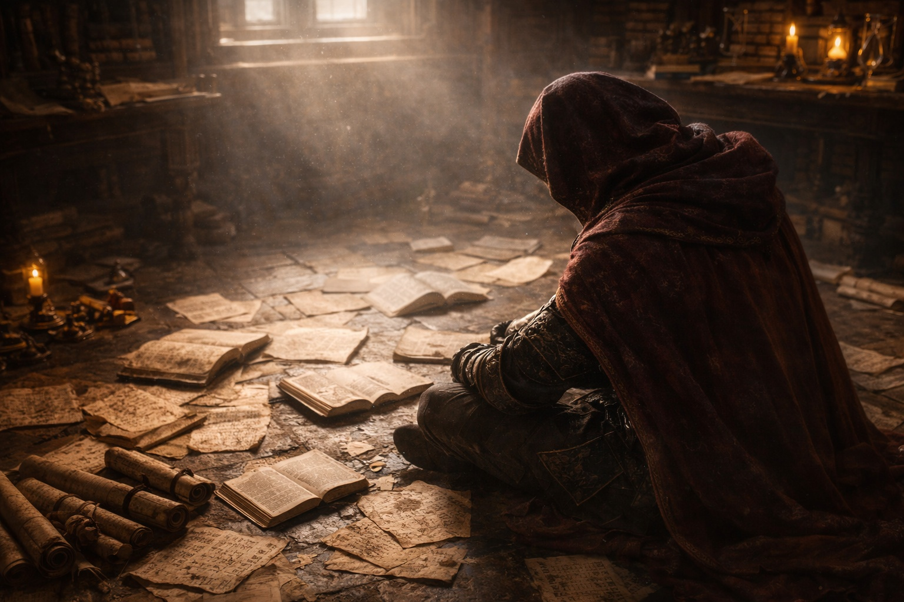

## Lore | Nothingness and the Second Sun

---

The book smelled of ash.

Ash sifted from the spine onto her gloves. Sage Meridia lifted the cover slowly; the leather cracked at the hinge.

"Where did you find this?" she asked.

The merchant shrugged and kept his hands off the desk. "Flooded cellar in the river district. Old building. Nobody claimed it."

Meridia turned the first page. Water had stained the parchment, but the angular script remained clear. It resembled writing from before unification, perhaps eight centuries old. The ink had a bronze tint unlike the gallnut ink on her own desk.

*An original?* She had never seen a modern copy in that ink. She held the page nearer the lamp, unwilling to test it with water.

She paid the merchant twice what he asked. He left quickly, as if glad to be rid of his burden.

---

The translation took three weeks.

Meridia had studied the old tongues since childhood. Here, a sentence she had read in the morning seemed to change by evening. Words slipped into different orders when she looked away. She had to stop after an hour, her eyes watering too badly to make out the letters.

She kept separate copies of her notes and compared them each morning. Sometimes the error was plainly hers. On other mornings she could not account for the differences.

By the end of the first week, she had identified at least four hands in the book. Someone had bound the fragments together without reconciling their accounts.

*In the beginning*, read the first fragment, *there was only void, endless and empty. Then came a spark.*

*In the beginning*, read the second fragment, *there was only sound: a note without origin, without end. The spark was a lie the sound told itself.*

*There was no beginning*, read the third fragment. *The concept of beginning was invented later, to make the records orderly.*

Meridia made three columns in her notebook: *Fire*, *Sound*, and *No Origin*. She assigned each fragment to a category, hoping patterns would emerge.

By the fourth page, she had crossed out half her assignments.

---

The section on the gods was worse.

*Human folly summoned 12 major gods*, one source claimed.

*Human wisdom invited them*, said another.

*The gods were already present*, insisted a third. *They simply chose that moment to reveal themselves. The summoning was theater.*

Marginalia in three different hands argued with each other across the pages:

*This contradicts the Temple of Azarion's account. Compare with the Vespertine Codex.*

*The Vespertine Codex is a forgery. Everyone knows this.*

*If it's a forgery, why does the Archpriestess quote it every equinox?*

Meridia followed one cramped annotation into the binding. Its author had underlined *forgery* hard enough to split the parchment, but had supplied no date or name.

---

The section on the First Pacts was missing sixteen pages.

The numbering jumped from page forty-three to page sixty. A note in crimson ink occupied the gap:

*These pages were removed by order of the Third Council. The content was deemed hazardous to doctrinal stability. Replacement text follows.*

The replacement text was three paragraphs long and said nothing useful. It praised the wisdom of the Pacts without explaining what the Pacts contained. It celebrated the harmony between gods and mortals without describing how that harmony was achieved.

Meridia read it twice, then wrote: *Removal recorded. No inventory of the missing pages.*

She moved on.

---

*Six gods engineered new races*, the book claimed. *Three birthed beings of pure goodness. Three created beings of pure evil.*

The marginal hand was back, sharper now:

*I would render the word for "goodness" as "utility," and "evil" as "resistance" or "wildness." Compare the usages in the damaged treaty, not the Temple hymn.*

Another hand, different ink:

*Useful to whom? The treaty calls a plough "obedient." Your reading does not settle this.*

No answer followed.

---

What remained of the final section concerned the Second Sun.

Meridia could barely read it. The pages were smoke-damaged, their edges curling inward as if the fire had come from within rather than without. Great black streaks obscured half the text.

What remained:

*...a new era. Diverse peoples. Regional confli[...]*

*[...]the necromancers claimed the dragons came from[...]*

*[...]the priests denied it. Their followers[...]*

*[...]sent east. The destination has been read as Wyr[...]*

The last readable sentence:

*Some called it a sun. Others denied it was light at all. The truth, if there is a truth, remains unwritten.*

Below that, in the same crimson ink as the censorship note:

*This book is incomplete. The final chapters were destroyed by order of the Assembly of Sages. The flame that consumed them was blessed. The blessing was not sufficient.*

---

Meridia closed the book.

Her hands shook when she tried to fasten the clasps. She rested them on the desk until the ache behind her eyes eased. Seventeen other texts waited in the archive; none had given her a reading she could carry through this book.

She reopened her notebook at the missing pages. There was no entry explaining whether the Pacts had been an agreement or a surrender.

She filed the book beside the others, leaving her disputed readings on loose slips between its pages. Another translator might need them.

For the next lecture she took out the Official Account. It gave a date for each event. She checked the date of the First Pacts against her notes, then checked again.

She left the prescribed date on the lecture sheet. In her own notebook she put a question mark beside it.

---

*Compiler's note: The preceding text was reconstructed from surviving fragments. All translations remain disputed. The Academy takes no official position on authenticity.*

*On the final page of Sage Meridia's notebook, a line in her hand reads:*

*"We do not know what happened. I cannot find the source of the date I am required to teach."*

*The date she meant is not given.*

**End of Lore 2 — continues in Lore 3: [The regions of Astalor](/the-regions-of-astalor/)**
