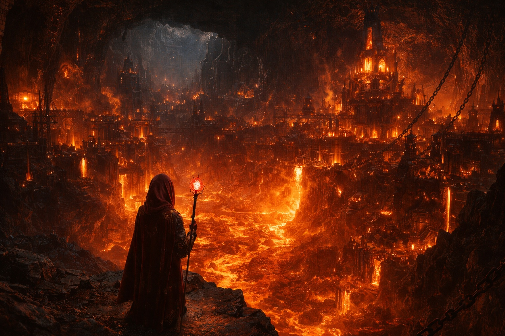

## Lore | The regions of Astalor

---

The map was wrong.

Not obviously wrong. The ink was crisp, the coastlines drawn with care, the borders marked in the Academy's standard notation. But Sage Meridia had compared it to three older maps from the restricted archive, and the borders didn't match. They never matched.

She spread all four across her desk, weighting the corners with ink bottles, and began writing what the Academy would never teach: an honest summary.

## Lumeshirean Divine Empire

The largest human nation, or so it claimed. The [Lumeshirean Divine Empire](https://www.drusniel.com/the-resilient-defense-of-the-lumeshirean-divine-empire/) held its borders through a combination of faith, paladins, and a political machinery that even its own citizens struggled to understand.

> "The empire is entangled in a web of political machinations, alliances, and betrayals with the Contian Theocracy."

Meridia noted: *The empire faces threats from Grukmar in the south and the Norths pressing down from Frostgard. Official accounts describe an empire united under faith and duty. Garrison reports tell a different story. Reports filed as "unexplained" fill entire cabinets at every border post.*

## Contian Theocracy

Where the [Contian Theocracy](https://www.drusniel.com/the-contian-theocracys-quest-for-magical-supremacy/) began and the Academy ended was a question no one answered the same way twice. Mage towers rose above the city. Knowledge was currency. Power was the interest it earned.

> "Although they claim neutrality, the Contians have numerous factions that accept all kinds of alignments."

Neutrality. Meridia underlined the word and added a question mark. In Contia, today's ally could be tomorrow's test subject.

A knock at the door.

She didn't move to cover the maps. That would only make it worse.

"Tea, Sage Meridia." Lenn, the junior archivist, entered with a tray. He set it on the only clear corner of the desk, then his eyes traveled across the spread maps. His hand froze on the tray's edge.

"Those are from the sealed wing."

"Research for the curriculum review," she said, not looking up.

"The curriculum review ended last month."

"Then I'm slow." She dipped her quill. "Thank you for the tea, Lenn."

He lingered. She could feel him weighing it. Report her, or pretend he hadn't seen. Lenn was young enough to still believe the Academy rewarded honesty.

"I'll leave the door open," he said, which meant nothing and everything.

"Close it."

He did.

She wrote faster after that.

## Empire of Frostgard

In the frozen north, [Frostgard](https://www.drusniel.com/ice-and-iron-the-warriors-of-the-empire-of-frostgard/) endured. The Norths called it home, barbarian warriors who carved their history into ice and swore by gods the southern temples refused to recognize.

> "The northern reaches of Frostgard are plagued by giants, posing a constant threat to the Norths."

Meridia's note: *Frostgard's official reports focus on giant incursions and weather. The unofficial reports, the ones passed between wardens after dark, mention settlements that go silent. Populations that vanish between supply runs. The songs say the Norths are unbreakable. The filing cabinets suggest otherwise.*

## Mountain Kingdom of Stonehold

The dwarves and gnomes of [Stonehold](https://www.drusniel.com/forge-and-fire-the-mountain-kingdom-of-stoneholds-stand-against-chaos/) built their cities inside the mountains. Fortress-cities, they called them. The ring of hammers on anvils never stopped, if you believed the poets. The engineers described a different sound: cracks in stone that shouldn't crack. Cold where there should be warmth.

Stonehold's greatest concern, by the official count, was the Grukmar tribes pressing against their borders. What concerned the mining councils, according to sealed reports Meridia should not have read, was something deeper.

## Kingdom of Elenoria

The elves of [Elenoria](https://www.drusniel.com/eternal-woods-the-kingdom-of-elenorias-dance-with-nature/) lived among ancient forests, in cities grown from living wood. Their archery was famous. Their bond to the natural world was the subject of a hundred songs.

The maps showed the same borders for Elenoria going back centuries. But Meridia had seen the patrol logs. Paths that didn't match the cartography. Groves that seemed to shift. Rangers who went in and came back... different. The elves called it harmony. Their restricted archives, if they kept any, were not shared with outsiders.

## Grukmar Tribes

The [Grukmar Tribes](https://www.drusniel.com/the-unruly-might-of-the-grukmar-tribes/) were what the other nations feared when they stopped fearing each other. Orcs, goblins, and worse occupied a territory that no outside force had successfully mapped.

The raids on Stonehold and Lumeshire were well documented. What was less documented was why the raid patterns changed. Some years the border was quiet. The generals called that victory. The border captains, who knew better, called it the silence before something worse.

## Umbra'kor Dominion

The dark elves of the [Umbra'kor Dominion](https://www.drusniel.com/shadows-reign-the-umbrakor-dominions-pact-with-darkness/) lived below the surface, in caverns the surface world preferred not to think about. They served, the histories claimed, as a buffer between the known world and whatever lay beyond.

Meridia found that claim in seven different texts. None of them agreed on what the dark elves were buffering *against*.

## Wyrmreach Dominion

Beyond the tempestuous sea lay the [Wyrmreach Dominion](https://www.drusniel.com/the-mysteries-of-the-wymreach-dominion/).

In song and tale, travelers whispered of terrible things in that distant land, but few who traveled there ever returned to confirm what was true.

To most, it remained a place spoken of in fearful legends rather than known fact.

> "Only the dark elves of Umbra'kor can establish contact with this forsaken realm."

Meridia set down her quill. She looked at the four maps, their borders disagreeing, their margins filled with annotations that argued with each other across the centuries.

These were the realms of Astalor. At least, these were the ones the Academy acknowledged. Whether the map showed the world as it was, or merely as someone had decided it should appear, was a question Meridia had learned not to ask aloud.

She filed her notes in the drawer she kept locked. Then she picked up the tea Lenn had brought. It was cold.

She drank it anyway. Cold tea was the least of her problems.

---

*Compiler's note: The preceding regional summary was found among Sage Meridia's personal papers following her transfer to the Outer Library. The Academy has not endorsed its contents. Several passages contradict the approved curriculum. Junior Archivist Lenn, when questioned about the document's provenance, stated he had no knowledge of its creation.*

**End of Lore 3 — continues in Lore 1: [The Contian Theocracy's Quest for Magical Supremacy](/arcane-echelons-the-contian-theocracy-quest-for-magical-supremacy/)**