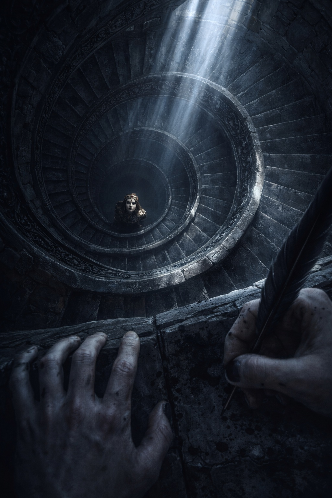
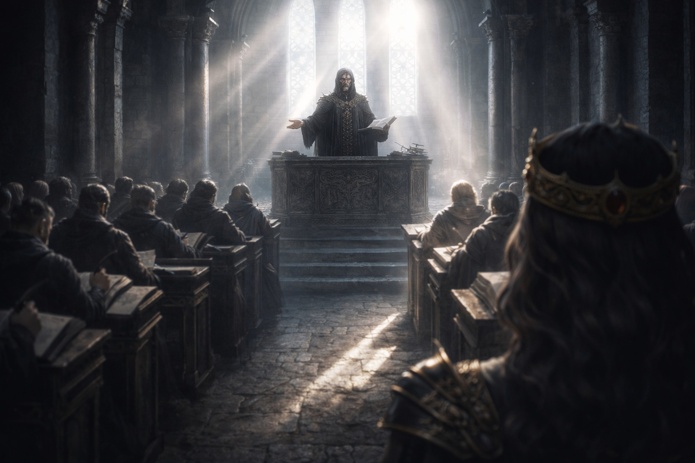
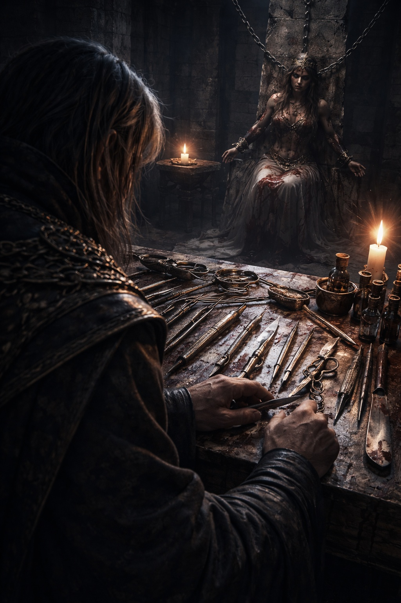

## Lore | The Contian Theocracy

--- 

Syrael hated the tower stairs.

Not because they were tall. The towers of Contian were built to be tall. Height was part of the lesson. You looked up until your neck ached, and you remembered where the power lived.

He hated the stairs because they echoed.

Every step sounded like an accusation in the stone. Every step reminded him he was late.

He lifted his robe hem with two fingers and climbed faster. Ink vials thumped gently against his belt. The scroll case bumped his hip. The parchment inside it was new and clean. That mattered. The Inquisitors loved clean parchment.

At the landing, an acolyte blocked the doorway. The boy's hair was shaved in the old style, leaving only a thin strip at the crown. His hands were stained with prayer ash.

"Name," the acolyte said.

"Syrael. Third Ledger. I'm assigned to the morning record."

The acolyte studied his face for a moment too long, as if deciding whether Syrael's voice sounded loyal enough.

Behind the boy, Syrael could hear the low chant, steady as a tide. The words were familiar. They always were. The same lines, repeated, carved into the mind the way Contian carved scripture into stone.

*Order is mercy. Mercy is control. Control is salvation.*

The acolyte stepped aside. "Do not speak unless asked. Do not write unless told."

Syrael nodded and entered.

Syrael nodded and entered.

The chamber was long and bright, with tall windows that let in the pale morning sun. Light wasn't sacred in Contian. It was simply useful. It revealed stains. It revealed flaws.

Rows of benches faced a raised dais. On the dais stood a circle of robed scholars, their collars stiff with gold thread. Behind them, the High Minister sat with hands folded, face calm, eyes like a man carved from wax.

In the center of the dais lay the object Syrael had been summoned to record.

A rod of dull metal, no longer than Syrael's forearm.

It didn't glow. It didn't hum. It didn't float. It just sat there on the black cloth as if it belonged in a kitchen drawer.

That was the first lie, of course.

Nothing that reached the dais belonged in a kitchen drawer.

Syrael found his assigned place near the side, where scribes were meant to be invisible. He unrolled his parchment, sharpened his quill, and waited.

A scholar stepped forward. Minister Halvek. His voice carried easily without effort.

"Brothers and sisters," Halvek said, "you have heard the rumors from the border. You have heard the whispers of wild power. You have heard the foolish claim that magic belongs to the untamed."

He let silence answer him. It always did. Contian did silence better than any other kingdom. Silence was training.

Halvek gestured toward the rod. "We have recovered this from the ruin beneath the river shelf. It was found where no faithful man should have been able to find anything. Yet the faithful went. And returned. Because order rewards obedience."

Syrael wrote: *Recovered artifact presented. Claimed recovered from river shelf ruin.*

The quill scratched. The ink dried quickly in the warm light.

Halvek continued. "Our doctrine is simple. Magic is law. Law is structure. Structure is control. If something can be measured, it can be governed. If something can be governed, it can be purified."

Syrael wrote it down because he was supposed to.

He had written those lines before. Hundreds of times. Different days. Different objects. The words always fit. That was the strength of doctrine.

It was also, Syrael sometimes feared, the weakness.

Halvek turned toward a set of brass instruments arranged on a smaller table: bowls of blessed water, a slate etched with circles, a thin chain of silver links, and a small glass prism. Practical tools. Simple tools. The kind of tools that made priests feel like engineers.

"Bring the subject," Halvek said.

Two guards escorted a young man into the chamber. The man's wrists were bound. His cheeks were hollow. A bruise darkened one side of his throat, as if someone had gripped him hard and long.

Syrael recognized the symbols tattooed on the man's forearms. Not the holy marks. Not Contian's clean geometry.

Spiral marks. Crude. Tribal. Borderland.

The kind that made ministers speak of *filth*.

Halvek's smile did not change. "You were observed using uncontrolled manifestation near the salt road. Do you deny it?"

The prisoner lifted his head. His eyes were bloodshot. "I was trying to stop a fire."

The High Minister's gaze did not move. But Syrael felt the room tighten. The wrong answer had been spoken: a claim of virtue without permission.

Halvek's voice remained gentle. "You attempted to act as if power belongs to the individual."

The prisoner swallowed. "It belongs to whoever needs it."

Syrael's quill paused.

He told himself it was only because he needed to catch up.

Halvek picked up the silver chain. "Hold this."

One guard forced the prisoner's hands forward. Halvek wrapped the chain around the bound wrists and clipped it shut.

Syrael had seen the chain before. He'd recorded its use twice last month. It did not stop magic. It did not block it. It did something stranger.

It made the room feel… *flatter*.

Like a melody had lost one note.

Halvek placed the glass prism beside the prisoner's hands. "Now," Halvek said softly, "show us what you are."

The prisoner looked from face to face. He saw robed scholars. He saw guards. He saw no mercy.

He closed his eyes.

For a moment, nothing happened.

Then the air in front of his bound hands shimmered, faint as heat over stone. The bowls of water trembled. The flame lamps along the wall flickered.

Syrael felt the hairs on his arms lift.

Power. Real power. Not in scripture. Not in diagrams. In the air, alive.

Halvek watched with satisfaction. "There," he said. "Unstructured. Wasteful. Emotional."

The prisoner's breath hitched. The shimmer grew. The flame lamps strained, bending their light.

Halvek lifted one hand, palm down, and pressed it toward the chain.

The change was immediate.

The shimmer didn't vanish. It didn't break. It didn't explode.

It simply… *thinned*.

As if something had been drained out of it, leaving a hollow shape behind.

The prisoner gasped. He tried again, forcing, straining. The shimmer returned in weak spurts, then collapsed into nothing.

Syrael wrote quickly: *Chain interaction observed. Manifestation attenuates. Subject distressed. Lamps stabilize.*

Halvek leaned in as if studying a specimen under a lens. "See? Magic obeys when law is applied."

One of the older scholars nodded. Another murmured a blessing.

Syrael did not look at the prisoner's face. He kept his eyes on the parchment.

The prisoner's breathing had turned uneven, like he was trying to inhale through cloth.

Halvek released the chain and stepped back. "We will now measure residual variance."

He lifted the brass bowl of blessed water and poured it onto the slate circles. The water did not spread evenly. It crawled along the etched lines, obeying the geometry as if frightened of crossing.

Syrael had always liked that part. It made the world seem simple.

Halvek placed the prisoner's bound hands above the slate. "Again."

The prisoner's lips moved. Syrael could not hear the words, but he could guess: a plea, not to any god, but to the power itself. Begging it to return.

A shimmer sparked.

The water in the slate circles rippled, once. Then it went still.

Halvek frowned.

It was tiny. Most people would not have noticed it. His mouth tightened at one corner for half a breath, then smoothed again.

Syrael noticed because scribes lived on details. Details were the only safe thing to own.

Halvek tried again. The same result. Weak shimmer. One ripple. Stillness.

The older scholar beside him leaned in and whispered something. Halvek's eyes flicked to the High Minister, seeking permission without moving his head.

The High Minister did not nod.

Halvek swallowed.

Then he raised his voice. "The measurements confirm it. Contian's instruments are sufficient."

Syrael wrote the words. His hand did not pause this time, but his stomach did.

Because the instruments had not confirmed what Halvek wanted.

They had confirmed something else.

Something resistant.

Something that did not fit the geometry cleanly.

The prisoner sagged. The guards held him up.

Halvek addressed the chamber. "This is why the Theocracy expands its reach. Wild power threatens the faithful. We do not conquer for pride. We conquer for protection."

Syrael had written that line before too.

It always sounded noble.

It always sounded clean.

Halvek turned to the guards. "Take him below. Prepare him for instruction."

The prisoner's head jerked up. "Instruction?"

Halvek's smile returned. "You will learn obedience."

The guards dragged the man away. His feet scraped the stone.

Syrael forced himself to keep writing, even as the scrape sound faded into the hall.

The High Minister stood at last. Everyone in the chamber rose with him.

His voice was quiet. That made the room listen harder.

"We will not be afraid of what we cannot name," the High Minister said. "We will name it. We will number it. We will bind it in law."

Syrael wrote every word.

Because that was his job.

Because jobs were safer than opinions.

The High Minister looked down at the rod on the black cloth. "Increase retrieval efforts. Two more ruins have been identified. Bring me everything."

Halvek bowed. "As you will it."

The High Minister's gaze lifted, passing over the scribes, the guards, the scholars. When it reached Syrael, Syrael lowered his eyes at once.

He felt, absurdly, like the man could read his thoughts.

But that was not possible. Contian had rules. Contian had walls. Contian had chains.

When the chamber emptied, Syrael stayed until he was permitted to leave. He rolled the parchment carefully and sealed it with the Third Ledger mark.

Outside, the air in the tower stairwell felt colder than it should have.

Syrael paused on the landing, alone for the first time since he had arrived. He found that his fingers were trembling.

Not from fear of punishment.

From the memory of that shimmer.

From the way it had thinned when the chain touched it.

Not stopped. Not blocked.

*Changed*.

He told himself that meant the doctrine was right. Law could shape magic.

But another thought slipped in, unwanted and sharp.

*If law could shape it… then something else could shape it too.*

*Something older than law.*

Syrael pushed the thought away as he descended the stairs. He did not let it show on his face. He did not let it touch his writing.

Still, when he reached the ground floor, he found himself glancing back up the tower, as if expecting to see the prisoner's eyes staring out from a window.

There were no eyes.

Only stone.

Only order.

And somewhere below that, in a place Syrael was not allowed to name, a man was being "instructed," and the Theocracy was calling it mercy.

Syrael tightened his grip on the scroll case and walked into the sun, repeating the doctrine under his breath like a charm.

*Order is mercy. Mercy is control. Control is salvation.*

This time, the words did not settle in his chest the way they usually did.

This time, they felt thin.

**End of Lore 1 — continues in Lore 1: [The Resilient Defense of the Lumeshirean Divine Empire](/the-resilient-defense-of-the-lumeshirean-divine-empire/)**