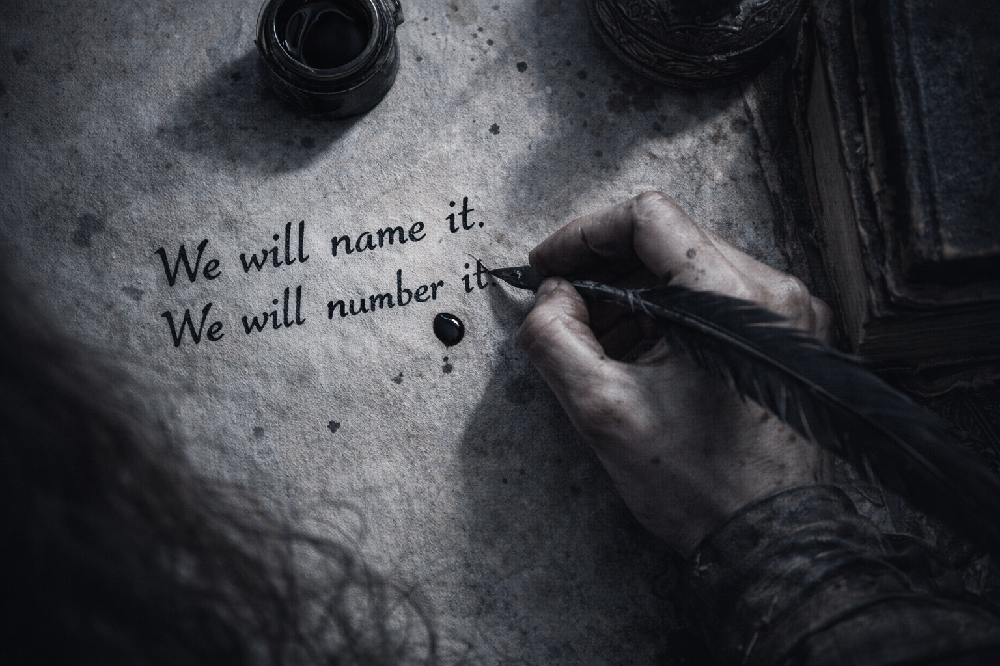

## Lore | The Contian Theocracy

---

Syrael hated the tower stairs.

The towers of Contian rose higher with each generation. By the last turn his calves burned, and the chant from the chamber above had already begun.

He hated the stairs because they echoed.

He tried placing his feet close to the wall. The stone carried each footfall ahead of him anyway.

He lifted his robe hem with two fingers and climbed faster. Ink vials thumped gently against his belt. The scroll case bumped his hip. The parchment inside it was new and clean. That mattered. The Inquisitors loved clean parchment.

At the landing, an acolyte blocked the doorway. The boy's hair was shaved in the old style, leaving only a thin strip at the crown. His hands were stained with prayer ash.

"Name," the acolyte said.

"Syrael. Third Ledger. I'm assigned to the morning record."

The acolyte studied his face for a moment too long, as if deciding whether Syrael's voice sounded loyal enough.

Behind the boy, Syrael heard the low chant repeating the same lines. He knew them by heart.

*Order is mercy. Keep faith with the law.*

The acolyte stepped aside. "Do not speak unless asked. Do not write unless told."

Syrael nodded and entered.

The chamber was long and bright. Morning sunlight reached the scribes' benches, showing an ink stain Syrael had missed on his cuff. He tucked it beneath his sleeve.

Rows of benches faced a raised dais. On the dais stood a circle of robed scholars, their collars stiff with gold thread. Behind them, the High Minister sat with his hands folded and his face expressionless.

In the center of the dais lay the object Syrael had been summoned to record.

A rod of dull metal, no longer than Syrael's forearm.

It lay on the black cloth, as dull and ordinary as a tool from a kitchen drawer.

Syrael found his assigned place near the side, where scribes were meant to be invisible. He unrolled his parchment, sharpened his quill, and waited.

A scholar stepped forward. Minister Halvek. His voice carried easily without effort.

"Brothers and sisters," Halvek said, "the rumors from the border have reached this chamber. Some would have you believe that magic belongs to anyone who can seize it."

He waited. Syrael heard a bench creak as someone shifted, then nothing.

Halvek gestured toward the rod. "Recovered from the ruins beneath the river shelf. The retrieval party calls it a measuring instrument. Our cataloguers favor a ceremonial use. We will establish which account belongs in the record."

Syrael wrote: *Metal rod presented. River ruins, according to Minister Halvek. Function disputed.*

The quill scratched. The ink dried quickly in the warm light.

Halvek continued. "Unlicensed practitioners tell us power cannot be governed. Today you will see it measured under lawful supervision."

Syrael wrote it down because he was supposed to.

Syrael had recorded the same promise at the previous demonstration. He left a blank line beneath it for the result.

Halvek turned to the smaller table. Brass bowls stood beside a slate etched with circles, a silver chain, and a glass prism. Syrael checked their number against his inventory.

"Bring the subject," Halvek said.

Two guards escorted a young man into the chamber. The man's wrists were bound. His cheeks were hollow. A bruise darkened one side of his throat, as if someone had gripped him hard and long.

Syrael recognized the symbols tattooed on the man's forearms. Not the holy marks. Not Contian's clean geometry.

Spiral marks. Crude. Tribal. Borderland.

The kind that made ministers speak of *filth*.

Halvek's smile did not change. "You were observed using uncontrolled manifestation near the salt road. Do you deny it?"

The prisoner lifted his head. His eyes were bloodshot. "I was trying to stop a fire."

The High Minister's gaze did not move. Halvek waited until the prisoner lowered his head.

Halvek's voice remained gentle. "You attempted to act as if power belongs to the individual."

The prisoner swallowed. "There were people in the house."

Syrael's quill paused.

He told himself it was only because he needed to catch up.

Halvek picked up the silver chain. "Hold this."

One guard forced the prisoner's hands forward. Halvek wrapped the chain around the bound wrists and clipped it shut.

Syrael had recorded the chain's use twice the previous month. Neither report explained the sensation he felt when Halvek closed the clasp.

The chant seemed to lose a note. He pressed his tongue against his teeth; the sound had left them aching.

Halvek placed the glass prism beside the prisoner's hands. "Now," Halvek said softly, "show us what you are."

The prisoner looked along the rows of scholars. No one met his eyes.

He closed his eyes.

For a moment, nothing happened.

The air in front of his bound hands shimmered. He sucked in a painful breath as the bowls trembled and the wall lamps flickered.

Syrael felt the hairs on his arms lift.

Halvek watched with satisfaction. "There. He cannot even hold it steady."

The prisoner's breath hitched. The shimmer grew. The flame lamps strained, bending their light.

Halvek pressed his palm toward the chain. His fingers whitened, and a tremor ran through the lifted hand.

The change was immediate.

The shimmer thinned until Syrael could see the far edge of the slate through it.

The prisoner gasped. He tried again, forcing, straining. The shimmer returned in weak spurts, then collapsed into nothing.

Syrael wrote quickly: *Chain interaction observed. Manifestation attenuates. Subject distressed. Lamps stabilize.*

Halvek leaned in as if studying a specimen under a lens. "See? Magic obeys when law is applied."

One of the older scholars nodded. Another murmured a blessing.

Syrael did not look at the prisoner's face. He kept his eyes on the parchment.

The prisoner's breathing had turned uneven, like he was trying to inhale through cloth.

Halvek released the chain and stepped back. "We will now measure residual variance."

He lifted the brass bowl and poured its blessed water onto the slate. It collected along the etched circles. Halvek had to steady the bowl with his other hand before setting it down.

Syrael had always liked that part. It made the world seem simple.

Halvek placed the prisoner's bound hands above the slate. "Again."

The prisoner's lips moved. Syrael could not hear the words.

A shimmer sparked. The prisoner bent over his bound hands, coughing.

The water in the slate circles rippled, once. Then it went still.

Halvek frowned.

It was tiny. Most people would not have noticed it. His mouth tightened at one corner for half a breath, then smoothed again.

Syrael left his quill poised over the result line. Halvek had not given him a number.

Halvek made the prisoner try again. The man's knees gave way; the water rippled once and settled.

The older scholar beside him leaned in and whispered something. Halvek's eyes flicked to the High Minister, seeking permission without moving his head.

The High Minister did not nod.

Halvek swallowed.

Then he raised his voice. "The measurements confirm it. Contian's instruments are sufficient."

Syrael wrote the words above the empty result line.

Had the instruments failed to measure him, or was there too little strength left to measure? Syrael looked at Halvek's trembling hand and could not tell.

The prisoner sagged. The guards held him up.

Halvek addressed the chamber. "The border governors will receive a copy of today's findings. They will bring unlicensed casters here for instruction."

Syrael had written that line before too.

Halvek turned to the guards. "Take him below. Prepare him for instruction."

The prisoner's head jerked up. "Instruction?"

Halvek's smile returned. "You will learn obedience."

The guards dragged the man away. His feet scraped the stone.

Syrael forced himself to keep writing, even as the scrape sound faded into the hall.

The High Minister stood at last. Everyone in the chamber rose with him.

His voice was quiet. That made the room listen harder.

"We will name it. We will number it," the High Minister said. "Record those who refuse. The governors will answer for omissions."

Syrael copied the order, keeping his pen clear of the unfinished measurement.

The High Minister looked down at the rod on the black cloth. "Increase retrieval efforts. Two more ruins have been identified. Bring me everything."

Halvek bowed. "As you will it."

The High Minister's gaze lifted, passing over the scribes, the guards, the scholars. When it reached Syrael, Syrael lowered his eyes at once.

He felt, absurdly, like the man could read his thoughts.

He bent over the inventory until the High Minister turned away.

When the chamber emptied, Syrael stayed until he was permitted to leave. He rolled the parchment carefully and sealed it with the Third Ledger mark.

Outside, the air in the tower stairwell felt colder than it should have.

Syrael paused on the landing, alone for the first time since he had arrived. He found that his fingers were trembling.

The scroll case would not sit straight in his grip. He held it against the rail.

He could remember the prisoner's first effort clearly. After the chain, he could remember only how hard the man had struggled to breathe.

Halvek had called that obedience. Syrael had copied the word, but it did not tell him what the chain had done.

He started down again. He would have to make a fair copy for the border governors.

Still, when he reached the ground floor, he found himself glancing back up the tower, as if expecting to see the prisoner's eyes staring out from a window.

The windows were empty. He could not see the lower rooms from the courtyard.

Syrael tightened his grip on the scroll case and walked into the sun, repeating the doctrine under his breath like a charm.

*Order is mercy. Keep faith with the law.*

He still had no figure to put in the space Halvek had left blank.

**End of Lore 1 — continues in Lore 1: [The Resilient Defense of the Lumeshirean Divine Empire](/shields-up-the-resilient-defense-of-the-lumeshirean-divine-empire/)**
