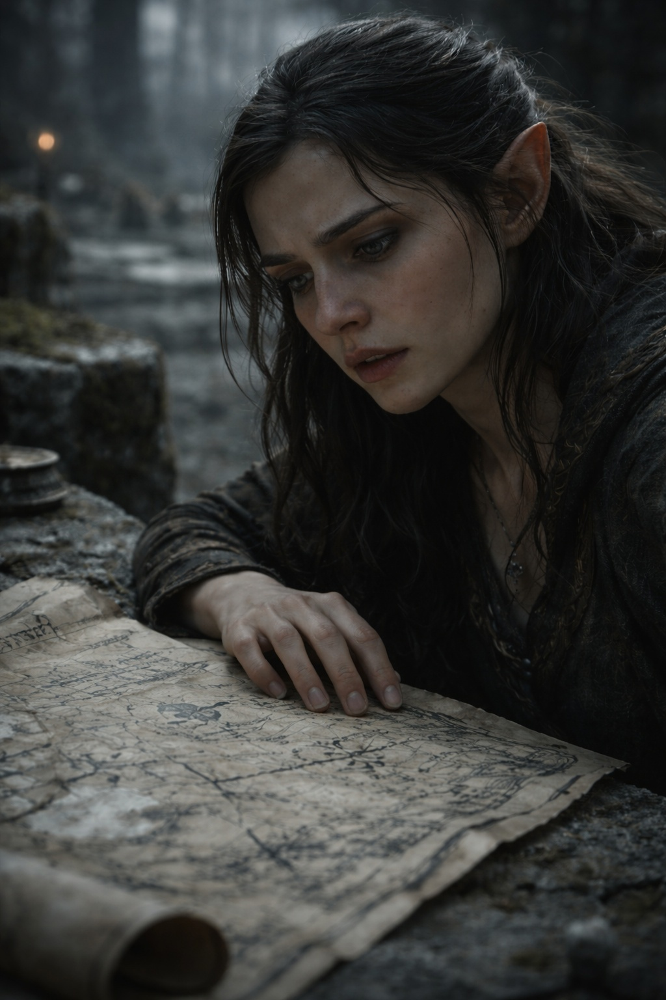

## Lore | Eternal Woods: The Kingdom of Elenoria

---

Faelyn eased a page free of the root pressing through the shelf. Its corner tore despite her care. She carried it to a stone table beneath the trees, where two archivists had spread their books.

She had searched the Aelindril libraries for three months. The histories cited texts older than the current dynasty and its wars with Lumeshire, but none of the catalogued copies was on its shelf.

"You're looking in the wrong section."

She knew Thandril's voice. The senior archivist had put aside his book; his younger colleague kept reading.

"The histories of the First Age are catalogued here," she said.

"The *approved* histories are catalogued there." Thandril rested his fingers on a leather spine. "What you want would be behind the third seal. If we have it."

"I don't have access to the third seal."

"No. You don't."

Sunlight reached the table through the canopy. Faelyn brushed root dust from her page. The catalogue called the library an example of harmony; it did not say who was responsible when the shelves grew through the books.

"Why do you want to know about the border wards?" Thandril asked finally. "The official position is clear. They've held for two thousand years. They will hold for two thousand more."

"The rangers reported anomalies last season."

"Rangers always report anomalies. It's in their nature to see threats."

"Three patrols went into the eastern groves. Two returned." Faelyn closed the book. "They found the third a week later, beside their equipment. No wounds. But none of them could..."

"Answer questions. Yes. I read the report." Thandril's expression did not change. "The Council attributed it to grove sickness."

"There's no mention of grove sickness in any text I can access."

"The condition is rare. The references are... carefully preserved."

Faelyn kept a finger in the catalogue. Beside the report, one ranger had written *poisoned water*. Another blamed a breach in the wards. Thandril had not mentioned either annotation.

---

> *"It is said that in the dawn of the world, the elves were already there, their eyes shining with the light of the divine and their hearts filled with the song of the universe."*

The words came from the oldest hymn, sung at every festival, taught to every child. Faelyn had believed them once. She still wanted to believe them.

She checked the hymn's reference against the catalogue. It led to an empty shelf. The next reference sent her back to the same hymn.

She returned to the southern trade agreements. The merchant names were legible, and someone had supplied every date.

After dark, sounds carried from the restricted shelves. Once she put down her pen, certain she had heard a word. A branch rasped against the wall; she could not hear it again.

The senior archivists never worked after dark.

She began finishing her copies before the lamps were lit.

---

Three weeks later, a patrol reported that trees stood across a path marked clear on its map. The returning rangers argued about whether they had taken the wrong turning.

The Council convened. Faelyn wasn't invited, but she heard the outcome: the maps would be redrawn. The patrols would be reassigned to different routes. The matter was closed.

While filing the replacement, she pulled out the sheets marked *superseded*. Several put the boundary farther east. Others followed a stream omitted from the new map. She could not match their survey dates.

The Council's accompanying note called the changes corrections to earlier surveys.

She looked toward the third seal. The original surveys might be there. So might a catalogue as incomplete as the one on her desk.

She laid the new map over the old ones. On the old sheet, the stream followed a crease in the paper. She kept smoothing it with her thumb, but the crease would not lie flat.

**End of Lore 2 — continues in Lore 2: [Ice and Iron: The Warriors of the Empire of Frostgard](/ice-and-Iron-the-unyielding-warriors-of-the-empire-of-frostgard/)**
