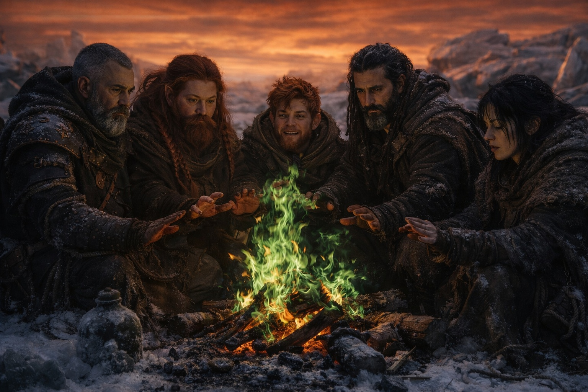

## Chapter 43 | Part 1 | The Aftermath

---

The campfire burned green.

That was the first sign. The thin fire they'd been maintaining against the Frostgard cold, fed with the same fuel they'd been burning for days, turned the color of copper flame without explanation. The wood was the same. The air was the same. The fire was wrong.

Then the water in Balin's canteen turned to ice. Not froze. Turned. One moment liquid, the next solid, without the gradual process of temperature change, without the expansion that should have cracked the leather. The water became ice the way a word becomes another word in translation: instantly, with no intermediate state.

Then the last of Xandor's ward stones crumbled in his hand like wet sand.

Dulint watched it happen. The scholar was holding the stone, the final functional piece of his protective array, turning it over in his fingers with the compulsive attention of a man checking the last asset on a balance sheet he knew was bankrupt. The stone softened. The edges blurred. The crystal matrix that had given the stone its protective properties dissolved, and what remained in Xandor's palm was a handful of powder that the wind took before he could close his fist.

"The field has changed," Xandor said. His voice was the voice of a man whose house was on fire and who was explaining the architectural principles that made the fire possible. "The magical substrate. The foundational layer that all structured applications draw from. It's been restructured by the breach. The resonance patterns are different. The frequencies are shifted. Every enchantment, every ward, every augmentation that was calibrated to the old field is now operating in an environment it wasn't designed for."

"In language the rest of us speak," Aldric said. He was holding his cold sword, turning it the way Xandor had turned the ward stone, looking for the property that had been there yesterday and was gone today.

"Everything magical is broken. Not destroyed. Misaligned. The world's magic is speaking a different language now, and nothing we built was built to understand it."

The green fire cast strange shadows. The ice in the canteen did not melt. The wind carried the ward stone dust into the new sky and the new sky swallowed it without comment.

Dulint inventoried the damage.

The wards: gone. All of them. Every protective circle Xandor had maintained since they left Zuraldi, every chalk line and crystal anchor and scholarly intention, crumbled or failed or simply ceased to function. The protective theory they had relied on was written in the old field's language, and the old field was gone.

Balin's staff: split. The augmentation dead. The wood was still wood, still useful as a walking stick, but the minor strengthening that had made it weapon-grade was absent. Balin had bound the two halves together with leather cord. The binding held. The magic did not.

Aldric's sword: functional as steel. The forge-resonance that had given it its edge, the trace of the smith's intent that made it better than ordinary metal, had evacuated with the field change. It would cut. It would not cut like it had.

The terrain was wrong. Not dramatically. Subtly. The angle of the ridge behind them had shifted by a degree that Dulint's surveyor's eye caught and his vocabulary could not describe. The ice formations to the west had changed pattern overnight, the crystals growing in configurations that didn't correspond to any temperature or wind condition he recognized. A bird he'd seen every morning since they entered this latitude was flying in the wrong direction. Not migrating. Confused. The navigational magnetic field it relied on had been disrupted by the same event that disrupted everything else.

Maris had not moved.

She lay where Balin had placed her, wrapped in cloaks, her breathing shallow and steady, her eyes closed, her body present and her consciousness absent. The blood on her face had been cleaned. The bruising beneath her eyes had darkened. Balin checked her pulse every fifteen minutes with the mechanical regularity of someone performing a task because the task was the only thing preventing the feeling that was waiting behind the task.

"She's stable," he said each time. Not to inform. To confirm. Repetition as ritual, the way a man counts his steps on a long march not because the number matters but because the counting proves the march continues.

The grey cloaks were gone.

Dulint had noticed within the first hour. The figures who had been watching from a league south, who had been present and visible and unmoving for days, had disappeared. Not fled. Not retreated. The ground where they had stood was empty, the snow undisturbed, as if they had been removed from the landscape the way the ward stones had been removed from Xandor's hands: completely, without residue.

"They knew," Aldric said. He was scanning the southern approach with the focused attention of a man whose primary threat had just vanished and who understood that vanished threats were more dangerous than visible ones. "They knew what was coming and they left before it arrived."

"Or they were recalled," Xandor said. "If the grey cloaks serve the same system the Beacon served, and that system has been disrupted..."

He didn't finish. The implication was clear. The grey cloaks were components. The system they belonged to had changed. The components had been withdrawn, reprocessed, or simply ceased to function in their current form.

Dulint looked at the sky. The amber-rust color had settled. Not deepening, not spreading, not changing. Settled. The permanent condition of a sky that had been rewritten by an event that could not be undone. Clouds moved through it in patterns that didn't correspond to wind. The light that reached the ground was filtered through the contamination, and the filtering gave everything a tone that made the familiar look foreign.

The world after the breach. Magic unstable. Terrain shifted. Guardians vanished. Equipment degraded. One of them unconscious. The mission that had brought them across a continent concluded by the event they had tried to prevent.

Dulint built the fire back up. The green flames accepted the wood the way they had accepted wood before, burning with the same heat, providing the same warmth. The color was the only thing wrong. The color and everything else.

---

**End of Chapter 43.1 —> 45.2: [The Things That Follow: The Factions](/the-things-that-follow-the-factions/)**