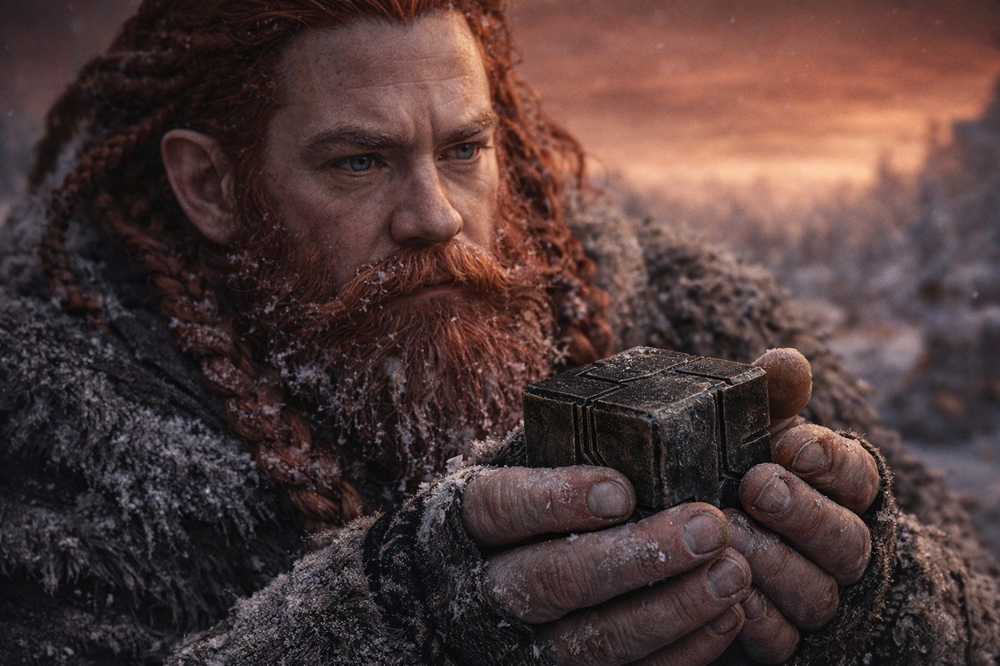
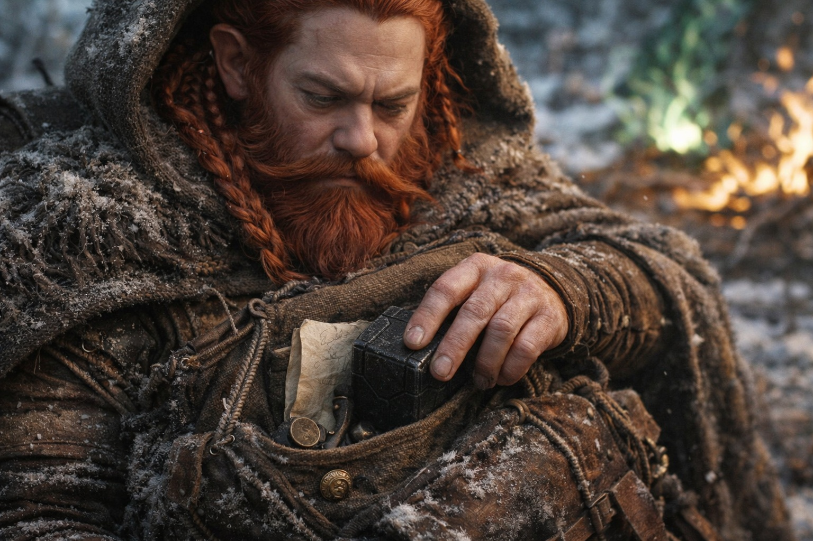

---
order: 327
title: "After the Light: The Cold Stone"
description: "It felt like burying something."
date: 2024-11-09
language: en
chapter: 43
subchapter: 2
storyline: west
canon_phase: main
canon_sequence: W-043-002
narrative_weight: medium
category: Frostgard
author: Dulint
type: Main
tags: ['#after the light', '#dulint', '#frostgard']
thumbnail: image.jpg
featured: false
counterpart_path: site/content/posts/es/frostgard/despues-de-la-luz-la-piedra-fria/index.mdx
counterpart_title: "Después de la Luz: La Piedra Fría"
---

# Chapter 43.2 | After the Light: The Cold Stone

---

Dulint took the Beacon from his belt pouch at dawn, though dawn was a word that no longer described what happened at the horizon. The light came, but it came through the amber-rust, and the result was a morning that looked like a bruise healing in the wrong direction.

The stone sat in his palm. Cold. The kind of cold that objects have when they have been cold for a long time and have no memory of warmth.

He held it the way he had held it every morning since they left the coast. Turned it. Checked for the pulse that used to live in the crystal matrix, the faint warmth that meant the Nexus system was operational and the Beacon was connected to the network it was part of. The warmth had been subtle. He had not appreciated how much he relied on it until it was gone, which was the way things worked with subtle warmth.

Nothing. No warmth. No pulse. No faint directional pressure that said *north* or *closer* or *he's still moving*. The Beacon was a stone in a dwarf's hand, and the hand was cold, and the stone was colder.

"Xandor."

The scholar came. He had not slept. His eyes had the particular quality of a man who had spent the night trying to understand something that resisted understanding, and who had succeeded only in understanding how much he did not understand.

"Let me see it."

Dulint handed over the Beacon. Xandor held it up to the amber-rust light, turned it, pressed his thumb against the primary interface facet where a ward-calibrated touch used to produce a response. Nothing. He closed his eyes and tried to push his awareness into the stone the way he had done with his wards, the diagnostic technique that let a trained mage read the state of a magical instrument.

His wards were dead. His diagnostic technique found nothing to push against. He was a locksmith trying to pick a lock with fingers that had gone numb.

"The crystal matrix is intact," he said. "Physically, the Beacon is undamaged. The housing, the facets, the interface surfaces. All present. All functional in terms of structure."

"But."

"But the system it connected to doesn't exist anymore. Not in the way it needs to." Xandor turned the stone once more. "The Beacon was a node in a network. The network ran through the barrier, through the Nexus system, through whatever infrastructure the Drow maintained beneath the surface of the world. That infrastructure is disrupted. Not destroyed, perhaps. Disrupted. The Beacon is trying to connect to something that no longer answers."

"Trying."

"In the way that a compass tries to find north when north has moved. The mechanism still functions. The thing it was calibrated to find has changed position, or nature, or both."

Dulint looked at the stone. He thought about the first time it had pulsed in his hand, back at the coast, when the direction had been clear and the mission had been simple and the world had been organized in a way that included a functional barrier and a stable sky and magic that worked the way magic was supposed to work.

"Is there any chance it comes back?"

Xandor was quiet for a long time. The green fire crackled behind them. Balin sat beside it, his staff across his knees, the split running through the heartwood visible in the morning light. The staff that had carried generations of accumulated prayer was two pieces held together by binding and habit. Aldric stood at the perimeter, his cold sword sheathed, watching nothing approach from every direction.

"The Beacon was calibrated to a specific system state," Xandor said. "The system state has changed. For the Beacon to function again, the system would need to return to its previous configuration. The barrier would need to be intact. The Nexus would need to be operational. The infrastructure would need to be restored." He paused. "A thousand years of Drow maintenance kept that system running. The maintenance is gone. The maintainers are gone. The system is not coming back, Dulint. Not in our lifetime. Not in anyone's."

Dulint took the Beacon back. Held it. The weight was the same. The shape was the same. The cold was different. Before, the cold had been the cold of a stone that would warm when it found what it was looking for. Now the cold was the cold of a stone that had stopped looking.

He thought about putting it back in his belt pouch. The pouch he had checked every morning, adjusted every evening, protected through every terrain and threat and league of frozen Frostgard. The pouch that had held the purpose of their expedition the way a reliquary holds a bone.

Instead, he opened his pack. Found the inner pocket where he kept the things that mattered but were not needed for immediate survival. A letter from his cousin in Stonehold. A piece of iron from the first mine he had worked. A brass button from his father's coat.

He put the Beacon beside them.

The weight settled into the pack. He closed the pocket. He did not look at Xandor because looking at Xandor would mean acknowledging what both of them already knew, and acknowledging it would make it a fact instead of a condition, and Dulint preferred to give facts a few hours to see if they planned to stay facts before he treated them as permanent.

Balin watched from the fire. His hands on the split staff, holding the two halves together the way a man holds the pieces of a broken promise. He had not spoken since the staff cracked. Prayer required a conduit. The conduit was damaged. The connection between a priest and his faith was not the same thing as the connection between a priest and the instrument that carried his faith, but in practice the distinction was narrower than theology suggested.

"The staff?" Dulint asked.

Balin looked at the split heartwood. "It holds. Barely. The binding I did last night keeps the halves aligned, but the resonance is gone. The accumulated weight of prayers, the generations of use that gave the wood its authority. That weight required a magical field that is no longer stable." He ran his thumb along the crack. "I can still pray. The prayer goes somewhere. I am less certain that somewhere is where it used to go."

Dulint nodded. He did not ask about Aldric's sword. He had seen Aldric draw it twice during the night watch, testing, and both times the blade had come out cold. The forge-resonance that had made it more than steel was gone the way Xandor's wards were gone and Balin's staff-weight was gone and the Beacon's pulse was gone. The world had changed and the instruments that measured the old world were calibrated to measurements that no longer applied.

He went to check Maris.

She lay where they had arranged her, wrapped in every spare cloak, her head on a folded blanket, her breathing shallow but regular. The bruising beneath her eyes had darkened overnight. Her skin was pale in a way that had nothing to do with the cold and everything to do with what the connection had cost her. Blood had been cleaned from her face, her ears, her left eye. The cleaning was Balin's work, careful and thorough, the work of a man who could not heal with magic but could still heal with cloth and water and attention.

She had not moved. Not once. Not a twitch, not a murmur, not the small shifts that sleeping people make when their bodies adjust to the ground. She was present the way a person in deep water is present: somewhere, but not at the surface.

"Still the same," Aldric said from the perimeter. He had been watching. Of course he had.

Dulint adjusted the cloak around her shoulders. Checked her pulse at the wrist. Steady. Slow. The pulse of a body that was conserving everything it had because it was not sure how much it would need.

He sat back on his heels. Five people on frozen ground under an amber-rust sky beside a green fire with a dead Beacon in a pack and a cracked staff and a cold sword and a crumbled set of wards and a seer who would not wake.

He had been a miner. He understood cave-ins. The moment after the collapse, when the dust was settling and the air was bad and the darkness was complete, and the first thing you did was not panic and the second thing you did was count heads and the third thing you did was find out how much air you had.

The first thing: done. No one was panicking. They were past panic. Panic required the belief that the situation might be temporary, and no one here believed that.

The second thing: done. Five heads. All present.

The third thing. How much air.

Dulint looked at the sky, the wrong color that Xandor said was not going away. He looked at the fire, the green that should have been orange. He looked at the terrain, the frozen expanse of Frostgard that they had crossed for weeks with a Beacon that told them where to go and a mission that told them why.

The Beacon was dead. The mission was over. The where and the why were both gone, and what remained was a dwarf on frozen ground with four companions and the oldest question in the world.

What now.

---

**End of Chapter 43.2 — continues in Chapter 43.3: [After the Light: The Decision](/after-the-light-the-decision/)**

