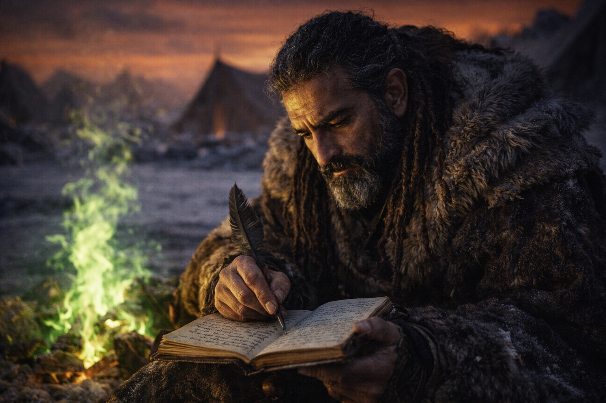
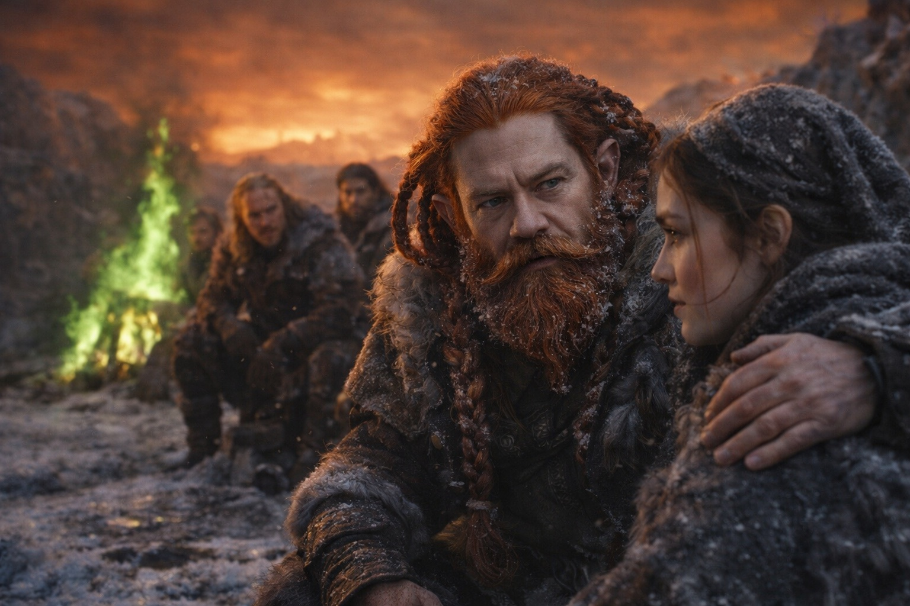
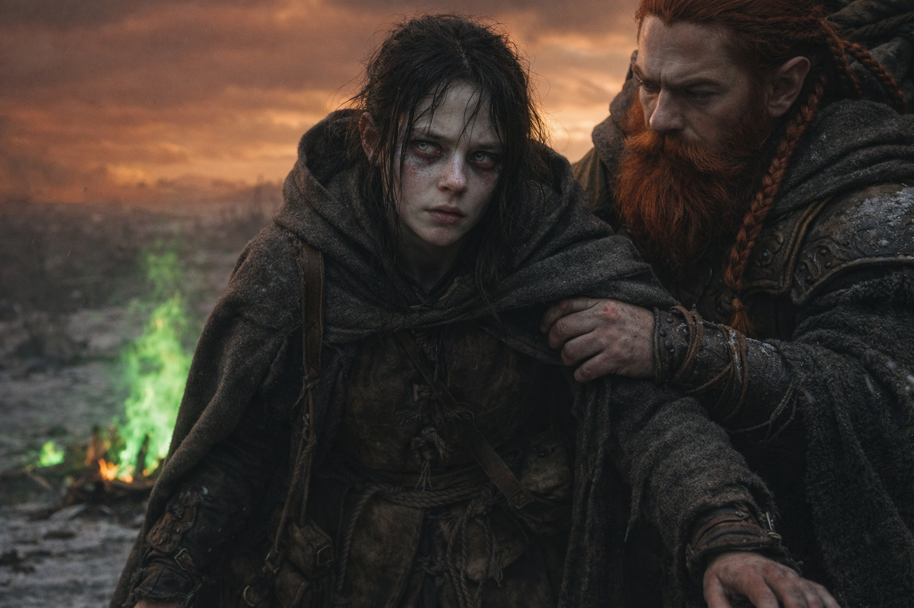
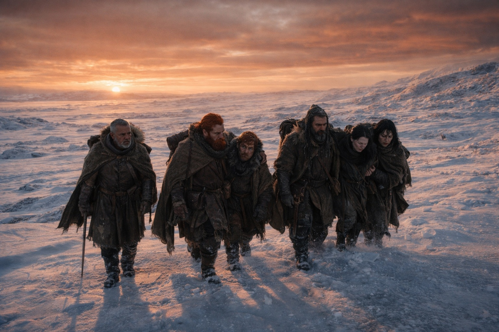

---
order: 328
title: "After the Light: The Decision"
description: "That color isn't going away."
date: 2024-11-10
language: en
chapter: 43
subchapter: 3
storyline: west
canon_phase: main
canon_sequence: W-043-003
narrative_weight: high
category: Frostgard
author: Dulint
type: Main
tags: ['#after the light', '#dulint', '#frostgard', '#maris']
thumbnail: image.jpg
featured: false
counterpart_path: site/content/posts/es/frostgard/despues-de-la-luz-la-decision/index.mdx
counterpart_title: "Después de la Luz: La Decisión"
---

## Chapter 43 | Part 3 | The Decision

---

They ate because bodies require fuel regardless of what has happened to the world. The rations tasted the same, which was a small mercy that Dulint noted and filed alongside the other inventories he was keeping: the list of what still worked, the list of what had broken, the list of things he was not yet sure about.

Aldric ate standing. He had not sat since the light. His eyes moved across the frozen terrain in patterns that Dulint recognized from soldiers who had fought in places where the enemy could come from any direction, the constant scan that was not alertness but the body's refusal to believe that danger had ended just because the visible threat had disappeared.

"The grey cloaks are gone," Aldric said. It was the third time he had said it. "Nothing south. Nothing east. The terrain where they stood shows no trace."

"You've mentioned."

"I'll mention it again when it stops being wrong." He chewed his ration. "Things don't vanish. People don't vanish. Even the dead leave a body. These left nothing. Not a footprint, not a thread, not a depression in the snow where weight stood for days."

Dulint did not argue. Aldric was right that it was wrong, and being right about wrongness was all any of them had at the moment.

Xandor had his journal open. He had been writing since before dawn, the scratching of his pen a sound that Dulint found oddly comforting because it meant that someone was recording this, that the chaos was being converted into language, that when they returned there would be a document and not just the testimony of five people who had seen impossible things.

"The magical field is destabilized in a radius that extends beyond my ability to measure," Xandor said without looking up. "The contamination is not local. Whatever leaked through the barrier is atmospheric. It will spread. It may have already spread farther than we can see."

"How far?"

"Everywhere." The pen stopped. "I mean that literally. The barrier was a continental-scale system. Its disruption will be felt at continental scale. The magic instability we're experiencing here will reach Stonehold, Zuraldi, Lumeshire. Every enchantment, every ward, every magical infrastructure built on the assumption of a stable magical field. All of it is now operating in an environment it was not calibrated for."

The green fire crackled. Dulint fed it another stick. The flames stayed green.

"How long before people notice?"

"Weeks for the obvious effects. The powerful enchantments, the civic wards, the healing circles. They'll degrade first because they draw the most from the field. Months for the subtle effects. Years before the full scope is understood." Xandor looked at the amber-rust sky. "The sky, they'll notice immediately. Every settlement with a clear line of sight to the northern horizon will see this. They won't know what it means. But they'll see it."

Balin spoke from the fire. "The temples will feel it." His hands on the split staff. "Not the faith. The instruments. Every consecrated space uses the magical field as a foundation. Not because faith requires magic, but because the rituals that carry faith were built during a time when magic was stable. The rituals will begin to fail. The priests will think they've lost their connection to the divine. They haven't. They've lost the mechanism that carried the connection, and they will not understand the difference."

The silence after that was the kind that follows a statement no one wants to be the first to respond to.

Maris made a sound.

Small. A breath that caught on something, the intake that happens when a sleeping body begins to surface and finds that the surface is not where it remembers. Dulint was beside her in two steps, crouching, his hand on her shoulder, the weight of the hand saying *here, present, ground* in the language that bodies understood when words were too much.

Her eyes opened.

Bloodshot. Both of them, the capillaries burst in patterns that made the whites look like fractured glass. And the irises. Dulint had known Maris's eyes for weeks, the warm brown that went focused and distant when the visions came, the color that her father probably shared and her mother probably loved. The brown was lighter now. Not a different color. The same color with something removed. As if the visions had bleached something out of the pigment, the way sun bleaches cloth that has been left out too long.

"Maris." His voice was careful. The voice he used with miners who had been trapped underground and brought back into light.

She blinked. The blink was slow, labored, the effort of eyes that had been closed for a long time and were not certain they wanted to open again.

"He's alive," she said.

Her voice was a thread. Thin and frayed and carrying weight it was not built to carry.

"He's alive. Somewhere. Barely."

Dulint looked at Xandor. Xandor looked at Balin. Balin looked at the fire.

"Can you find him?" Dulint asked.

Maris was quiet for a long time. Her eyes moved, tracking something none of them could see, the internal landscape that seers navigated when they were trying to locate a connection that used to be a road and was now a path and might now be less than that.

"Not anymore." The words came slow. Each one weighed and tested before release. "The connection is different now. It's not gone. But it's not what it was. The thread that the Beacon calibrated is still there, but the Beacon is dead and the calibration is dead and what's left is raw and unfiltered and I can't control it the way I could when the system was intact."

She tried to sit up. The effort cost her something visible. Dulint's hand stayed on her shoulder, steadying.

"Everything is different now," she said. She looked at the sky. The amber-rust that had settled like a permanent bruise over everything they could see. "That color isn't going away, is it."

"No," Dulint said. "I don't think it is."

She looked at each of them. Aldric at the perimeter with his cold sword. Xandor with his journal. Balin with his split staff. Dulint with his hand on her shoulder and his pack on the ground and the Beacon buried in the inner pocket beside the letter and the iron and the button.

"What are we doing?" she asked.

The question sat among them like a stone placed on a table. Dulint had been waiting for it because the question was his to answer. Not because he was the leader in a formal sense but because he was the one who had been given the Beacon and the mission and the responsibility, and the Beacon was dead and the mission was over but the responsibility did not die with the things that created it. Responsibility survived its context. That was what made it responsibility and not assignment.

"We go home," he said. "We travel south. We find the nearest settlement. We tell them what happened. We tell everyone who will listen what happened, what we saw, what the sky means, what the magic instability means, what is coming."

Aldric turned from the perimeter. "Home may not be what it was."

"No."

"The enchantments that protect the cities. The wards around the settlements. The magical infrastructure that holds everything together. If Xandor is right and the destabilization is continental, then what we go back to will be different from what we left."

"Yes."

"Then why go back?"

Dulint looked at the warrior. The question was honest, not hostile. Aldric was a man who needed to know the reason before he walked, and the question deserved an honest answer.

"Because they don't know. Stonehold doesn't know. Zuraldi doesn't know. Lumeshire, the coast towns, the border settlements, the mining camps, the farming villages, all of them are waking up to a sky they can't explain and magic that doesn't work right and they don't know why. We know why. We were here. We saw it. We have Xandor's records and Maris's testimony and the dead Beacon and the split staff and the cold sword and all of it says the same thing, and the thing it says is something that every person in every settlement needs to hear so they can prepare for what's coming."

"What's coming?" Balin asked from the fire.

Dulint shook his head. "I don't know. I know the barrier is damaged. I know the entity leaked through as a condition, not a creature. I know the magical field is destabilized. I know the sky is wrong and the fire burns green and the water freezes when it shouldn't and the terrain shifts when you're not looking. Beyond that, I don't know. But I know enough to say that people need to be warned, and I know enough to say that we're the ones who can warn them, and I know enough to say that sitting here waiting for the world to explain itself is not something any of us is built for."

Maris reached for Dulint's hand. Her grip was weak, the strength of someone who had been pulled from deep water and was still learning that air was available again.

"He counted," she said. Quiet. Almost to herself. "At the end. After everything. He counted. One, two, three, four. I felt it through the thread, the last thing before the connection changed. He was still counting."

Dulint did not know what that meant. He filed it with the other things he did not understand, in the inventory that grew longer every hour, the list that would take years to sort through and might never be complete.

"South," he said. "We pack what we have. We carry what we can. We walk."

No one argued. Aldric sheathed his cold sword. Xandor closed his journal. Balin wrapped his split staff in cloth, protecting the binding. Maris, with help, got to her feet. She swayed. Dulint's hand steadied her. She stayed standing.

Five people on frozen ground under an amber-rust sky, facing south, facing home, facing whatever the world had become while they were watching the end of the world it used to be.

They walked.

---

**End of Chapter 43 —> 44.1: [Ash and Silence](/ash-and-silence-the-body/)**

