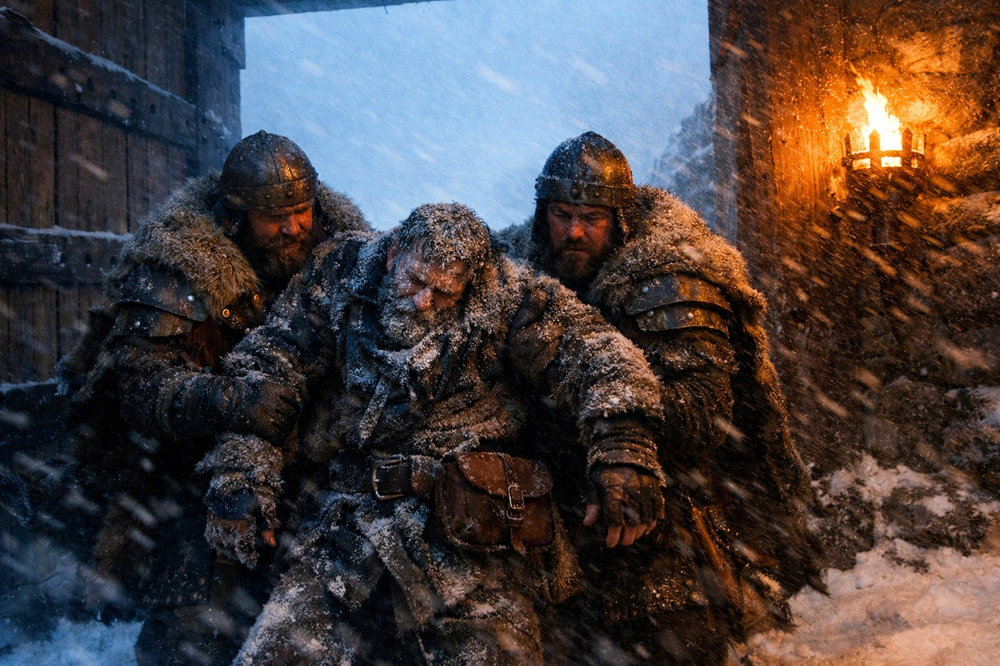
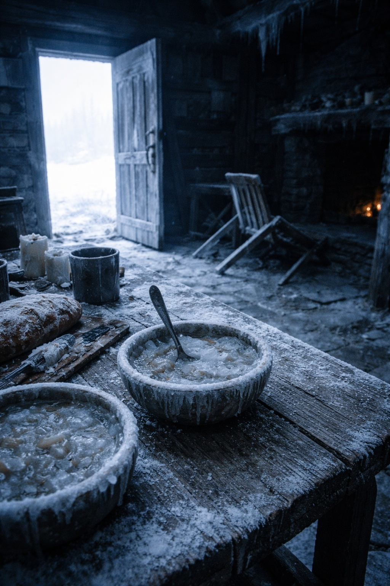

## Lore | Ice and Iron: The Warriors of the Empire of Frostgard

--- 

The messenger's lips had turned blue by the time he reached Jotunheim's gates.

Warden Thorvald watched as two guardsmen carried the man inside, his furs stiff with ice, his beard a frozen mask. The message pouch still hung from his belt. Whatever news it carried had been important enough to ride through a three-day blizzard.

"From the southern passes," one of the guardsmen said. "Found him a quarter mile out. Horse died under him."

Thorvald took the pouch. The seal was Lumeshirean—the golden sun that never quite warmed anything this far north. He cracked it open and read by torchlight.

*Regarding the matter of northern trade agreements and mutual defense considerations...*

He stopped reading. The usual diplomatic language. The same phrases they'd sent last season, and the season before. Requests dressed as offers. Demands wearing the clothes of friendship.

He folded the letter and handed it to his adjutant.

"File it with the others."

"The High King will want to see—"

"The High King has seen a hundred letters like this one." Thorvald watched the healers carry the messenger toward the warming hall. "And a hundred messengers who nearly died bringing them."

In the great hall, the skalds were singing of the Jotun. The old songs—the ones that claimed the first Frostgardians were carved from glaciers, their hearts hard as the frozen north. Thorvald had heard the songs since childhood. He'd believed them once.

Now he watched young warriors listen with shining eyes, and he wondered how many of them would survive their first real winter patrol.

"The giants moved again," said Ingrid, his second. She appeared at his elbow with a rolled map. "Three sightings near the Broken Teeth. Tracks suggest at least two distinct groups."

"Moving south?"

"Moving. Direction unclear." She spread the map on a side table. "The scouts disagree. Halvard claims they're migrating. Sven insists they're massing."

"And what do you think?"

Ingrid was quiet for a moment. "I think giants don't explain their movements to us. We watch. We guess. Sometimes we guess right."

Thorvald appreciated her honesty. Too many of the younger officers spoke with certainty about things they couldn't possibly know. The north had a way of punishing certainty.

---

A week later, another messenger arrived. This one from the eastern settlements. A village called Frosthollow had gone silent. The monthly supply caravan had found empty houses, cold hearths, no bodies.

"Blizzard?" Thorvald asked.

"No major storms in that region." The messenger was young, trying not to show fear. "The strangest thing—food was still on some tables. Frozen solid, but there. Like everyone just... left."

"Or was taken."

The messenger said nothing. Some things were easier not to name.

Thorvald sent a patrol. Three weeks later, only two of the six returned. They spoke of tracks in the snow—massive, inhuman—and of sounds in the night that didn't match any creature they knew. One of them had stopped speaking entirely by the time they reached Jotunheim.

The report was filed. Officially, Frosthollow was listed as *abandoned due to harsh conditions*. The actual findings were sealed in the Warden's archive, where they joined a growing collection of things the people weren't told.

---

> *"The weak do not survive in Frostgard—only the strong, the cunning, and the tenacious."*

Thorvald used to recite that phrase with pride. Now it felt less like wisdom and more like an excuse. The strong survived. But what about the settlements that went silent? Had they been weak, or simply unlucky?

The songs never mentioned luck.

That evening, another diplomatic pouch arrived from Lumeshire. This one carried a different seal—military, not trade. Thorvald read it twice, then burned it.

Some offers were better left unanswered.

Spring would come eventually. The passes would clear. And then they'd learn whether Lumeshire's patience had limits. Until then, Frostgard would do what it had always done: watch the snow, count the missing, and pretend the songs were true.

The wind howled outside the great hall. Inside, the skalds kept singing of glory.

Thorvald poured himself another drink and tried not to count the empty seats.

**End of Lore 2 — continues in Lore 2: [The Unruly Might of the Grukmar Tribes](/the-unruly-might-of-the-grukmar-tribes/)**