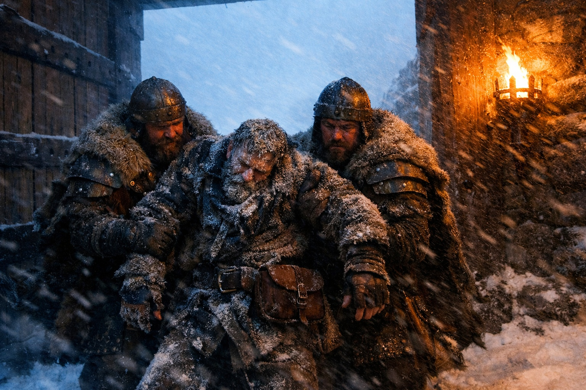
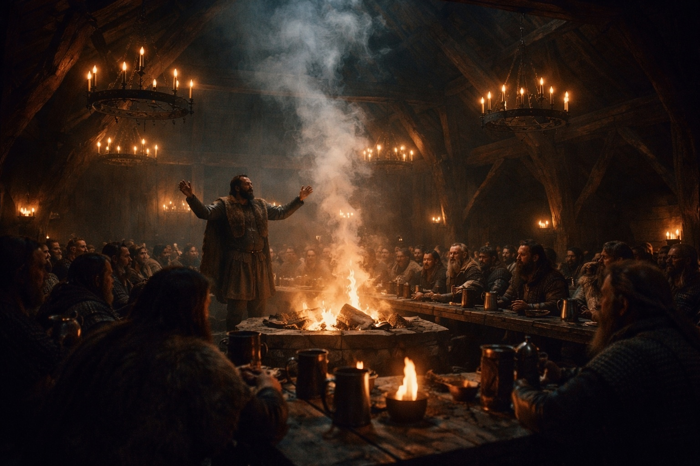
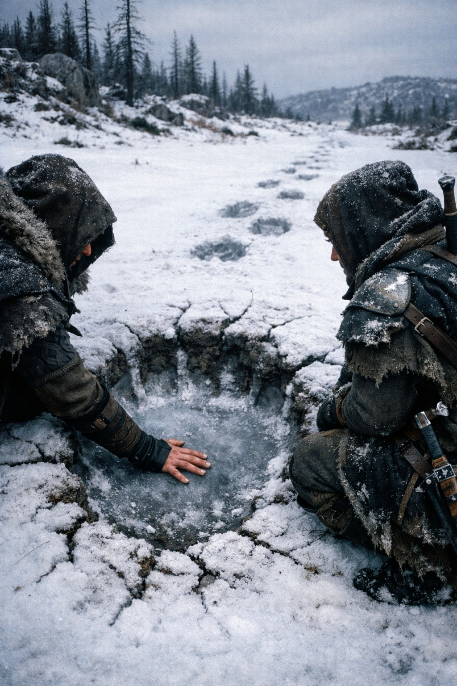

## Lore | Ice and Iron: The Warriors of the Empire of Frostgard

---

The messenger's lips had turned blue by the time he reached Jotunheim's gates.

Warden Thorvald watched as two guardsmen carried the man inside, his furs stiff with ice, his beard a frozen mask. The message pouch still hung from his belt. Whatever news it carried had been important enough to ride through a three-day blizzard.

"From the southern passes," one of the guardsmen said. "Found him a quarter league out. Horse died under him."

Thorvald took the pouch. The seal was Lumeshirean—the golden sun that never quite warmed anything this far north. He cracked it open and read by torchlight.

*Regarding the matter of northern trade agreements and mutual defense considerations...*

He stopped at the request for passage through the southern gates. The heading still called it a mutual defense agreement. He checked the signature against the last letter: the same envoy.

He folded the letter and handed it to his adjutant.

"File it with the others."

"The High King will want to see—"

"The High King has seen a hundred letters like this one." Thorvald watched the healers carry the messenger toward the warming hall. "And a hundred messengers who nearly died bringing them."

In the great hall, the skalds were singing of the Jotun. The old verse claimed the first Frostgardians had been carved from glaciers. Thorvald remembered singing it with his brothers before any of them was old enough to hold a watch.

Now he watched young warriors listen with shining eyes, and he wondered how many of them would survive their first real winter patrol.

"The giants moved again," said Ingrid, his second. She appeared at his elbow with a rolled map. "Three sightings near the Broken Teeth. Tracks suggest at least two distinct groups."

"Moving south?"

"Moving. Direction unclear." She spread the map on a side table. "The scouts disagree. Halvard claims they're migrating. Sven insists they're massing."

"And what do you think?"

Ingrid tapped two marks on the map. "Halvard saw tracks. Sven saw the giants. Neither was there when they moved. I need another sighting."

Thorvald moved his cup off the map so she could lay the scouts' routes side by side.

---

A week later, a messenger from the eastern settlements came into the hall shedding snow from his cloak. The supply caravan had found Frosthollow empty. He had a list of the houses they had searched, but no names of survivors.

"Blizzard?" Thorvald asked.

"No major storms in that region." The messenger was young, trying not to show fear. "The strangest thing—food was still on some tables. Frozen solid, but there. Like everyone just... left."

"Or was taken."

The messenger worked a damp glove between his hands.

Thorvald sent six men. Only two returned three weeks later. One described huge tracks beyond the houses and sounds he could not identify. The other shook his head when asked about the tracks, then would say nothing at all.

The report was filed. Officially, Frosthollow was listed as *abandoned due to harsh conditions*. The actual findings were sealed in the Warden's archive, where they joined a growing collection of things the people weren't told.

---

> *"Frostgard keeps only those who can endure."*

Thorvald heard the line from his seat beside the hearth. He had chosen the six men himself. All six had wintered on the border before.

Another pouch from Lumeshire arrived that evening, bearing a military seal. Thorvald read the letter twice, then held it in the hearth until the flame reached his fingers.

He dropped the last scrap among the coals. The adjutant waited with a sheet for the reply; Thorvald waved him away.

When the passes cleared, another envoy might come to ask for an answer. Thorvald set the empty pouch beside the reports from Frosthollow. He had no answer for those either.

The wind howled outside the great hall. Inside, the skalds kept singing of glory.

Thorvald poured himself another drink and tried not to count the empty seats.

**End of Lore 2 — continues in Lore 2: [The Unruly Might of the Grukmar Tribes](/clash-of-clans-the-unruly-might-of-the-grukmar-tribes/)**
