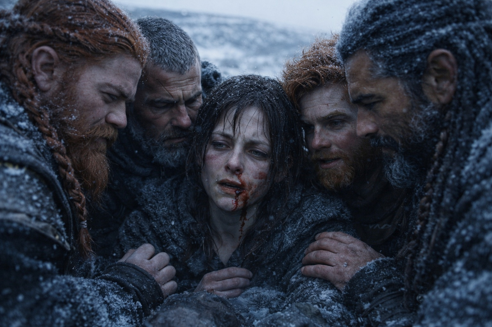
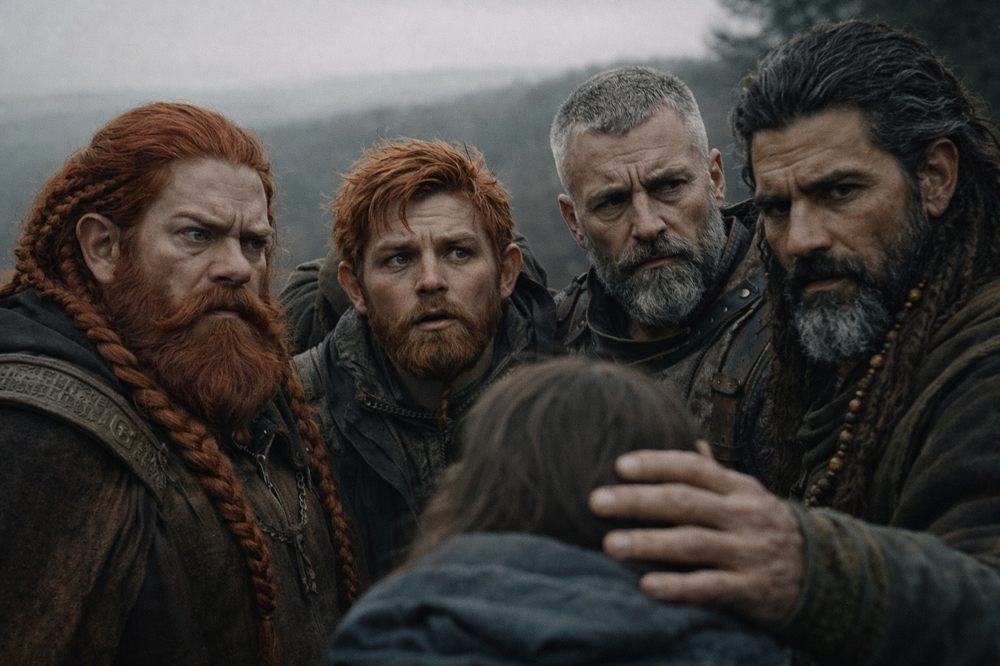
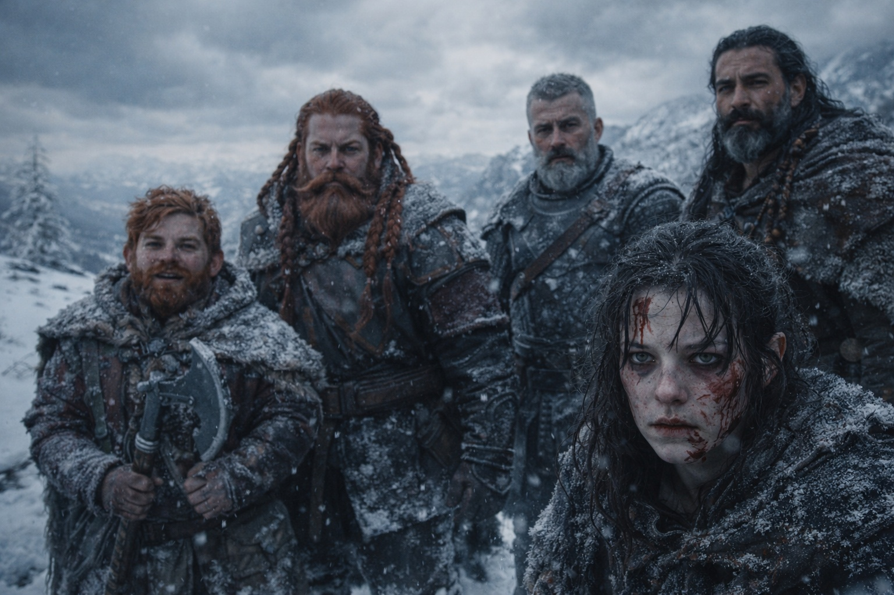

## Chapter 24 | Part 5 | The Aftermath

---

Blood ran from her nostrils and left ear. A thin red line reached down from the corner of her eye.

Her throat gave out. She tried to speak and managed only a rasp. Her hands shook, her left leg was numb from the hip down, and she could not lift her head without sharp pain at the base of her skull.

Xandor was speaking. She couldn't hear the words. Her ears were full of a high, thin ringing that erased the lower frequencies, leaving only its own monotone. She watched his mouth move and understood, from the shapes, that he was asking if she could hear him.

She nodded. The motion sent the world lurching sideways.

"Don't move." His voice arrived belatedly, filtered through the ringing, tinny and distant. "You're bleeding from places that shouldn't bleed. Stay still."

Dulint's face appeared above her. The dwarf looked like he'd aged a decade in the minutes she'd been gone. His jaw was clenched so hard the muscles stood out in cords along his neck. Behind him, Balin stood with his sword drawn, pointed at nothing, the reflex of a young man who'd heard his friend screaming and reached for the only tool he had.

"Sheathe it, lad." Eldric, calm as stone. "There's nothing to cut."

Balin didn't sheathe it. His hands were shaking too.

Xandor pressed a fresh cloth beneath her nose. The bleeding had slowed but hadn't stopped, a steady seep that turned the fabric pink and then red and then dark. He tilted her head, checked her ear, wiped the blood trail from her cheek with a gentleness that didn't match the rigid set of his shoulders.

"How long?" she managed. Her voice sounded like it belonged to someone who'd spent a week shouting into wind.

"Seven minutes," Eldric said. "You seized for the first three. Went rigid for two. Then you screamed for the last two."

Seven minutes. More than twice as long as the previous vision. She held on to the number while she waited for the ringing to ease.

"Water," she said, and Balin was there before the word finished, pressing a waterskin to her lips. She drank and tasted copper underneath the cold.

They gave her ten minutes. She used five of them lying still, letting the ringing fade, letting her hands slow their trembling from violent to merely persistent. Then she pushed herself to sitting. Xandor tried to stop her. She pushed past his hands with a stubbornness that was less about strength and more about the need to deliver what she'd seen before the details started to erode.

"I saw him."

All four of them turned toward her.

"The drowning man. I saw him clearly. I was inside his body. I felt what he felt." She wiped her upper lip. "Blue-ash skin, white hair, pointed ears. The dark elf Xandor described. He looked younger than Balin."

Balin flinched.

"He was in a chamber inside the volcano. There was something there. I couldn't see it, but he could feel it, and so could I." She pressed a hand against her chest. "He held on to the wall. His nose bled. I thought he was going to fall."

"Why?" Eldric asked. The soldier's question, practical, economical.

"I don't know. He wanted to get away, but he stayed. I could feel how much that cost him."

Dulint crouched beside her. "The Beacon. You said something before, during the convulsions. You said the word *inside.*"

She looked at him. Then at the pack. The Beacon had gone quiet since the vision broke, its usual pulse dampened to a faint, exhausted flicker.

"There's something near his chest that answers the Beacon."

Silence.

"I felt it from inside him. I couldn't tell whether he was carrying it or whether it was part of him. The rhythm matched ours."

"What kept you from speaking to him?" Xandor leaned closer.

"I could feel him, but he could barely hear me. Something was stopping us." She pressed her palm against her forehead. "I think the Beacon may be pointing toward a place where we can get through."

"A way through," Xandor said. "Through a barrier between worlds?"

"I don't know if that's what it is. I know I could feel him through it, but I couldn't make him hear me."

Eldric walked three paces and stopped. "So we follow the Beacon to this gap. And beyond it there may be someone carrying another piece."

"Yes."

"And whatever is in that chamber can reach him."

Maris closed her eyes. She remembered him holding out his hand despite the pain.

"I think it's changing him," she said. "I don't know into what. I could feel something answer inside him when the pressure rose."

"Does he know?"

"I couldn't tell. He was trying to stay on his feet."

Wind moved through the frozen branches. The Beacon gave off a faint light inside Dulint's pack.

"There's one more thing," Maris said.

They waited.

"He saw me. At the end. He looked right at me and he knew I was there. He tried to speak." Her voice cracked. She let it crack. There was no clinical distance left to hide behind. "He asked who I was. I tried to answer. I couldn't get through. But he knows, now, that someone is on the other side."

Balin still held his sword. Maris looked at him until he lowered it, then turned to Dulint.

"He's real. And whatever connects him to the Beacon is hurting him." She sat straighter despite the pain. "We need to find a way through."

Dulint looked at Eldric. Eldric looked at Xandor. Xandor looked at Maris, who was bleeding from her ear and her nose and the corner of her eye, who had just endured seven minutes inside someone else's agony, and who was already planning to do it again.

"North," Dulint said. It wasn't a question.

"North," Maris confirmed. "And faster than we've been going."

The Beacon pulsed once, faintly. Whether it agreed or simply had nothing left, Maris no longer cared to ask.

She kept her eyes on Dulint.

---

**End of Chapter 24.5 —> 25.1: [The Approach: Beyond the Crystal Fields](/the-approach-beyond-the-crystal-fields/)**

