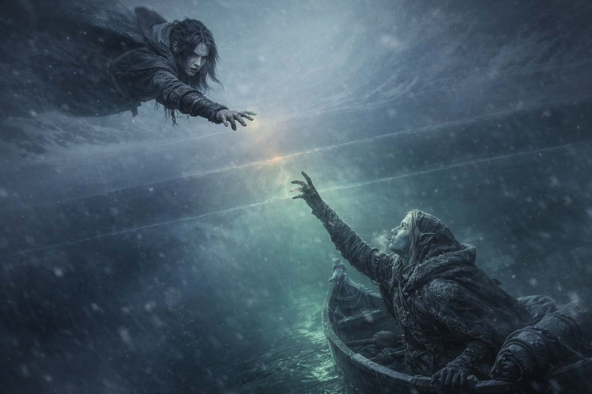
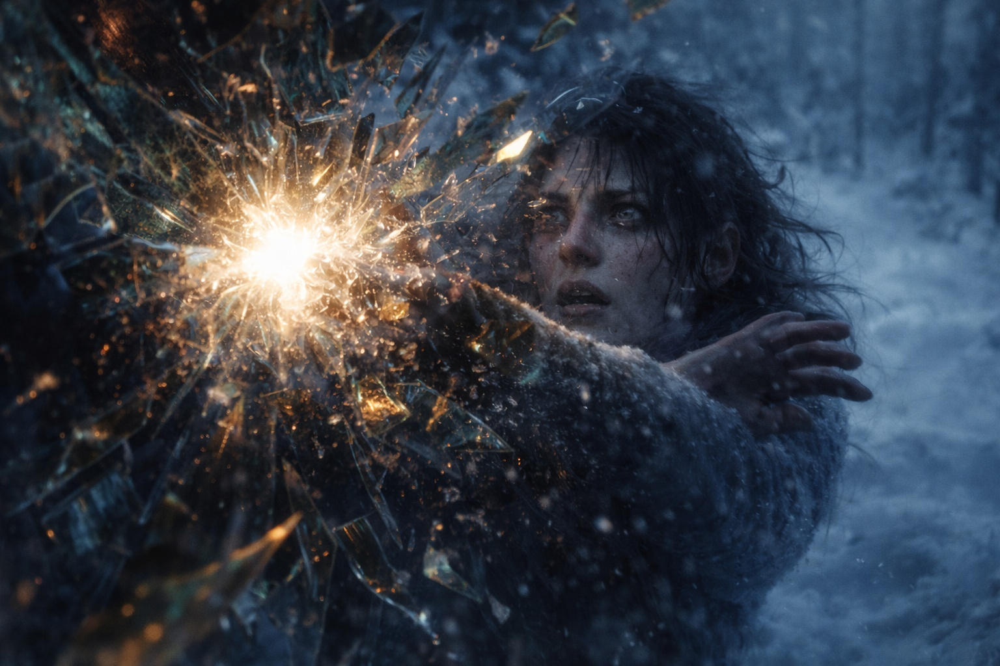
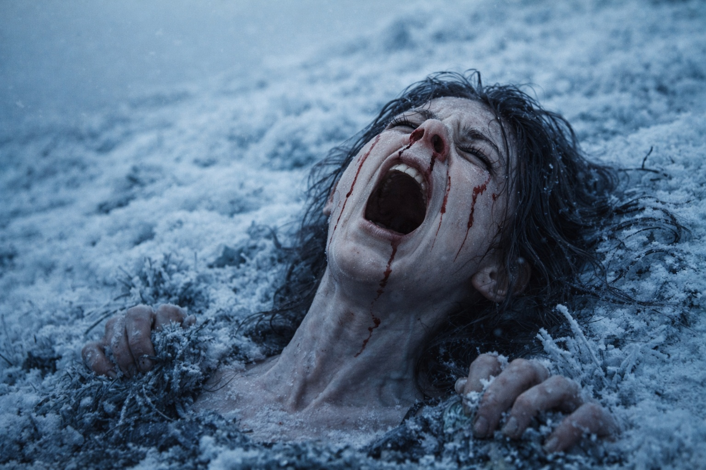

## Chapter 24 | Part 4 | The Distance

---

He saw her.

For a moment the connection held. His breathing faltered. Maris felt his attention shift away from the chamber and toward her.

Not something. Someone.

He seemed unable to believe she was there. Then he tried to reach her, and she felt how badly he wanted an answer.

She felt him trying to find her. For the first time, she wondered how much of her own fear he could sense.

He was trying to speak.

He spoke in a language she did not recognize. When she failed to answer, he stopped and tried again, more slowly.

*Who are you?*

She did not understand his language, but the question reached her. He wanted to know who was there.

She tried to answer.

*I'm Maris. I can see you. You're not alone.* She tried to make the words reach him. Something stopped them. She could feel him waiting, but could not tell whether he had heard.

She pushed harder. Nothing gave. She could still feel his pain, but could not make him hear her.

The pulse near his chest answered the Beacon in Dulint's pack. She felt the same rhythm on both sides of the obstruction.

He was far away.

She could not judge the distance. It felt unlike the space between towns or countries. Whatever separated them would not yield when she tried to speak.

Perhaps the Beacon was leading them toward a place where this connection could hold. She could not see how simply walking north would bring them to him.

She knew the rhythm of his breathing and the ache where his side pressed against the wall. His stomach tightened when the presence shifted. She felt that too.

She could see no one beside him. Whatever had happened, he had faced it alone.

She tried again to speak. Gathered everything she had and threw it at the crack in the barrier.

*I can see you. I'm coming.*

His eyes widened. Had some part of her answer reached him? She tried again, but the resistance was stronger now.

She could no longer feel his hand.

The connection was failing.

Pain struck as she lost contact. She screamed, but could no longer tell whether he heard her.

The cavern disappeared. She could not tell where her body was until she felt the ground beneath her.

She hit the bottom.

Cold ground. Pine needles against her cheek. The smell of frost and blood.

She could hear herself screaming. Her throat hurt, but she could not stop or tell the others why.

---

**End of Chapter 24.4 —> 24.5: [The Clear Sight: The Aftermath](/the-clear-sight-the-aftermath/)**

