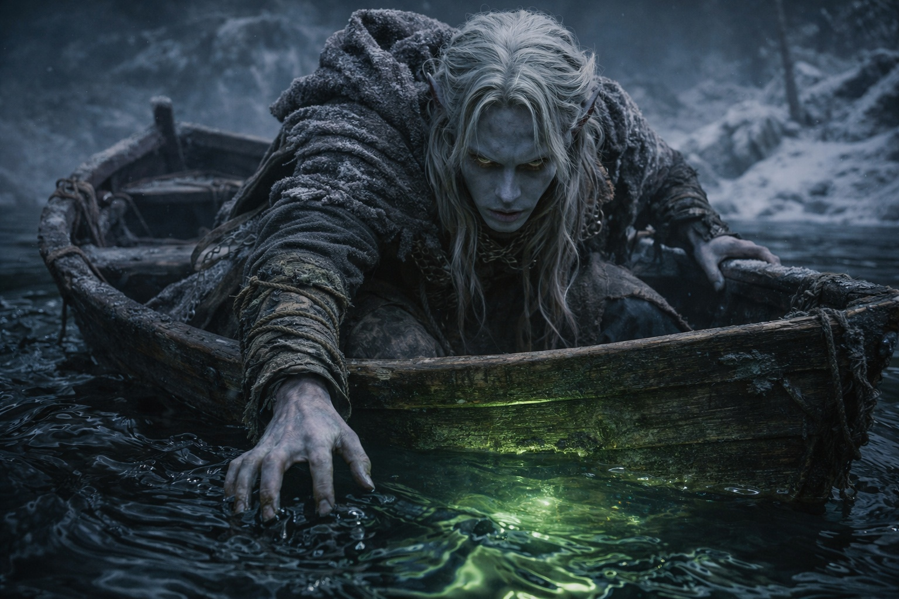

## Chapter 24 | Part 3 | The Drowning Man

---

The boat vanished. Heat took its place.

Hot air burned her throat. She coughed, or he did; she could no longer tell. She tasted sulfur and could feel sweat running down his face.

She was inside his experience.

She could not control his body or turn his head. Wherever he looked, she looked. She felt his fear and could do nothing to ease it.

Crystals covered the chamber walls. Their faint light shifted when he moved, and Maris could not see how high the ceiling rose. Beneath the warmth of the stone she felt a constant vibration.

He stood alone beside the wall. Beyond the reach of the crystal light, she could distinguish nothing.

His hands were shaking. She felt the tremor in the small muscles of his fingers, in his forearms, traveling upward through his shoulders. Not from the heat. From what stood in front of him.

His eyes would not hold on the shape ahead. She caught its size, then lost it again. The pressure in his chest increased whenever he looked toward it.

The hum deepened.

Pressure built in his chest. She felt it through his body, but heard no words.

He tried to draw a full breath.

He wanted to turn away. She felt that as clearly as the heat. Yet he stayed beside the crystal wall, bracing himself against it.

Now she saw his hands.

His blue-ash hands shook. Thin scars crossed their backs, and fresh cuts marked the knuckles. His nails were sharp. The hands were young despite the damage.

He raised his head. The chamber seemed larger now, its edges beyond his sight. Sweat ran into his eyes and he blinked it away.

The pressure increased.

He pressed a hand to his ribs.

He was frightened, and beneath the fear she felt a grief she could not place. Still he held his ground. Maris knew that effort: getting up again when a vision had left her bleeding and she could barely stand.

He reached for the wall.

His fingers spread against a patch of crystal. Maris felt the warmth through his palm and the effort it took to keep his feet.

The vibration spread up his arm.

His sight pulsed. Blood ran from his nose, and the hand against the wall began to shake. Maris felt pain through his body and could not pull away.

She heard herself cry out, far away in the forest.

Beneath the chamber's hum she felt another pulse, near his chest. She recognized its rhythm.

The Beacon's signal. Inside him.

Something in his chest answered with the same rhythm as the artifact in Dulint's pack. She felt it from inside him. She could not tell where it ended and his own body began.

Whether he knew about it, she could not tell.

His sight cleared briefly. In a smooth crystal face she caught his reflection: blue-ash skin, white hair matted with sweat, pointed ears. In the dim light she could make out the yellow of his eyes.

Young. So young. Younger than Balin.

She had called him the drowning man to keep him separate from her life. Now she knew the pain in his hand and how much he wanted someone beside him.

The pressure eased. He sagged against the wall and wiped his nose. His hand still shook. Maris felt the rock against his side as he struggled to breathe.

He looked up.

And for one impossible heartbeat, his eyes found hers.

She felt his attention turn toward her. She could not tell what he saw, only that he seemed to notice someone else was there.

His mouth opened.

The image faltered.

---

**End of Chapter 24.3 —> 24.4: [The Clear Sight: The Distance](/the-clear-sight-the-distance/)**

