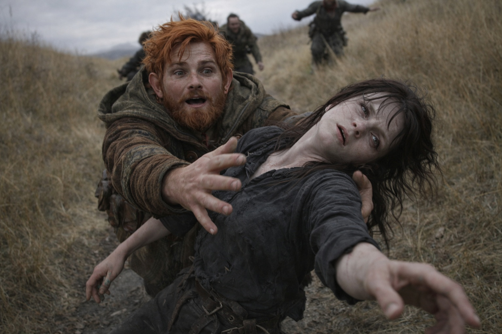
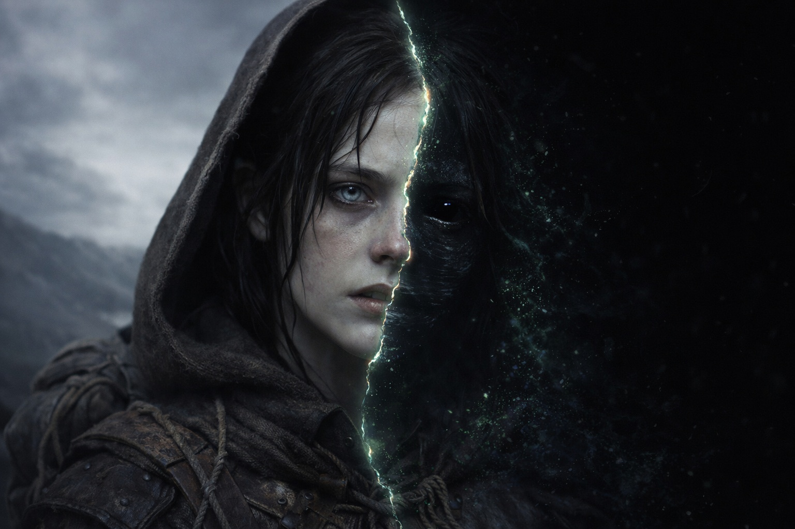

## Chapter 24 | Part 2 | The Fall

--- 

It took her mid-step.

She had one foot on the ground and the other raised when her sight failed. After hours of mounting pain, there was no final warning, no chance to sit down.

She could no longer see where to put her foot.

Her cheek struck a root. Her teeth cut through her lip, and she tasted blood. She had not managed to raise her hands.

"Maris!"

Balin's voice sounded distant. She tried to turn toward it.

She tried to say his name, but could not make her tongue move.

Hands on her shoulders. Rolling her onto her back. The canopy of dark trees spinning above her, branches braiding and unbraiding against a sky that was the wrong color. Too bright. Pulsing.

"Hold her head. Hold her head steady." Eldric's voice now, calm with the particular flatness of a man who'd stabilized wounded soldiers and knew that panic was a contagion you couldn't afford. "Xandor, her nose."

Blood. She could feel it running from both nostrils, warm tracks sliding toward her ears. More blood than the usual nosebleeds, thicker, coming faster. Xandor's fingers pressed cloth beneath her nose and the cloth was soaked through in seconds.

"This is different," Xandor said. She heard him clearly despite the distance growing between her and the forest. His voice arrived as though transmitted through the trunk of a tree, vibrating along the wood. "This isn't a regular vision. Her pupils are uneven. The left is fully dilated."

"What does that mean?"

"It means we protect her head and keep her from hurting herself."

She wanted to tell them she could hear everything. She felt their hands holding her, but the forest was fading. Something was pulling her away from them.

The Beacon screamed.

Dulint cursed and threw down his pack. Even through the canvas, the Beacon's sound hurt. Balin stumbled away from it. Eldric drew his sword, then stopped with the blade half out.

The sound reached Maris through the ground. The pull grew stronger, and she lost sight of the trees.

She could feel them holding her body. Dulint's thick fingers wrapped around her wrist, anchoring. Balin's palm against her forehead, warm and trembling. Xandor doing something at the edge of her perception, murmuring words that might have been medicine or prayer or both.

She could feel all of that and it wasn't enough.

The elsewhere was stronger.

Black water rose around her. She knew she was lying on the ground, but she could feel the cold against her throat.

Her body arched off the ground. She heard Eldric swear. She felt Balin's hand slip from her forehead and return, pressing harder.

"Keep her from hitting anything. Protect her head and let her limbs move."

She tried to tell them she was drowning. No sound came.

The black water rose to her chin. Her throat. The corners of her eyes. She couldn't breathe, which was impossible because she wasn't actually in water, she was lying on frozen ground in a forest with four people trying to protect her. But the signal from her lungs was clear. No air. No air. Drowning.

*This isn't how it works.*

That was her last thought as herself. Her last moment of clinical observation, the detached analyst's voice that had carried her through years of visions and nosebleeds and waking screams. This isn't how visions work. They don't take you. You go to them. You observe. You don't participate. You don't drown.

*This isn't how it works.*

The black water closed over her head.

She was looking through someone else's eyes. His fear was as immediate as her own.

---

**End of Chapter 24.2 —> 24.3: [The Clear Sight: The Drowning Man](/the-clear-sight-the-drowning-man/)**

