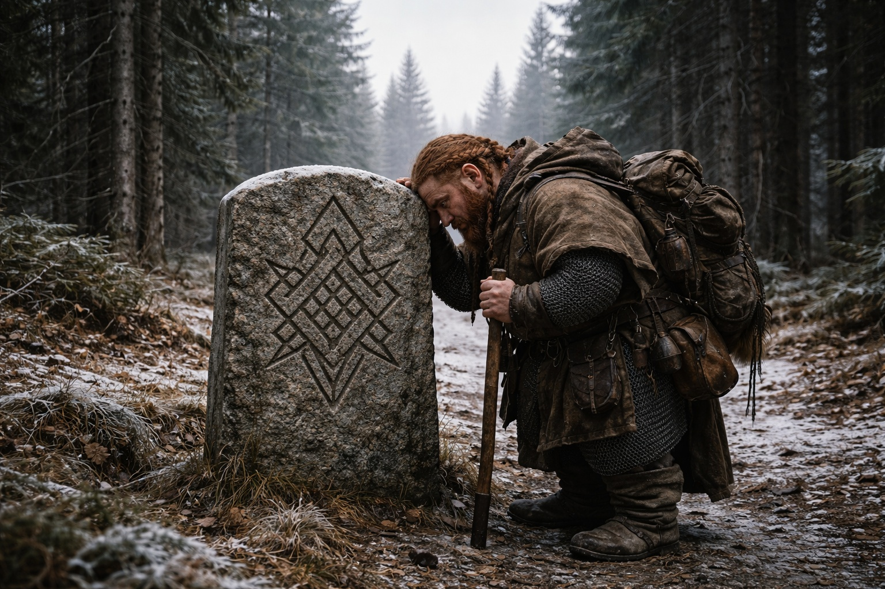
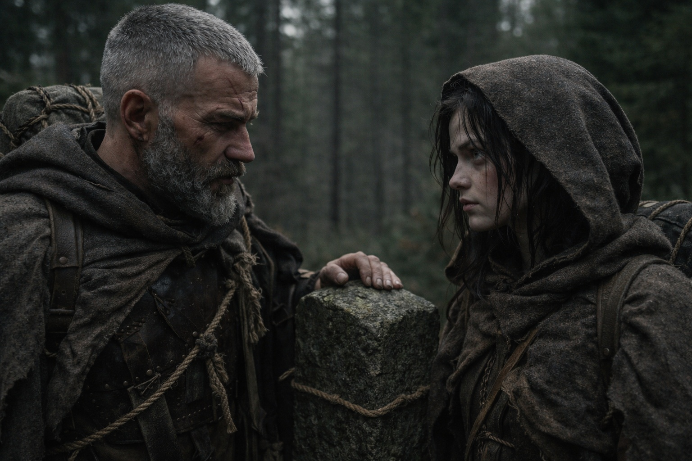
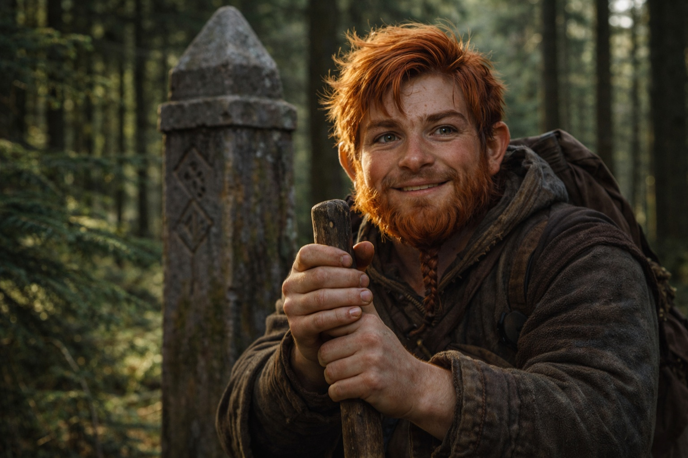

## Chapter 30 | Part 5 | The Commitment

---

They reached the Frostgard border on the sixth day, and it was nothing.

A granite post stood beside the trail, carved with the northern province's sigil. There was no gate or garrison. Spruce grew on both sides.

Balin reached it first. He leaned his stick against the post and rested his forehead on the stone.

Aldric checked the perimeter. Scanned the tree line. Listened for horns. The grey cloaks had been behind them since the hollow, maintaining distance, never closing, never falling back. Professional pursuit. The kind that didn't need to hurry because it knew where the quarry was going.

Nothing here would stop the grey cloaks. Aldric checked the trail south again.

Still, they'd reached the place he'd promised to bring them.

"Water," Aldric said. "Five minutes."

They drank. Xandor's left arm had regained some feeling over the past two days, enough to make the pain worse rather than better. He held his waterskin with both hands, the left trembling, and the act of lifting it to his mouth was a victory he didn't celebrate.

Dulint sat against a tree. For three days he'd carried part of Xandor's and Balin's loads without mentioning it. He drank, then checked the southern tree line.

Maris stood at the marker. The Beacon pulsed in Dulint's pack, steady and directional and alive. Northeast. The pull hadn't weakened since the vision in the spruce forest. If anything, it had sharpened, the signal becoming more precise with each passing day, as if the source on the other end was calibrating, adjusting, learning to aim.

He was out there. Running. Coming toward the signal that came from the thing in Dulint's pack.

"Maris."

Aldric stood beside her, packed and ready. He spoke quietly enough that the others wouldn't hear.

"What are we walking into?"

She looked for a clue in his face. This time, he seemed to be asking her.

"She doesn't know."

"That's the problem." He looked at the marker. At the forest north of it, identical to the forest south, offering nothing. "I signed on to escort a dwarf with a stolen artifact from Zuraldi to Frostgard. That's done. The artifact is in Frostgard. The dwarf is alive. The contract is fulfilled."

"But."

"But."

Balin repacked his kit. Nearby, Xandor and Dulint discussed the next water source. Aldric waited for them to finish.

"The contract is done. The pursuit isn't." Aldric looked south. "And now there may be something else following that signal."

"You're asking if she thinks we should continue."

"I'm asking if you think we have a choice."

Maris turned northeast. The pull remained. She remembered the man's scraped hand and his refusal to stop running.

"We could leave the Beacon here," she said. "Go home, those of us who have one. She can't tell you what would happen then."

"And?"

"And she wouldn't be able to sleep."

Aldric almost smiled. It was a grim thing, the expression of a man recognizing his own logic in someone else's mouth. "Neither would I. For different reasons."

"The grey cloaks have seen us," Maris said. "Leaving the Beacon won't make them forget. And if something else followed her through the vision, she needs to find out."

He nodded and turned to the others.

"Everyone." Aldric's voice carried the way it carried when he addressed formations. Not loud. Clear. The others looked up. "We're past the border. Contract's fulfilled. What's ahead isn't part of what anyone signed on for."

Balin pushed off the marker. His walking stick found its grip. "I signed on for an adventure. This qualifies."

"This qualifies as getting killed in ways you haven't imagined yet."

"That qualifies too." Balin's grin was thin and genuine and the bravest thing Maris had seen in weeks. "First time getting killed by ancient artifacts. I'm counting it."

Xandor stood. His left arm hung in its sling, useless, the pain managed but not absent. "The system is waking. Whether we witness it or not, it will happen. I'd rather understand what's coming than be surprised by it."

Dulint shouldered the Beacon and waited at the northern edge of the clearing. He looked at Balin until his nephew joined him.

Aldric looked at Maris. She was already packed.

"Northeast," she said.

"Northeast."

Aldric passed the marker. The others followed into the spruce, Balin leaning on his stick beside Dulint.

<video controls playsInline preload="metadata" poster="./five-walk-north_sora.jpg" width="100%">
	<source src="./Frostgard.mp4" type="video/mp4" />
	Your browser does not support the video tag.
</video>

Maris looked back once. No grey cloaks on the trail yet.

Weeks, the man had thought. She hoped he knew the distance better than she did.

She pressed the stained cloth to her ear and caught up with Aldric.

The marker disappeared behind the trees.

The Beacon hummed.

---

**End of Chapter 30.5 —> 31.1: [The Departure: The Morning](/the-departure-the-morning/)**
