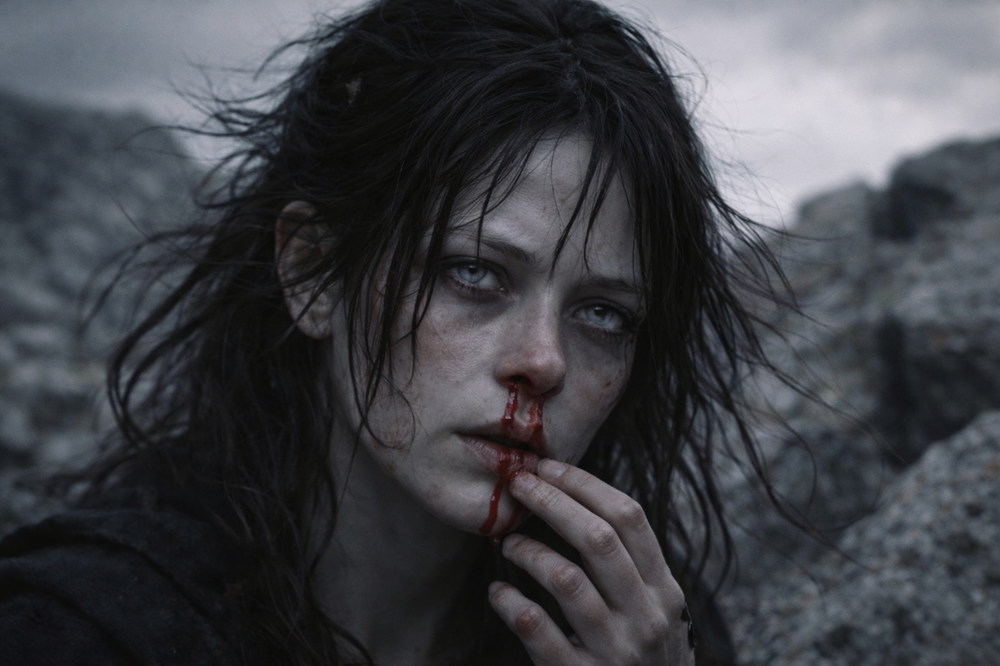

## Chapter 30 | Part 1 | The Direction

---

---

Three days north of the hollow and the Beacon stopped pointing.

The pull behind Maris's breastbone weakened. She slowed, trying to find the direction again.

She said nothing at first. They were climbing a ridgeline above the tree cover, the pines thinning into exposed granite and lichen, and the wind had picked up to the kind of sustained assault that made conversation a choice between shouting and silence. Balin's walking stick found purchase between the rocks with the patience of a man who'd learned, in three days, exactly how much his calf would tolerate per step. Xandor walked with his left arm strapped to his chest and his right hand on Dulint's shoulder when the footing got uncertain, a dependence neither of them acknowledged aloud. Aldric walked point, forty paces ahead, his head moving in the steady arc of a man scanning terrain the way other men breathed.

Dulint stayed in the middle of the group. He spoke to Xandor about water and footing, but hadn't said a word to Maris or Balin in days.

They crested the ridge at midday. The view opened north: a descending slope of birch and granite that flattened into lowland forest, grey-green under the overcast, stretching to a horizon that offered nothing to distinguish one direction from another. The Frostgard border was somewhere in that expanse. Two days, maybe three. Close enough to matter. Far enough to kill them if the grey cloaks caught them in the open.

Aldric called a rest. Balin sat down the way he did everything now, with calculation. Xandor lowered himself against a boulder and closed his eyes. Dulint stood apart, looking south, watching the ridge behind them for movement.

Maris went to Dulint's pack and opened it.

The fragment was still fused to the Beacon's surface. She checked it twice a day, comparing the pulse and the strength of the pull. Until now, both had stayed steady.

She unwrapped it. Placed her palm against the surface.

The Beacon lunged.

The cube stayed on its wrapping, but her hand locked against it. Its pulse accelerated. She felt herself pulled sideways, away from the ridge.

She tried to lift her hand.

Pressure built behind her nose. The pulse spread beyond her, and for a moment she felt another beat against it.

Northeast. The answering pull held steady, though she couldn't judge the distance.

Blood ran from her nose.

She felt it arrive, warm on her upper lip, and had just enough presence of mind to take her hand off the Beacon before the pull dragged her under entirely. The signal dampened the moment she broke contact, collapsing back to its coiled slack, and she sat there on the exposed granite with blood dripping off her chin and the wind flattening her hair against her skull.

Balin reached her first. "Maris."

"She's fine." Maris pressed her sleeve to her nose. "It wasn't a vision. The Beacon reacted."

"Reacted to what?" Aldric, behind her. He'd covered forty paces in the time it took blood to reach her chin. His voice was level in the way that meant he was already assessing threats.

"Something is responding." She looked at the Beacon in its cloth, inert now, the pulse reduced to a faint flicker. "It's not just broadcasting anymore. Something on the other end is answering."

Silence. Wind on granite. Xandor had opened his eyes and was watching her with the sharpened attention she'd seen in the aftermath of every significant vision since the journey began.

"Friend or enemy?" Aldric asked.

Maris wiped her nose. The bleeding was already slowing. A minor cost. "She doesn't know. The signal was specific. Northeast. A fixed point, not a moving target. Whatever it is, it's stationary. And it knows we're here."

"That's not an answer."

"That's the only answer she has."

Aldric looked northeast. Birch and lowland and grey sky, the same featureless expanse in every direction. "How far?"

"She can't measure distance through the Beacon. Only the pull. It hasn't been this strong since the fragment joined it."

Xandor spoke from his boulder. "Closer than before?"

In the ice cave, she'd struggled to separate the signals. This one had stayed distinct.

"Not closer. Clearer. Something changed on the other end. The source isn't just broadcasting. It's aimed."

Dulint hadn't moved from his position watching the southern ridge. His back was to the group. His shoulders were rigid.

"We continue north," Aldric said. It wasn't a question. "The border is two or three days. We don't alter course based on a nosebleed."

"Something is answering us, Aldric." She wrapped the Beacon, watching her hands until they steadied. "Whatever changed, it wasn't here."

Aldric looked at her for a long moment. His eyes were grey and hard and bone-tired.

"Northeast and north overlap enough," he said. "For now."

Aldric led them down the ridge. Maris followed, with Xandor and Dulint behind her. Balin took each step carefully at the rear.

The Beacon pulsed in the pack, low and steady, locked on something it refused to let go of.

As she walked, the pull returned. Northeast. She could feel it without touching the cube now.

---

**End of Chapter 30.1 —> 30.2: [The Convergence Seeds: The Response](/the-convergence-seeds-the-response/)**
