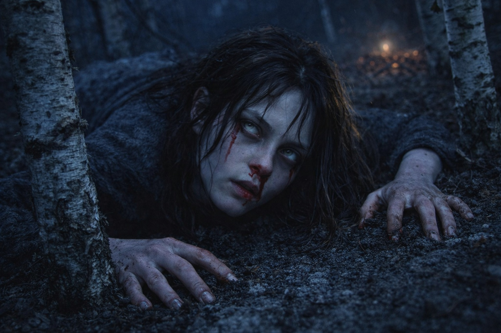
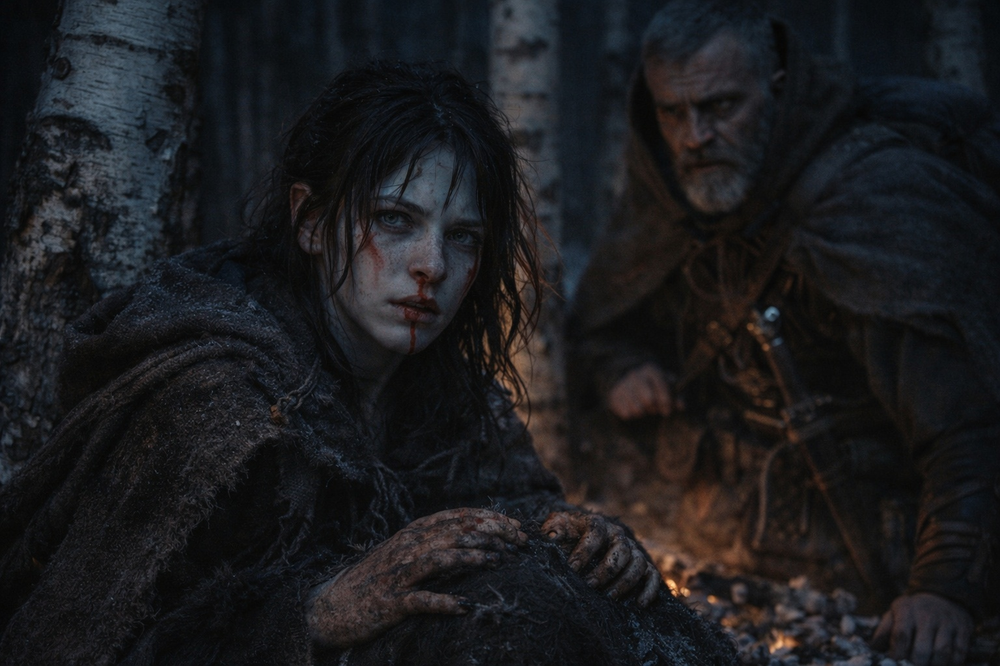
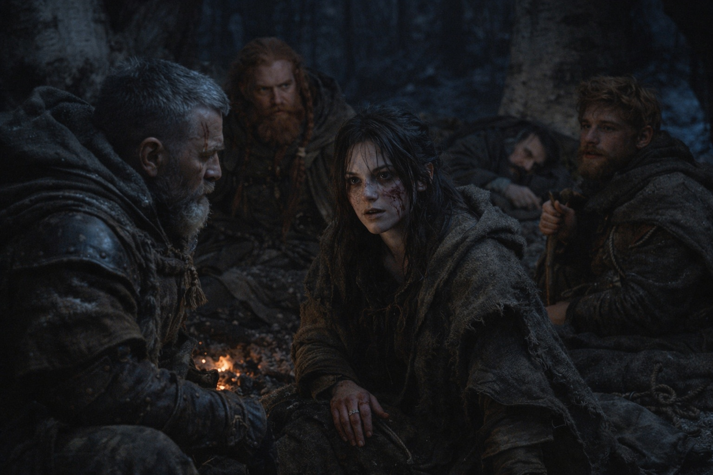

## Chapter 30 | Part 2 | The Response

---

That night, the vision came before she was fully asleep.

They had camped between birches. Aldric took first watch. Maris checked Xandor's dressing, then lay down where she could see the others. Balin slept with his stick across his chest. Dulint faced the trees.

She was halfway to sleep when the world inverted.

Not the drowning man. Not his eyes, his fear, his volcanic heat. This was different. This was the thing itself.

She couldn't find a surface beneath her. Amber and blue pulses crossed the darkness. Each arrived with a vibration she felt in her teeth.

She recognized the Beacon's pulse. Others answered it, merging and separating too quickly to count.

A word came with them: *Nexus*. She tried to hold on to it. She'd never heard it before.

The pieces were waking up.

One pulse strengthened, then another answered. She tried following the sequence back to its source.

She remembered the fragment joining the Beacon in the ice cave. Had that started this? The pulses had the same rhythm.

Beside the Beacon's signal she found the drowning man's presence. She recognized his urgency before she glimpsed the black stone around him. Something near his chest answered the pulse.

And others. Fainter. Two signals so distant they registered as suggestions rather than certainties. One was cold and still, held by something that wasn't a person. The other was buried so deep in interference that she could feel it only as a pressure against the edge of her awareness, a weight that suggested enormity.

The signals met at a point she couldn't reach. She tried to see what was there, but each pulse obscured it again.

Then a pulse passed through her. Pain tightened her chest. She tried to pull away, afraid that the next one would hold her there.

The signals turned toward her.

They struck together. For a moment she couldn't remember where her body was.

Before they released her, she felt the point where they met. She would recognize the pull again, but couldn't put it on a map.

The pull released. The vision collapsed.

She came back to the birch hollow with a gasp that brought Aldric's hand to his sword. Her nose was bleeding again. Both nostrils this time, and her left ear, a warm trickle that ran down her neck into her collar. Her hands were pressed flat against the frozen ground, fingers dug into the earth as if she'd been trying to anchor herself.

Xandor was awake. Watching.

"Not him," she said. Her voice was wrecked, scraped raw. "Not the drowning man. The thing itself. The system. It's waking up."

She covered her eyes. The pulses continued for several breaths before fading.

"There are more pieces," Maris said. "She felt them answering each other. Then they turned toward her."

The birch hollow was silent. Balin had woken and was sitting up, his walking stick gripped in both hands. Dulint had rolled over and was watching her with an expression she couldn't parse in the darkness.

Aldric knelt beside her. His eyes were steady. "How many pieces?"

"At least four signals. Perhaps five. She couldn't separate them all. They met at one point, but she couldn't see what was there."

"Where?"

Maris lowered her hands. Blood on her palms. Blood on her ear. The taste of copper in the back of her throat.

"She doesn't know. But whatever it is, it's happening whether we participate or not."

---

**End of Chapter 30.2 —> 30.3: [The Convergence Seeds: The Scope](/the-convergence-seeds-the-scope/)**
