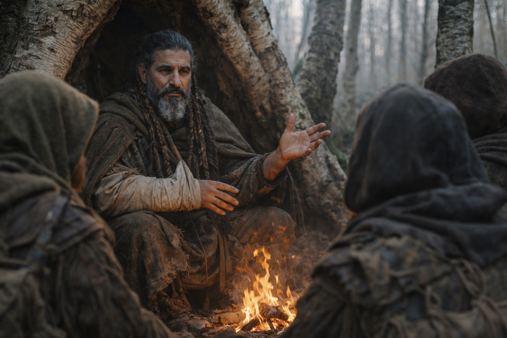
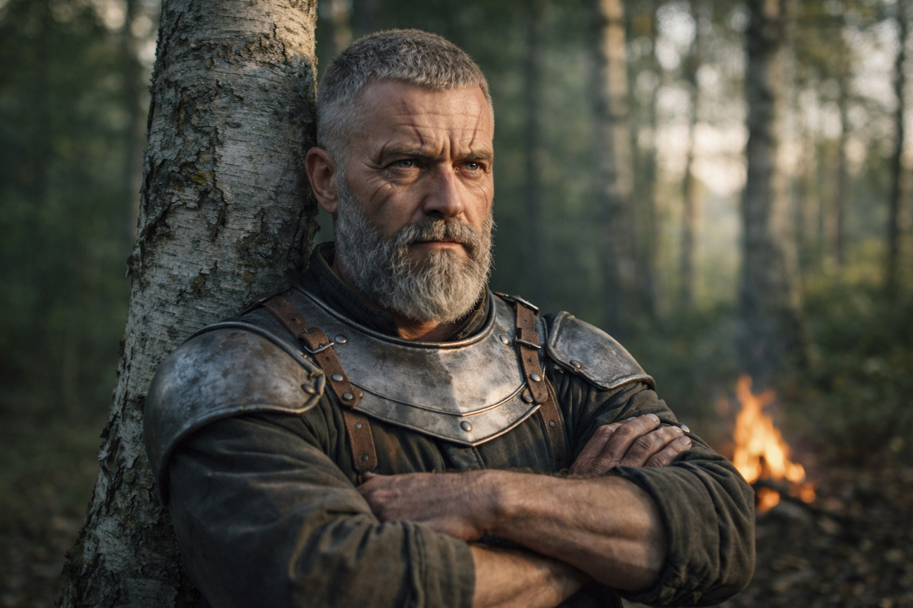
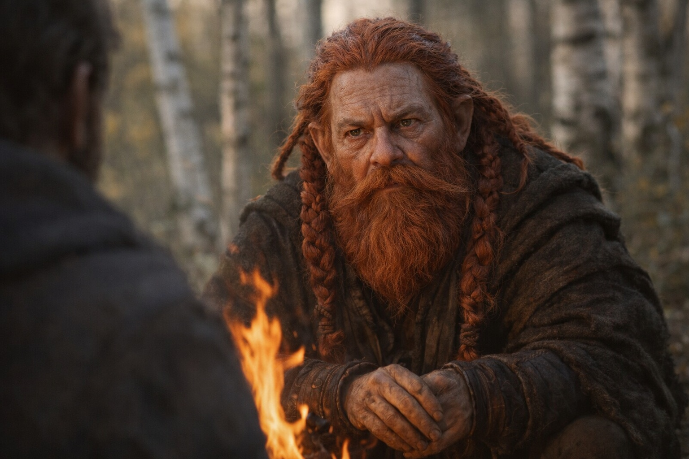
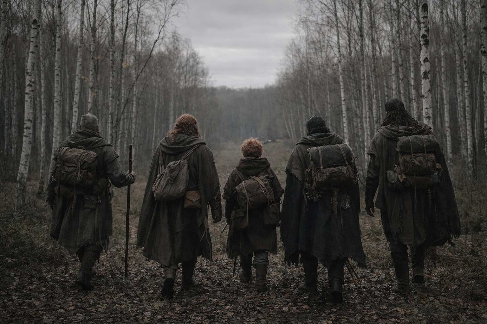

## Chapter 30 | Part 3 | The Scope

---

Xandor waited until morning to speak. Maris hadn't slept since the vision.

Aldric rebuilt the fire. Xandor sat close to it, adjusting his sling before he began.

"The artifact in Dulint's pack is a piece of something. You know that. What Maris described last night suggests the something is larger than I feared."

"How much larger?" Aldric leaned against a birch, arms crossed. He had his commander's face on, the one that processed information without reacting to it.

"When I first examined the cube, I told you it was reading. Sensing. Broadcasting. I believed it was a single instrument. Damaged, incomplete, but singular. A device with a function I couldn't fully identify." Xandor adjusted his injured arm in its sling. The pain was constant but he'd stopped acknowledging it days ago. "That was wrong. Or rather, it was a partial truth. The cube is a piece. The fragment Maris retrieved from the ice cave is another piece. What she saw last night, the frequencies, the connections, suggests there are more."

"How many?" Balin asked. He was leaning on his walking stick, weight off his wounded calf. His voice held the careful patience of someone who'd learned that interrupting Xandor delayed the answer rather than accelerating it.

"I don't have a number. The old texts I studied in Zuraldi mentioned a system. An ancient network of connected artifacts, each with a specific function, together forming something greater than their parts. The texts called it the Nexus. I dismissed the name as mythological. Scholars do that when the evidence is fragmentary and the implications are uncomfortable." He paused. Looked at the fire. "I was wrong to dismiss it."

Maris sat across from him, a cloth pressed to her ear though the bleeding had stopped hours ago. The habit of monitoring damage had become reflexive. "She felt at least four distinct signals. Maybe five. Two clear, two faint. And something at the center."

"Some texts distinguish the chassis from the phases it carries. Sense reads; Erase removes; Alter changes access. Beyond that, the copies disagree." Xandor held his injured arm. "The cube is the chassis, if I have read them correctly. We have seen what happens when it receives a fragment. We haven't seen what a complete assembly does."

"Other pieces carried by other people," Aldric said.

Xandor nodded. "That is what her account suggests. The man in the volcano carries something that answers our cube."

"Near his chest," Maris said. "She couldn't see how he carried it."

"Then we should not call it part of his body. Proximity may be enough. We know how the Beacon affects you."

Dulint spoke for the first time in what might have been a day. His voice was rough and quiet, the voice of a man who'd been thinking instead of talking, which was the reverse of his natural state. "You said the pieces want to be together."

"The signals converge. Whether that's 'wanting' or physics, I can't say." Xandor looked at Dulint with the careful attention of someone who understood that the old dwarf's rare contributions tended to cut to the bone. "But yes. The system is assembling. The pieces are finding each other. The activation of our fragment appears to have accelerated the process."

"And the ones we can't feel clearly," Aldric said. "The faint ones. Where are they?"

"Maris said one was cold and still. Held by something that isn't a person. The other was buried in interference." Xandor spread his good hand. "I don't know what that means. The texts described guardians. Entities assigned to protect individual components during periods of dormancy. If those entities still exist, the pieces they guard may not be accessible through conventional means."

"Conventional," Balin repeated. "As opposed to what?"

"I don't know." The admission cost Xandor something. Maris could see it in the set of his jaw, the way the words came out clipped rather than circular. "I spent thirty years studying fragments of this system and I know less than a fraction of what I'd need to know to predict what happens next. What I know is this: the Nexus has multiple pieces. We carry two. The drowning man carries at least one. Others exist. The system is waking from dormancy and the pieces are communicating. Whether that communication is positive, neutral, or catastrophic depends on variables I can't identify."

Xandor fell silent. Maris lowered the cloth from her ear to check it for fresh blood.

"So we're part of something," Balin said. Not a question. The tone of a young man trying to measure the shape of a problem that exceeded his tools.

"We were part of it the moment Dulint found the cube in the mine. Possibly before that." Xandor looked at each of them. His old eyes were steady and exhausted. "The question isn't whether we're part of it. The question is whether the other parts are threats or allies. And we won't know that until we're close enough for the answer to matter."

Maris felt the Beacon pulse in Dulint's pack, the signal thin but unbroken, stretching northeast through the birch and the overcast and the distance, toward something that was reaching back.

"The drowning man is closer than he was," she said. "She felt him in the network. Moving. The direction is converging with ours."

"Toward us or toward the same point?" Aldric asked.

"She can't tell the difference yet."

Aldric uncrossed his arms and stepped away from the birch.

"We continue north. We reach the border. Whatever this system is, whatever it's assembling, we don't engage it in the open with three wounded and grey cloaks behind us. We get to safety, then we decide."

Balin reached for his walking stick. The border was still days away.

They packed and returned to the trail. Maris walked close to Dulint, listening for a change in the Beacon's hum.

---

**End of Chapter 30.3 —> 30.4: [The Convergence Seeds: The Signal](/the-convergence-seeds-the-signal/)**
