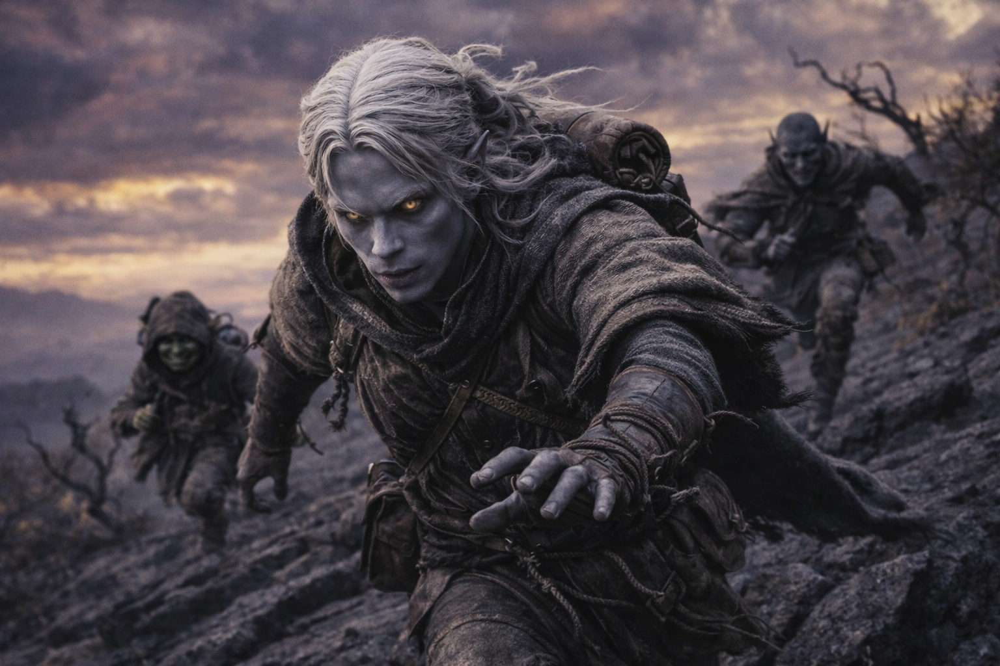
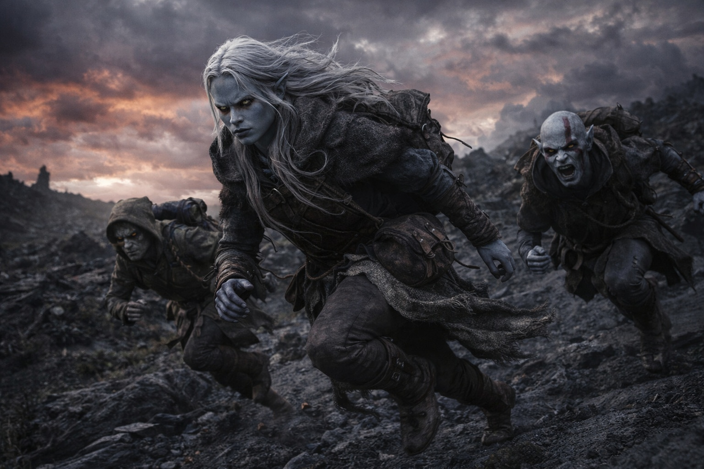

# Chapter 30.4 | The Convergence Seeds: The Signal

---

She didn't touch the Beacon. The vision found her anyway.

They were walking. Late afternoon, the lowland forest thinning as the terrain shifted northward, the birch giving way to stands of dark spruce that grew closer together and blocked what little light the overcast allowed. Balin was telling a story to no one in particular about a cousin who'd once eaten a leather boot on a bet, and the story was either true or Balin was testing whether anyone was listening. Maris was half a step behind Aldric, matching his pace, her mind on the pull in her chest that had been growing sharper all day when the ground went sideways.

Not the ground. Her.

The vision arrived without preamble, without the nosebleed that usually preceded it, without the pressure in her skull that served as a warning. One step she was walking through spruce forest. The next she was somewhere else, standing behind someone else's eyes, feeling someone else's urgency in the muscles of legs that weren't hers.

He was running.

Not the cautious, measured pace she'd felt in the volcano vision. Running. Full sprint through terrain that defied the word, a landscape of black stone ridges and sparse vegetation that twisted in directions that made her borrowed eyes ache. The sky above him was the color of a bruise, purples and yellows bleeding into each other in patterns that didn't follow any atmospheric logic she knew. The air tasted of metal and something else, something organic and wrong, like the breath of a living thing that was far too large.

He was not alone.

Two figures ran with him. One was small, low to the ground, moving with the mechanical efficiency of a creature that had calculated exactly how much energy each stride required. A goblin, she thought, though the thought came filtered through his perception rather than her own. The other was taller, lean and angular, grey-skinned, moving with a fluid grace that shifted and stuttered as if the runner's body couldn't decide on a single way to occupy space.

Behind them, nothing visible. But the urgency in his legs, in his breathing, in the rapid calculations firing through a mind she could feel but not direct, told her that what was behind them didn't need to be visible to be close.

His thoughts were fragmented. She caught pieces the way she'd catch shards of a broken mirror, each one reflecting a different angle of the same fear. *The route. East. The ridge drops beyond the marker.* A flash of a sketched map, lines that might have been paths or fracture patterns, directions that didn't correspond to any cartography she recognized. *Szoravel's directions. Trust them or don't, but move.* Another flash: an older face, angular, obsidian eyes, the afterimage of a conversation that had given him something to follow. *The Beacon. Not theirs. His. The Null. He could feel it pulling.*

The Null.

The word snagged in her awareness. Not a word she knew, but his mind supplied the context: a dark artifact, featureless, carried in his pack, pulling toward something northeast with a force that matched the Beacon's pull. Two pieces of the same system, reaching for each other across the distance. He could feel their piece. The artifact she and Dulint carried. He could feel it and he was running toward it.

Not toward them. Toward the signal. But the signal was them.

His foot caught a ridge of black stone. He stumbled, caught himself with hands that she felt scrape against the rock, and kept running. Blood welled from his palm. He didn't notice. His mind was three steps ahead, calculating the descent angle, the distance to the marker, the time until whatever followed caught up.

She tried to see his face. The vision wouldn't cooperate. She was locked behind his eyes, sharing his forward momentum, his tunnel vision, his absolute commitment to the next step and the step after that. But she caught fragments in the periphery. The reflection in a pool of standing water he leaped over: grey-black skin, white hair tied back, violet-red eyes burning with exertion. Young. The same face she'd seen in the volcano, but changed. Harder. Something in the set of his jaw that hadn't been there before. He'd learned things since the volcano. They hadn't been kind.

The small figure beside him called out. She couldn't hear the words but the tone carried: warning. Practical. A countdown to something.

He adjusted his route. Sharp left around a formation of twisted stone. The lean grey-skinned figure followed, flowing around the obstacle in a way that was beautiful and unsettling. The goblin scrambled over it, compact and efficient.

For one heartbeat his mind quieted enough for a single clear thought to form.

*Close. Weeks, not months. The signal is strong.*

He knew they were there. On the other side of whatever separated his world from hers. He could feel them the way she could feel him. Not specifics. Not faces or names. A presence. A pull. The knowledge that somewhere, someone carried the other half of what he carried, and the distance between them was shrinking.

The vision cracked.

Pain flooded in. Her pain, not his. She was on her knees in the spruce forest, Aldric's hand on her shoulder, Balin's face close to hers, the taste of blood in her mouth where she'd bitten her tongue. The nosebleed came late, the blood arriving after the vision instead of before, as if her body had been too surprised to protest on time.

"She's back." Her own voice, rough. She spat blood. "She's back."

"What did you see?" Aldric, kneeling, his eyes scanning her face for signs of something worse than a nosebleed.

She looked up. The spruce forest was dark and ordinary and entirely real. Her hands shook.

"He's close," Maris said. "Weeks away, not months. He's running. He has people with him, two of them, and something behind them that she couldn't see but he could feel." She swallowed. The copper taste wasn't fading. "He can feel us. Our artifact. He's coming toward the signal."

"Toward us."

"Toward the Beacon. The distinction matters." She pressed her sleeve to her nose. The bleeding was light. A minor toll. She'd pay more later. "He's carrying a piece of the system. The Null. It's pulling toward ours the way ours pulls toward his. Two halves of the same broken circuit trying to close."

Dulint had stopped walking. He stood ten paces back, his pack heavy on his shoulders, the Beacon inside it humming with a frequency Maris could feel from here. His face was unreadable. His hands gripped the pack straps with a force that turned his knuckles white.

"And whatever's chasing him," Aldric said.

Maris closed her eyes. The afterimage of the bruised sky lingered, the black stone ridges, the sense of vast and hostile geography. The thing behind him that didn't need to be visible to be lethal.

"It knows about us now too." She opened her eyes. "The system is connected. When she felt him, whatever is following him felt the connection. The signal goes both ways."

The spruce forest was quiet. Wind in the upper canopy. The creak of cold wood.

Aldric stood. His expression had gone past assessment into something deeper, the face of a man recalculating every variable in an equation that had just doubled in complexity.

"We keep moving," he said. "Faster."

Nobody disagreed. Nobody could.

---

*Next: The Convergence Seeds: The Commitment*

**End of Chapter 30.4 — continues in Chapter 30.5: [The Convergence Seeds: The Commitment](/the-convergence-seeds-the-commitment/)**
