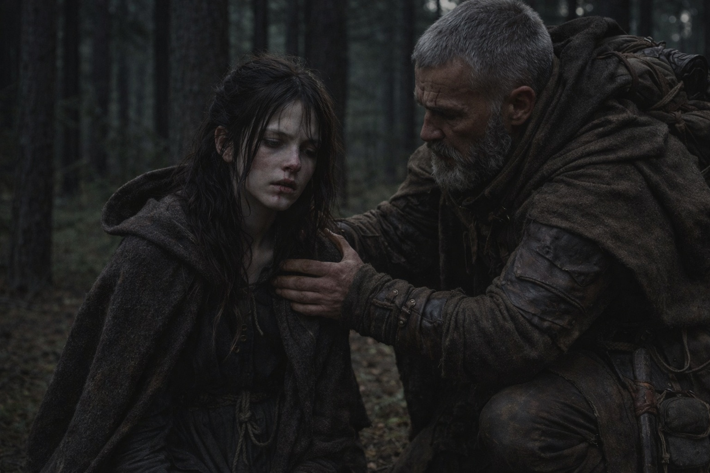
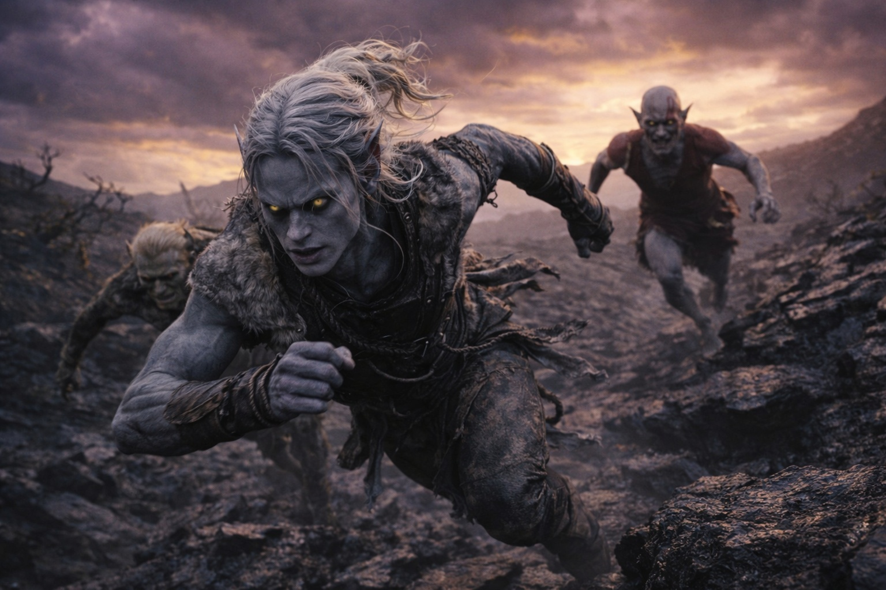
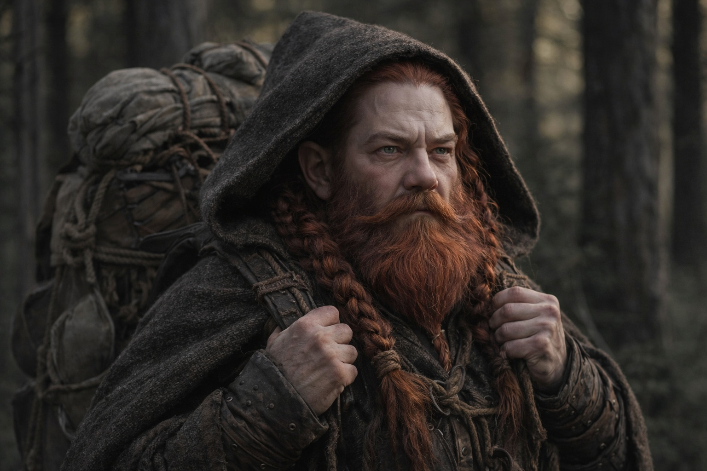

## Chapter 30 | Part 4 | The Signal

---

She didn't touch the Beacon. The vision found her anyway.

They were walking. Late afternoon, the lowland forest thinning as the terrain shifted northward, the birch giving way to stands of dark spruce that grew closer together and blocked what little light the overcast allowed. Balin was telling a story to no one in particular about a cousin who'd once eaten a leather boot on a bet, and the story was either true or Balin was testing whether anyone was listening. Maris was half a step behind Aldric, matching his pace, her mind on the pull in her chest that had been growing sharper all day when the ground went sideways.

Not the ground. Her.

The vision arrived without preamble, without the nosebleed that usually preceded it, without the pressure in her skull that served as a warning. One step she was walking through spruce forest. The next she was somewhere else, standing behind someone else's eyes, feeling someone else's urgency in the muscles of legs that weren't hers.

He was running.

He sprinted between ridges of black stone. Sparse shrubs caught at his legs. Beneath the purple-yellow sky, Maris felt his lungs burn with each breath.

He was not alone.

A goblin ran beside him. Farther out, a lean elf with pale bluish-white skin kept pace, his movements changing whenever the ground rose.

Behind them, nothing visible. But the urgency in his legs, in his breathing, in the rapid calculations firing through a mind she could feel but not direct, told her that what was behind them didn't need to be visible to be close.

She caught fragments of thought. *East. The ridge drops beyond the marker.* A glimpse of a map, then an older drow's face. *Szoravel's route. Keep moving.* She felt the pressure of an object beneath his shirt. *The Null.*

The Null.

She felt its outline against his chest, but the pull came from somewhere she couldn't separate from his own awareness. He was following a signal. She recognized the Beacon's pulse in it.

Not toward them. Toward the signal. But the signal was them.

His foot caught a ridge of black stone. He stumbled, caught himself with hands that she felt scrape against the rock, and kept running. Blood welled from his palm. He didn't notice. His mind was three steps ahead, calculating the descent angle, the distance to the marker, the time until whatever followed caught up.

He glanced down as he jumped a pool. Maris caught his reflection: bluish-ash skin, white hair tied back, yellow eyes. The face from the chamber. His jaw was clenched.

The small figure beside him called out. She couldn't hear the words but the tone carried: warning. Practical. A countdown to something.

He cut left around a ridge of stone. The elf followed; the goblin scrambled over it.

For one heartbeat his mind quieted enough for a single clear thought to form.

*Close. Weeks, not months. The signal is strong.*

He could feel their signal. She didn't know whether he was running now or whether she was seeing something still to come.

The vision cracked.

She fell to her knees among the spruce. Aldric caught her shoulder. Her bitten tongue filled her mouth with blood, and now her nose was bleeding too.

"She's back." Her own voice, rough. She spat blood. "She's back."

"What did you see?" Aldric, kneeling, his eyes scanning her face for signs of something worse than a nosebleed.

She looked up. The spruce forest was dark and ordinary and entirely real. Her hands shook.

"Weeks, he thought. Not months." Maris swallowed blood. "Two people were running with him. Something followed, but she couldn't see it. He was coming toward our signal. She doesn't know when."

"Toward us."

"Toward the Beacon." She pressed her sleeve to her nose. "He carries something called the Null. It was against his chest. She couldn't tell what it was doing."

Dulint had stopped walking. He stood ten paces back, his pack heavy on his shoulders, the Beacon inside it humming with a frequency Maris could feel from here. His face was unreadable. His hands gripped the pack straps with a force that turned his knuckles white.

"And whatever's chasing him," Aldric said.

Maris closed her eyes. She could still feel how hard he'd been running.

"It may have felt her too." She opened her eyes. "She reached him. She doesn't know what else noticed."

The spruce forest was quiet. Wind in the upper canopy. The creak of cold wood.

Aldric stood and looked back along the trail.

"We keep moving," he said. "Faster."

Nobody disagreed. Nobody could.

---

**End of Chapter 30.4 —> 30.5: [The Convergence Seeds: The Commitment](/the-convergence-seeds-the-commitment/)**
