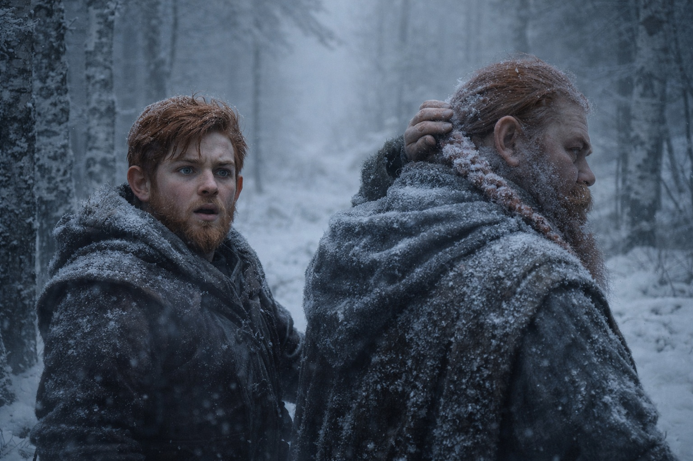
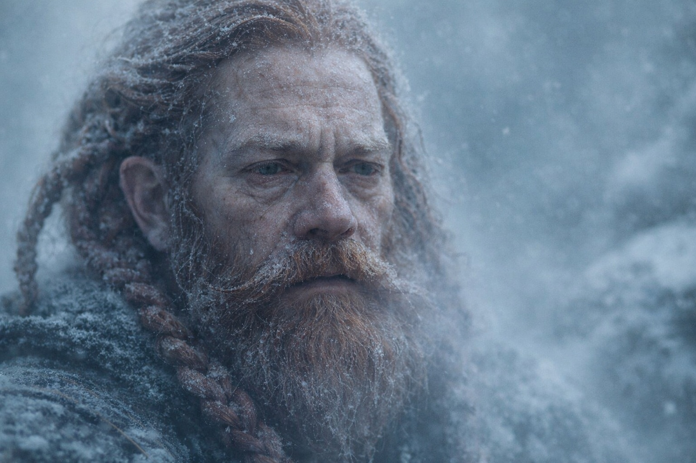
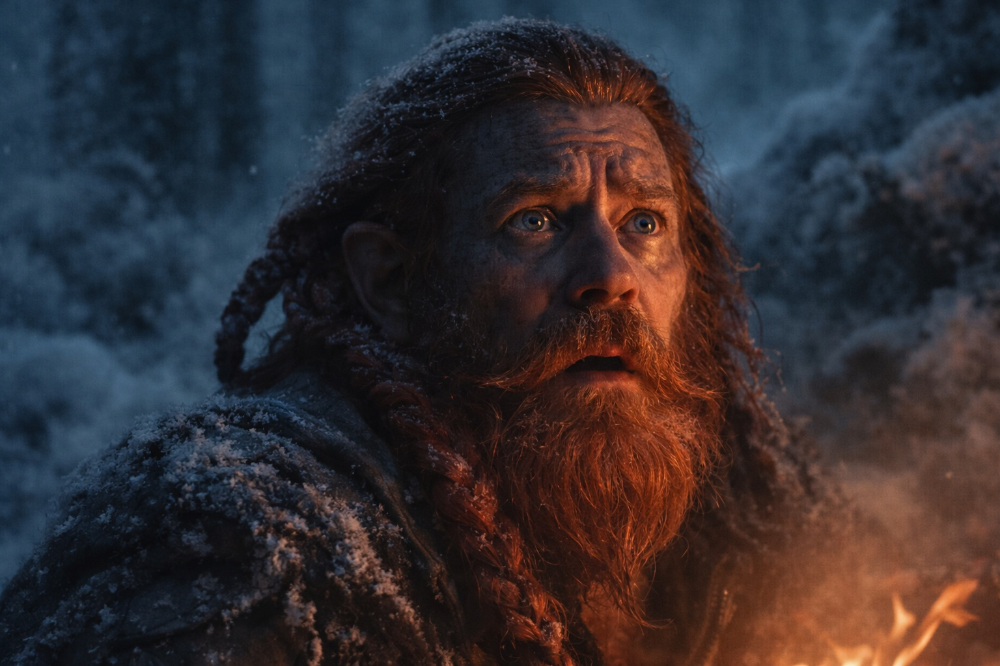

## Chapter 26 | Part 4 | The Almost

---

He had the words. He'd been carrying them for two days, polished smooth like river stones in his pockets.

*I found the note.*

Four syllables. Simple. Clean. The kind of sentence that lands like a hammer on an anvil and rings until the forge goes quiet. He'd rehearsed it while walking behind his uncle through the frozen pine corridors, matched the rhythm to his footsteps, timed the breath that would come before and the silence that would follow after. He knew exactly how Dulint's shoulders would tighten. He knew the old dwarf would stop walking. He knew the beard would move before the mouth did, that muscular twitch of the jaw that preceded every difficult word Dulint had ever spoken.

*The one that says I die.*

He would say it flat. No tremor. He'd decided that three river crossings ago, while his uncle led them through shin-deep water when the bridge was right there, visible, sturdy, mocking them both. He would say it the way Eldric reported casualties. Names, numbers, no decoration. Let the facts carry the weight.

The morning was wrong for it.

Fog had rolled up from a ravine overnight and settled in the trees like gauze packed into a wound. The world had shrunk to twenty paces in every direction, the pines appearing and dissolving at the edges of visibility, their trunks dark columns in a grey cathedral. Sound traveled strangely. Balin could hear Xandor's muttering from fifty yards back, the old druid addressing the moss on a fallen log with the patient formality of a diplomat. Maris walked between Eldric and Dulint, upright today, though her steps had the mechanical precision of someone counting each one to keep from falling.

Dulint stopped at a fork in the trail.

Left went uphill, into the fog. Right descended through a ravine where the trees thinned and the ground leveled out. Balin watched his uncle study both options. He watched the old dwarf's hand come up to rub the back of his neck, the gesture that always preceded a bad decision dressed up as a reasonable one.

Eighteen.

"Left," Dulint said.

Balin opened his mouth.

The words were there, loaded, ready, sitting on the back of his tongue like arrows nocked and drawn. *I found the note.* He could feel the sentence pressing against his teeth. His chest was tight with it, the particular pressure of a truth that wanted out the way water wants through a crack in a dam.

Dulint turned to look at him. The fog caught in the old dwarf's beard and turned it silver. His iron-ore eyes were tired. Not the tiredness of walking. The tiredness that lives behind the eyes of people carrying loads they can't set down and can't describe and can't share because sharing would make the load real, would give it weight in someone else's body, and that was worse than carrying it alone.

Balin had seen that tiredness before. On his mother's face, the year the mine collapsed and took four of their kin. On the faces of widows at Stonehold who smiled at market because the alternative was answering questions about the empty chair at their table. It was the tiredness of people doing harm to themselves quietly, methodically, because the harm kept someone else from breaking.

His uncle was breaking.

Not in the loud way. Not the way walls crack or axes shatter. In the slow way. The way iron rusts when you leave it in the rain. Day by day, molecule by molecule, the surface pitting and flaking while the core still holds its shape. Dulint looked like a man who'd been left in the rain for months and was pretending the flaking didn't hurt.

"Something you want to say, boy?"

The old dwarf's voice was careful. Controlled. The voice of a man standing on thin ice who knows exactly how thick it isn't.

*I found the note. The one that says I die.*

Balin swallowed. The words went down like gravel.

"Left's steeper," he said.

Dulint held his gaze for two more heartbeats. Three. Then the old dwarf's shoulders dropped by a fraction, and the tension in his jaw released, and the tiredness behind his eyes flickered with something that might have been relief or might have been disappointment, and Balin couldn't tell which was worse.

"Aye," Dulint said. "But the ravine'll be mud under that fog. Freeze our boots solid by nightfall."

It was a reasonable excuse. It was also a lie. Balin nodded and fell into line behind his uncle, and the fog swallowed them both.

They walked for an hour without speaking. The forest changed around them, the pines giving way to bare-limbed birches that stood like bones stripped of meat, their white bark peeling in curls that caught the fog and held it. Balin counted his steps. Lost count. Started over. Lost count again because his mind kept circling back to the expression on his uncle's face when their eyes had met.

Relief. It had been relief.

His uncle was relieved that Balin hadn't asked.

That meant the answer was worse than the question.

Eldric fell back to walk beside him. The soldier moved through the fog like a man who'd learned to navigate by sound alone, his steps placed with the automatic precision of someone who'd marched through worse conditions carrying twice the weight. He didn't look at Balin. He watched the trees.

"Your uncle needs rest," Eldric said. Quiet, pitched below the fog's dampening.

"He won't take it."

"No." Eldric's broken nose twitched. His version of agreement. "But he needs it."

Balin wanted to tell Eldric about the note. About the seventeen delays. About the conversation he'd overheard in the dark, his uncle arguing with himself about something that couldn't be stopped. He wanted to hand this weight to someone whose shoulders were built for carrying, someone professional, someone who would take it and file it under *actionable intelligence* and deal with it the way soldiers dealt with things.

He said nothing. The fog absorbed the silence and gave nothing back.

Camp that night was a hollow between three birches, their trunks leaning together like conspirators. Xandor coaxed a small fire from damp wood, speaking to the branches in a language Balin didn't understand, and the branches caught despite the moisture. Maris ate half a portion of dried meat and drank two cups of water and said "I'm fine" when Dulint asked, in a voice that convinced no one.

Balin sat across the fire from his uncle and practiced the words in his head.

*I found the note.*

Dulint was mending a strap on his pack. His thick fingers worked the leather with the unconscious competence of decades, threading the awl, pulling the cord, tying off. Simple work. The kind of work that kept hands busy while the mind devoured itself.

*The one that says I die.*

The fire popped. A coal rolled free and Dulint pushed it back with his boot, not looking up.

*Long enough to hate you for it. And love you anyway.*

The complete sentence assembled itself in Balin's chest, every word in place, every beat timed, and he could feel the rightness of it, the cleanness, the way it would cut through the fog and the lies and the seventeen deliberate delays and land where it needed to land. He could feel how the silence after would taste. How his uncle's face would change.

He opened his mouth.

Dulint looked up from the strap. And the firelight caught his face at an angle that stripped the old dwarf bare, peeled back the competence and the stubbornness and the decades of granite endurance, and underneath all of it Balin saw a man who was terrified. Not of the forest. Not of what waited at the crack. Terrified of the nephew sitting across the fire, terrified of the words he could see forming on Balin's lips, terrified of the conversation that would make everything real and irreversible and shared.

Balin closed his mouth.

"Strap's fraying," he said.

Dulint blinked. Looked down at the leather in his hands. "Aye," he said, and his voice cracked on the single syllable, and he cleared his throat, and it cracked again. "Aye, it is."

They sat in the firelight and said nothing that mattered, and the fog pressed in, and somewhere north the crack in the barrier waited with the patience of a thing that had been waiting for a very long time.

Balin pulled his blanket up to his chin and closed his eyes and rehearsed the words one more time. Not for tonight. For the morning he would be brave enough to say them. For the morning he would look at his uncle and speak the truth and watch whatever came next arrive.

*I found the note. The one that says I die. Long enough to hate you for it. And love you anyway.*

Not tonight.

Soon.

---

**End of Chapter 26.4 —> 26.5: [The Crack: The Changed Bond](/the-crack-the-changed-bond/)**