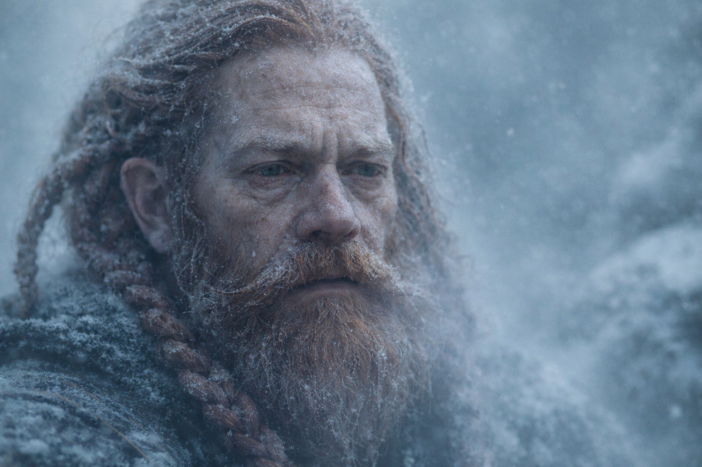
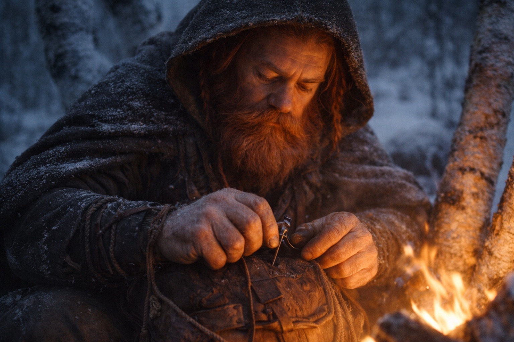

## Chapter 26 | Part 4 | The Almost

---

Balin had been rehearsing the words for two days.

*I found the note.*

He knew how Dulint would stop walking, how his jaw would work before he answered. Balin had rehearsed through that silence too.

*The one that says I die.*

He would say it flat. No tremor. He'd decided that three river crossings ago, while his uncle led them through shin-deep water when the bridge was right there, visible, sturdy, mocking them both. He would say it the way Aldric reported casualties. Names, numbers, no decoration. Let the facts carry the weight.

The morning was wrong for it.

Fog limited their view to twenty paces. Somewhere behind them, Xandor was talking to the moss on a fallen log. Maris walked between Aldric and Dulint, upright today but watching each step.

Dulint stopped at a fork in the trail.

Left went uphill, into the fog. Right descended through a ravine where the trees thinned and the ground leveled out. Balin watched his uncle study both options. He watched the old dwarf's hand come up to rub the back of his neck, the gesture that always preceded a bad decision dressed up as a reasonable one.

Eighteen.

"Left," Dulint said.

Balin opened his mouth.

*I found the note.* He drew breath to say it.

Dulint turned. Moisture clung to his beard. He looked as though he hadn't slept.

Balin had seen that look on his mother's face after the mine collapse. She'd kept smiling at people in the market that year.

His uncle was breaking.

He still checked the route and carried his share. Then someone spoke to him and he took too long to answer.

"Something you want to say, boy?"

Dulint waited, watching his face.

*I found the note. The one that says I die.*

Balin swallowed.

"Left's steeper," he said.

Dulint held his gaze for two more heartbeats. Three. Then the old dwarf's shoulders dropped by a fraction, and the tension in his jaw released, and the tiredness behind his eyes flickered with something that might have been relief or might have been disappointment, and Balin couldn't tell which was worse.

"Aye," Dulint said. "But the ravine'll be mud under that fog. Freeze our boots solid by nightfall."

It was a reasonable excuse. It was also a lie. Balin nodded and fell into line behind his uncle, and the fog swallowed them both.

They walked for an hour without speaking. Bare birches replaced the pines. Balin tried counting his steps, but kept thinking about his uncle's expression.

Relief. It had been relief.

His uncle was relieved that Balin hadn't asked.

That meant the answer was worse than the question.

Aldric fell back to walk beside him. The soldier moved through the fog like a man who'd learned to navigate by sound alone, his steps placed with the automatic precision of someone who'd marched through worse conditions carrying twice the weight. He didn't look at Balin. He watched the trees.

"Your uncle needs rest," Aldric said. Quiet, pitched below the fog's dampening.

"He won't take it."

"No." Aldric's broken nose twitched. His version of agreement. "But he needs it."

Balin wanted to tell Aldric about the note and the delays. Let the soldier ask Dulint. He'd ask once and wait until he got an answer.

But Balin let him walk on.

They camped between three birches. Xandor spoke over the damp branches until they caught fire, then sat down, rubbing his shaking hand. Maris ate half her meat and drank two cups of water. When Dulint asked, she said she was fine.

Balin sat across the fire from his uncle and practiced the words in his head.

*I found the note.*

Dulint was mending a pack strap. His thick fingers pulled the cord through the holes left by the awl.

*The one that says I die.*

The fire popped. A coal rolled free and Dulint pushed it back with his boot, not looking up.

*I hate you for hiding it. And I love you anyway.*

He wanted Dulint to hear all of it. Even the last part.

He opened his mouth.

Dulint looked up. His fingers stopped on the strap. He was afraid, Balin realized. Afraid of what his nephew was about to say.

Balin closed his mouth.

"Strap's fraying," he said.

Dulint blinked. Looked down at the leather in his hands. "Aye," he said, and his voice cracked on the single syllable, and he cleared his throat, and it cracked again. "Aye, it is."

They stayed by the fire until the fog left their blankets damp.

Balin pulled his blanket to his chin and rehearsed once more.

*I found the note. The one that says I die. I hate you for hiding it. And I love you anyway.*

Not tonight.

Soon.

---

**End of Chapter 26.4 —> 26.5: [The Crack: The Changed Bond](/the-crack-the-changed-bond/)**
