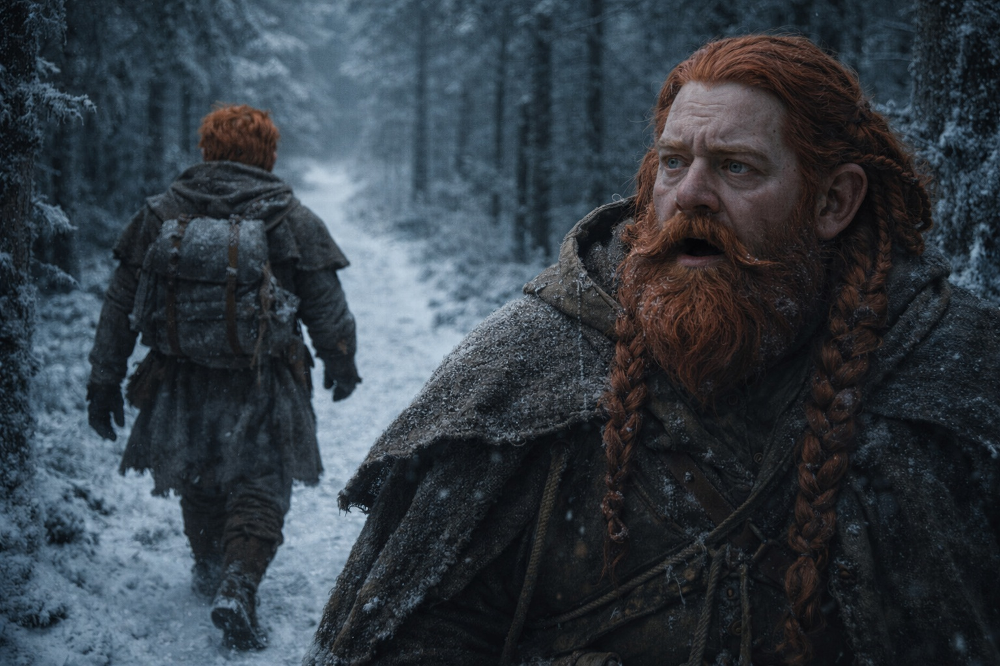
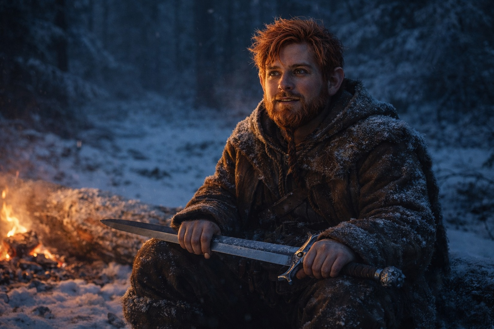
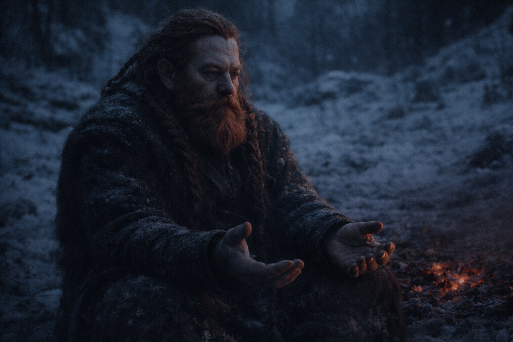

## Chapter 26 | Part 5 | The Changed Bond

---

Balin stopped laughing at Dulint's stories three days ago.

Not because they weren't funny. Some of them were. The one about the miner who'd accidentally sold his own pickaxe back to himself through a chain of twelve traders had a genuine punchline, and Dulint delivered it the way he always did, with that rolling cadence that made the listener lean in. But Balin recognized the rhythm now. Every story started when the trail narrowed toward a decision point. Every punchline landed at the exact moment someone might ask which fork to take.

He laughed anyway, the first two times. Out of habit. Out of something he wasn't ready to name, something that sat between loyalty and pity and made his stomach clench whenever Dulint cleared his throat to begin.

The third time, he just walked ahead.

Dulint didn't call after him. That was the part that confirmed it. The old dwarf who would have bellowed "Oi, I haven't finished!" in any mine shaft from Stonehold to Zuraldi simply watched his nephew's back disappear around the bend and said nothing.

They traveled like that for the rest of the day. Balin at the front with Aldric, matching the soldier's pace, asking questions about the terrain that he already knew the answers to. Aldric answered in his clipped way, pointing at ridgelines and drainage patterns, and if he noticed the young dwarf's jaw working between questions he didn't comment.

Maris walked between them and Xandor, her steps careful but steady. She was eating again, at least. The tremor in her hands had settled into something intermittent. Once, near midday, she caught Balin watching her and gave him a look that was too knowing for comfort.

Dulint brought up the rear with Xandor.

Balin caught only fragments of their talk. Xandor asked something; Dulint answered at length. The druid waited, then asked again.

At camp that evening, Balin took the first watch without being asked.

"I'll cover second," Aldric said. Not a question.

Balin nodded. He found a fallen trunk at the edge of the firelight, sat down, and rested his sword across his thighs. The blade needed oiling. He'd do it later. For now he just needed the weight of it, the specific pressure of iron through leather against his legs, the reminder that he carried something real.

The fire settled into coals. Aldric slept. Xandor slept. Maris slept or pretended to, her breathing too regular, too controlled.

Dulint sat across the dying fire and watched him.

Balin let him. He'd spent days watching his uncle for tells, cataloguing the delays, counting the detours. Now he let the watching be mutual. Let Dulint see whatever he needed to see in a nephew who sat differently than he used to, whose hands rested on a sword instead of fidgeting with whatever was closest.

Neither spoke for a long time.

"You're angry," Dulint said finally.

"No."

"You're something."

Balin looked at the coals. "I grew up."

Dulint caught his breath. Balin heard it over the fire.

"When?" the old dwarf asked. His voice had lost the storytelling cadence. What remained was raw, stripped, the voice underneath the performance.

"Somewhere between the seventeenth detour and the note in your boot."

Dulint went still. His hands, which had been resting on his knees, curled into fists and then slowly opened again. The firelight caught the grey in his beard and turned it copper. His iron-ore eyes held steady on Balin's face, searching for something, and whatever he found made him look down at the ground between his feet.

"How long have you known?"

"Long enough to count."

A log shifted, scattering sparks. Behind them, Maris's breathing faltered. She was listening. Balin kept his eyes on his uncle.

Dulint opened his mouth. Closed it. Opened it again. The old dwarf who could fill any silence with a story, who could talk his way through cave-ins and council meetings and grief, sat on frozen ground with nothing to say.

"I'm not asking what the seer told you," Balin said. "Not tonight." He paused. Let the words settle. "But you should know that I've been watching. The slow paths. The extra stops. The stories right when we need to choose a direction."

"I was protecting you."

"I know."

"You don't understand what she said."

"I read the note, uncle. 'Balin dies fast.' And below it, in your handwriting, 'Only if I rush.'" He kept his voice level. Quiet. The voice of a man stating facts he'd already processed, not a boy discovering them for the first time. "You've been slowing us down because you think speed kills me."

Dulint's jaw worked. His eyes reddened. He pressed his hands against his thighs.

"She didn't say it like that," he managed. "She said choices. She said there would be a moment when the path forward costs something I couldn't pay, and the faster we reached it..."

"The sooner I die."

"Don't say it like that."

Balin crossed the four paces between them and crouched in front of his uncle. Dulint couldn't quite keep his lower lip still.

"I'm not going to tell you it's all right," Balin said. "Because I don't know if it is. But I know what you've been doing, and I know what it's costing you, and I know that the group is slower because of it. Maris needs us moving. The Beacon needs us north. And you've been choosing my life over the mission every single day since Stonehold."

"Of course I have."

"I know. That's the problem." Balin put a hand on his shoulder. Dulint flinched, then leaned into the touch. "If dying fast means we succeed, I'll choose that. Every time."

Dulint said nothing.

The fire collapsed into itself. The coals dulled from orange to deep red. Somewhere in the forest, a night bird called once and did not call again.

Balin squeezed his uncle's shoulder, stood, and returned to his watch post. He picked up his sword. Rested it across his thighs. Stared at the dark line of trees where the firelight ended and the Frostgard forests began.

Behind him, Dulint sat exactly where he was, hands open on his knees, looking at the place where his nephew had crouched. He did not speak. The stories had run out. He sat there until the coals went dark.

---

**End of Chapter 26.5 —> 27.1: [The Price of Passage: The Mouth](/the-price-of-passage-the-mouth/)**
