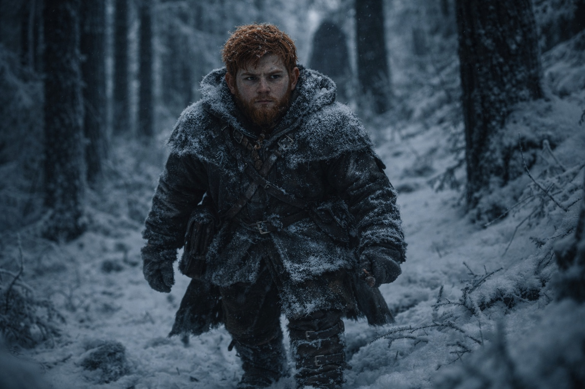
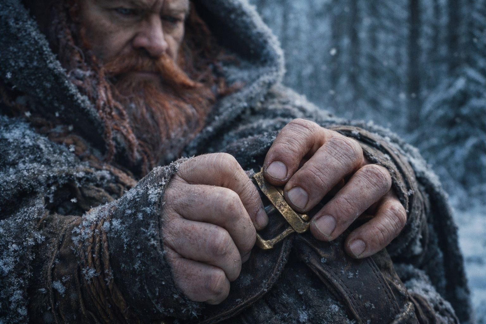
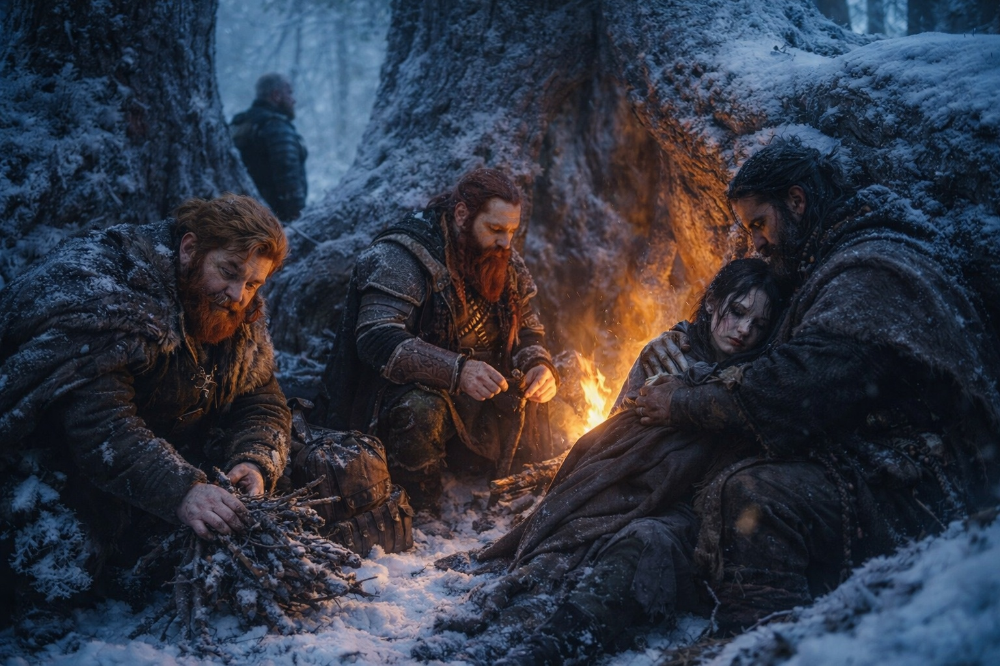
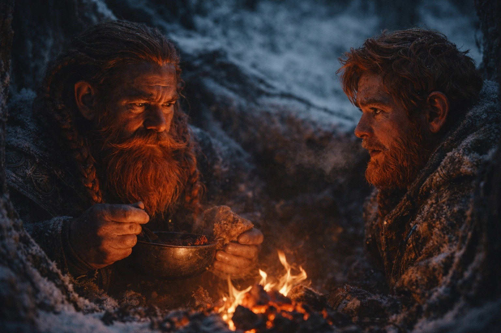
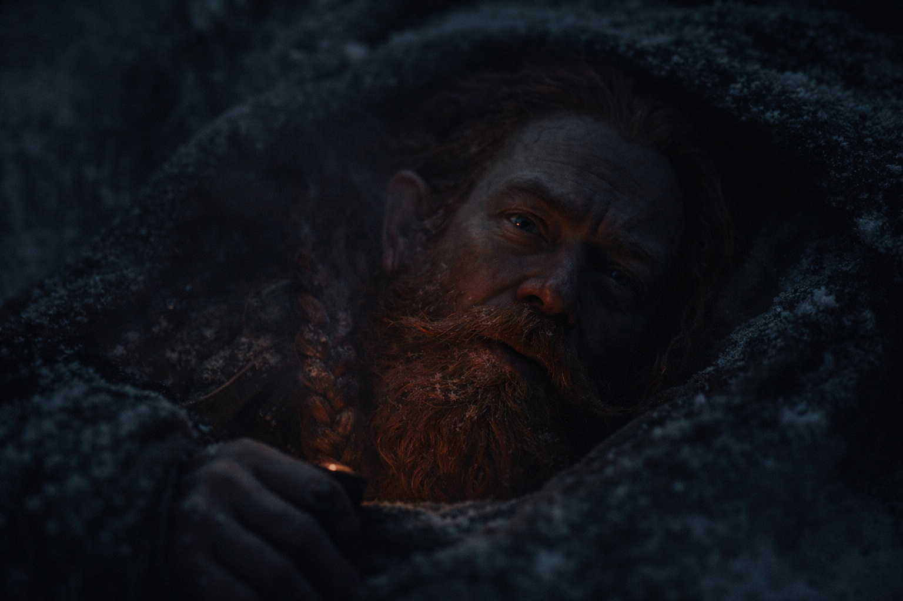

## Chapter 26 | Part 1 | The Doubt

---

Dulint's left hand kept finding the clasp of his pack strap.

Balin noticed because noticing was what he did now. Before the hunters, before the kill, before Maris had screamed for seven minutes and bled from her eye, Balin had been the kind of person who noticed things for fun. The crack in a tavern beam that looked like a face. The way Eldric's jaw worked when he ate jerky on the left side only. The number of steps between one clearing and the next. Idle counting, idle watching, the comfortable habit of a young dwarf with too much energy and not enough to spend it on.

That had changed. The counting continued, but the purpose had shifted. He counted threats now. He counted silences. And he counted the number of times his uncle reached for that strap clasp and then pulled his hand away, as if he'd caught himself doing something he shouldn't.

Fourteen times since morning. Balin was sure of the number because he'd been watching since the first.

The forest had thickened around them over the past two days. Frostgard's interior was different from its edges. The pines grew taller here, their trunks wider than Dulint was broad, bark rough and black with age. The canopy blocked most of the sky. What light reached the forest floor arrived grey and indirect, filtered through layers of frozen needles that caught the weak winter sun and held it prisoner. The ground was carpeted in frost and dead needles, their footsteps crunching in a rhythm that Balin had memorized: Eldric's long stride, Dulint's heavier tread, Maris's careful placement, Xandor's shuffling gait, and his own somewhere between his uncle's and Eldric's.

Maris walked slowly. She'd insisted on walking at all, which had produced the only argument Xandor had ever won. Not an argument, exactly. The druid had simply refused to move until she ate something, and she'd eaten, and then they'd moved. But she was fragile in a way that made Balin's hands itch for his sword, because the threat was inside her and cutting couldn't reach it. The dried blood was gone from her face. The pallor remained.

The Beacon was quiet. Whatever had happened during the vision had spent it. Dulint kept it in his pack and checked it at intervals, but its pulse was faint, occasional, the heartbeat of something sleeping.

Fifteen. The clasp again. This time Dulint held it for three seconds before releasing.

"You'll wear a groove in that buckle," Balin said.

Dulint glanced at him. The look was brief, unreadable. "Habit."

"You don't have that habit. You have three habits. Stroking your beard when you're thinking, tapping your axe handle when you're impatient, and talking too much when you're avoiding a question. The buckle is new."

His uncle laughed. It was a good attempt. "You've been studying me."

"I've been watching everyone. It's what I do now."

The laugh faded. Dulint walked on, and his hand stayed at his side, deliberate, controlled. Which told Balin more than the fidgeting had. A man who stopped a habit on command was a man who knew the habit was giving him away.

They made camp at dusk in a hollow between three massive pines. The roots had grown together over centuries, forming walls of gnarled wood that blocked the wind from the north. Eldric approved the position with a grunt and began checking the perimeter, which took him seven minutes. Balin timed it.

Xandor helped Maris sit. She leaned against a root and closed her eyes. The seer's breathing was steady but shallow, each exhale carrying a faint wheeze that hadn't been there a week ago. Xandor arranged his cloak around her shoulders with the quiet attention of someone tending a fire that might go out.

Balin gathered wood. He was good at it now. He knew which branches would burn clean and which would smoke, which were dry enough despite the frost, which would crack and pop and give their position away. First number thirty-seven: first time gathering firewood without being told. He'd lost count of the actual firsts somewhere around twenty, but the habit of naming them persisted.

The fire was small, shielded by roots, barely more than coals. Eldric's rule. Enough heat to keep alive, not enough light to be found by.

Dulint sat across from Balin and ate in silence. That was wrong too. Dulint didn't eat in silence. Dulint told stories during meals. Long, winding, pointless stories that Balin had pretended to find annoying for years while secretly cataloguing every detail. Stories about Stonehold, about his father, about the mines and the markets and the time Cousin Brunnhild had accidentally traded a barrel of ale for a goat that turned out to be pregnant with twins.

Tonight, nothing. Just the sound of chewing and the fire's low crackle and the wind in the canopy above.

Balin tried. "Did I ever tell you about the merchant in Zuraldi who tried to sell me a sword that was actually a cooking spit?"

Dulint looked up. Smiled. "No."

Balin waited.

"Tell me in the morning, lad. I'm tired."

Dulint was never too tired for stories. Dulint had told stories with a broken arm, with a fever, with blood on his boots and rain in his beard. The only time Dulint stopped talking was when the truth sat too close to the surface and he was afraid of what might come out if he opened his mouth.

Balin lay in his bedroll and did not sleep. He listened to Eldric take first watch, boots crunching softly on frost. He listened to Xandor's breathing settle into the deep rhythm of the very old and very exhausted. He listened to Maris shift, restless, her sleep troubled by things Balin couldn't see.

And he listened to his uncle.

Dulint's bedroll was six feet away. Close enough to hear the whisper when it came. Not words at first, just the shape of speech, the lips moving against sound too small to carry. Balin held his breath and strained.

"...what do I do if it happens?"

Silence. Not the silence of waiting for an answer. The silence of someone answering himself.

"You can't stop it."

The voice changed. Still Dulint's, but pitched differently. Lower. Flatter. As if he were quoting someone else's words from memory, rehearsing a conversation that had already taken place.

"Then what's the point?"

No answer. The whisper stopped. The bedroll rustled as Dulint turned over, and Balin heard the catch in his uncle's breathing, the tight, controlled inhale of a man holding himself together through force alone.

Balin stared at the dark canopy above and counted. One. Two. Three. Four. Counting nothing, counting to keep his mind from racing.

His uncle was talking to himself at night. Arguing with a voice that wasn't his own. Rehearsing words that sounded like they belonged to a conversation Balin had never been invited to hear.

*What do I do if it happens?*

If *what* happens?

The fire had burned to ash. Eldric's footsteps circled the perimeter. The forest creaked and settled in the cold.

Balin didn't sleep.

---

**End of Chapter 26.1 —> 26.2: [The Crack: The Evidence](/the-crack-the-evidence/)**