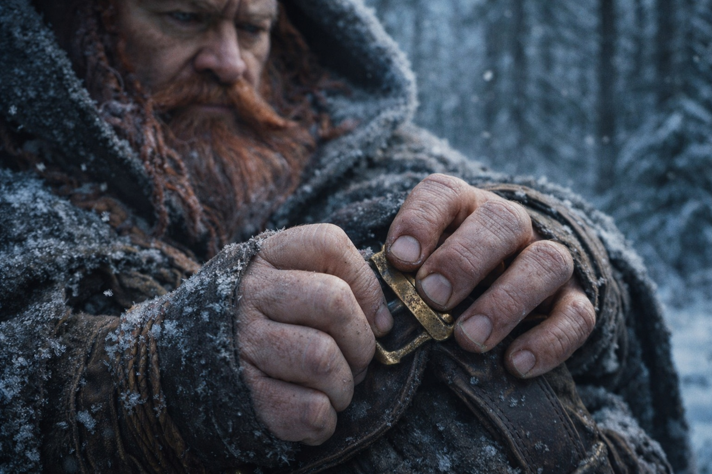
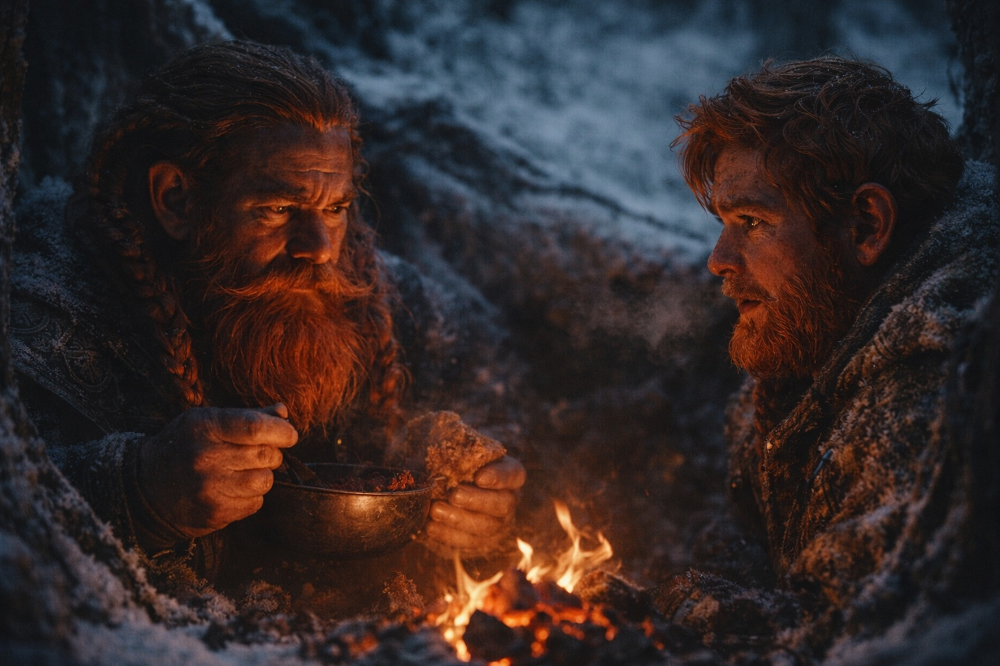
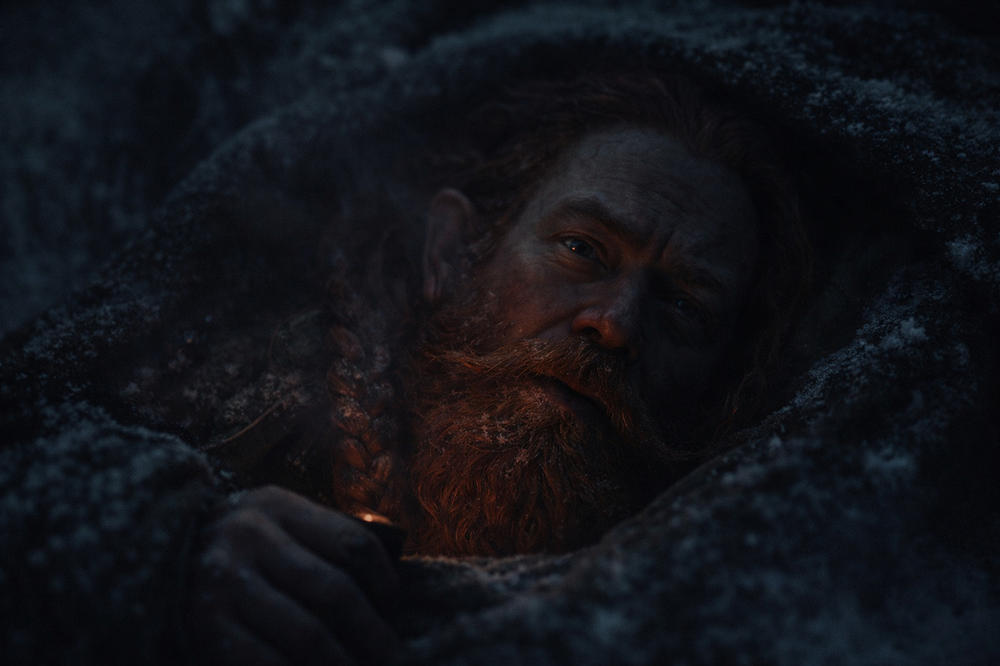

## Chapter 26 | Part 1 | The Doubt

---

Dulint's left hand kept finding the clasp of his pack strap.

Before the hunters and Maris's seven-minute vision, Balin had counted things for amusement: cracks in tavern beams, strides between clearings, the times Aldric chewed on only one side of his mouth.

Now he watched for threats. His uncle's hand kept returning to that clasp, then pulling away.

Fourteen times since morning. Balin was sure of the number because he'd been watching since the first.

The pines grew taller as they approached Frostgard. Little daylight reached the ground through the frozen needles. Balin could distinguish each companion by their footsteps: Aldric's long stride, his uncle's heavy tread, Xandor's shuffle. He kept listening for Maris to stumble.

Maris had insisted on walking. Xandor had refused to move until she ate, and for once he'd won the argument. The dried blood was gone from her face. She was still pale.

The Beacon had barely pulsed since the vision. Dulint kept it in his pack and checked it at intervals.

Fifteen. The clasp again. This time Dulint held it for three seconds before releasing.

"You'll wear a groove in that buckle," Balin said.

Dulint glanced at him. The look was brief, unreadable. "Habit."

"You don't have that habit. You have three habits. Stroking your beard when you're thinking, tapping your axe handle when you're impatient, and talking too much when you're avoiding a question. The buckle is new."

His uncle laughed. It was a good attempt. "You've been studying me."

"I've been watching everyone. It's what I do now."

Dulint's laugh faded. His hand stayed at his side for the rest of the walk.

They made camp at dusk in a hollow between three massive pines. The roots had grown together over centuries, forming walls of gnarled wood that blocked the wind from the north. Aldric approved the position with a grunt and began checking the perimeter, which took him seven minutes. Balin timed it.

Xandor helped Maris sit against a root and tucked his cloak around her. Her eyes closed. Balin could hear a faint whistle in her breathing that hadn't been there a week ago.

Balin gathered wood. He was good at it now. He knew which branches would burn clean and which would smoke, which were dry enough despite the frost, which would crack and pop and give their position away. First number thirty-seven: first time gathering firewood without being told. He'd lost count of the actual firsts somewhere around twenty, but the habit of naming them persisted.

The fire was small, shielded by roots, barely more than coals. Aldric's rule. Enough heat to keep alive, not enough light to be found by.

Dulint sat across from Balin and ate in silence. That was wrong too. Dulint didn't eat in silence. Dulint told stories during meals. Long, winding, pointless stories that Balin had pretended to find annoying for years while secretly cataloguing every detail. Stories about Stonehold, about his father, about the mines and the markets and the time Cousin Brunnhild had accidentally traded a barrel of ale for a goat that turned out to be pregnant with twins.

Tonight, nothing. Just the sound of chewing and the fire's low crackle and the wind in the canopy above.

Balin tried. "Did I ever tell you about the merchant in Zuraldi who tried to sell me a sword that was actually a cooking spit?"

Dulint looked up. Smiled. "No."

Balin waited.

"Tell me in the morning, lad. I'm tired."

Dulint had told stories with a broken arm. Balin had never known him too tired for one.

Balin lay in his bedroll and did not sleep. He listened to Aldric take first watch, boots crunching softly on frost. He listened to Xandor's breathing settle into the deep rhythm of old age and exhaustion. He listened to Maris shift, restless, her sleep troubled by things Balin couldn't see.

And he listened to his uncle.

Dulint's bedroll was six feet away. Close enough to hear the whisper when it came. Not words at first, just the shape of speech, the lips moving against sound too small to carry. Balin held his breath and strained.

"...what do I do if it happens?"

Balin waited. Dulint spoke again.

"You can't stop it."

The voice changed. Still Dulint's, but pitched differently. Lower. Flatter. As if he were quoting someone else's words from memory, rehearsing a conversation that had already taken place.

"Then what's the point?"

Dulint turned over. His next breath caught, then came out slowly.

Balin stared at the dark canopy above and counted. One. Two. Three. Four. Counting nothing, counting to keep his mind from racing.

Who had told his uncle he couldn't stop it?

*What do I do if it happens?*

If *what* happens?

The fire had burned to ash. Aldric's footsteps circled the perimeter. The forest creaked and settled in the cold.

Balin didn't sleep.

---

**End of Chapter 26.1 —> 26.2: [The Crack: The Evidence](/the-crack-the-evidence/)**
