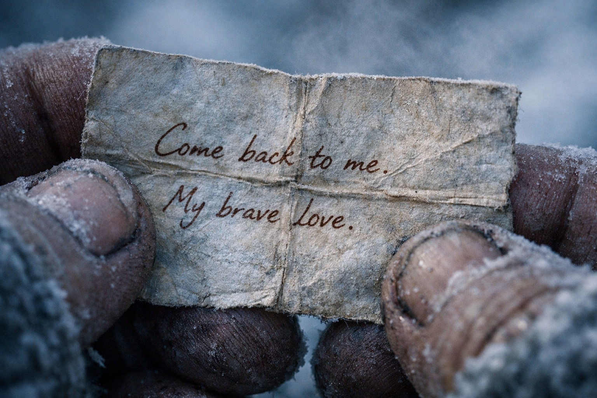
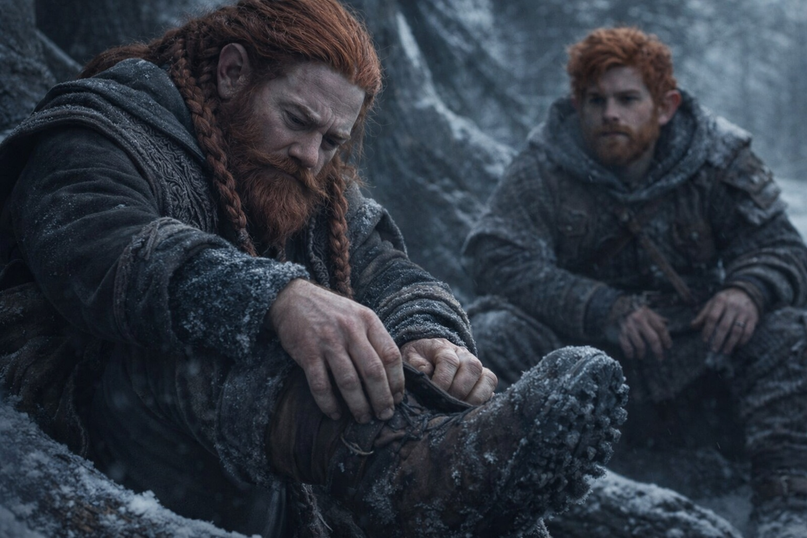
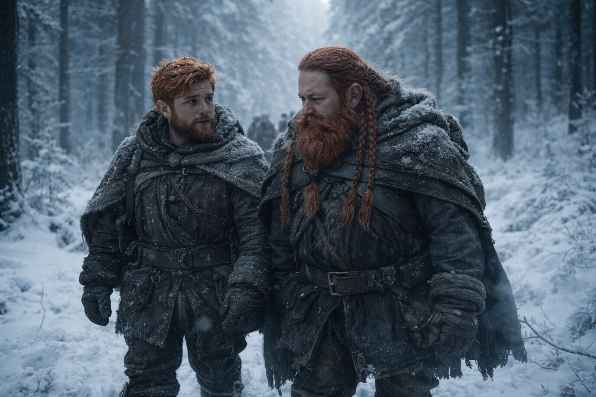

## Chapter 26 | Part 2 | The Evidence

---

The boot was sitting by the fire when Balin found it.

Dulint had left before dawn. Balin had heard him step over his bedroll and kept his breathing even.

He'd been awake for hours, thinking about the whispering and the meals his uncle no longer filled with stories.

Dulint had gone to relieve Aldric in his camp shoes, leaving his wet boots to dry. He'd knocked the left one against a root on his way out.

Balin was pulling on his own boots when he saw the edge of paper.

A folded scrap protruded between the leather and the wool lining. It must have slipped loose when the boot fell.

He should leave it. His uncle was allowed to keep things to himself. Balin reached for the paper anyway.

But trust went both directions. And his uncle had been whispering to himself in the dark, rehearsing a conversation about something that could not be stopped, and the man who had taught Balin to face hard truths was hiding from one.

He pulled the paper free.

The paper was soft along the folds, worn thin where fingers had pressed it flat.

The small, careful writing wasn't Dulint's. His uncle wrote in large, sprawling letters. The ink had faded to brown.

Two lines. The first ran across the center of the paper in that careful script:

*Balin dies fast.*

Below it, squeezed into the remaining space, was a second line in Dulint's hand:

*Only if I rush.*

Balin read the words three times. His hands didn't shake. That surprised him.

His name. In someone else's handwriting. In his uncle's boot.

*Balin dies fast.*

Whoever wrote it hadn't allowed for doubt.

And his uncle's response, written underneath: *Only if I rush.*

The detours. The arguments with Aldric over their pace. Dulint had been slowing them down since Stonehold.

His uncle was afraid of losing him.

Him.

Voices at the perimeter. Dulint's rumble, Aldric's clipped reply. They were coming back. Balin folded the note along its original creases, feeling how naturally the paper found its old shape, and slid it back between leather and wool. He pushed the boot upright and adjusted it so the opening faced the same direction it had before.

His hands were steady. His breathing was steady. His face, when Dulint ducked under the root-wall and met his nephew's eyes with a tired half-smile, showed nothing but the usual morning grumpiness of a young dwarf who hadn't slept well.

"Morning, lad."

"Morning."

Dulint sat and pulled on his boots. Left, then right. His fingers found the interior of the left boot, pressed once against the lining where the paper hid, and continued lacing. The motion was practiced, automatic. He'd checked for the note every morning. Probably every time he put the boots on.

Balin watched without reacting, then ate his jerky and packed his bedroll.

Maris appeared from behind the root-wall, moving slowly. Her color was marginally better. Not good, but better. Xandor walked beside her, one hand near her elbow without touching it, ready to catch what he hoped wouldn't fall.

"How are you?" Balin asked.

"Vertical," Maris said. "Which is an improvement over yesterday's ambitions."

Balin smiled. It felt real enough. He was becoming good at that.

They packed. They moved. North, under canopy, steady pace. The compromise from the clearing held. Aldric led. Dulint walked behind him. Balin took his position beside Maris, whose careful steps had become a metronome he matched without thinking.

He walked and he carried his discovery and he did not share it. Not yet. There were pieces missing. The note told him something existed, something his uncle knew, something that involved Balin's own death delivered as a certainty by someone whose handwriting spoke of precision and authority. But it did not tell him who had written it, or when, or why his uncle had chosen to carry the warning rather than speak it aloud.

Dulint had options. He could have told Balin. He could have told Aldric, or Xandor, or Maris. He could have turned around, gone home, kept his nephew safe behind stone walls. Instead he'd brought Balin north, into Frostgard, into the cold and the hunters and the bleeding seer and the Beacon's call, and he'd done it while holding a note that said his nephew would die if he moved too fast.

*Only if I rush.*

Dulint thought he could change what the note predicted by choosing a slower route. Balin needed to hear what the seer had actually said.

Had those been her exact words? When had she said them?

He would watch a little longer before asking.

The forest stretched ahead, grey and endless. The Beacon pulsed once, faintly, from Dulint's pack.

Balin counted his steps and walked beside his uncle and said nothing.

---

**End of Chapter 26.2 —> 26.3: [The Crack: The Watch](/the-crack-the-watch/)**
