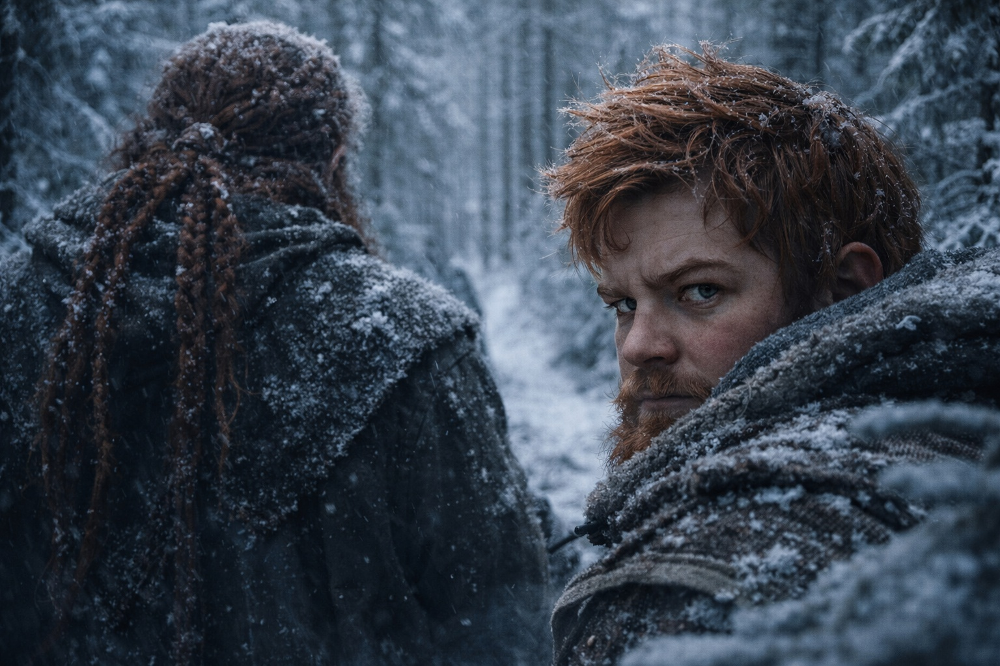
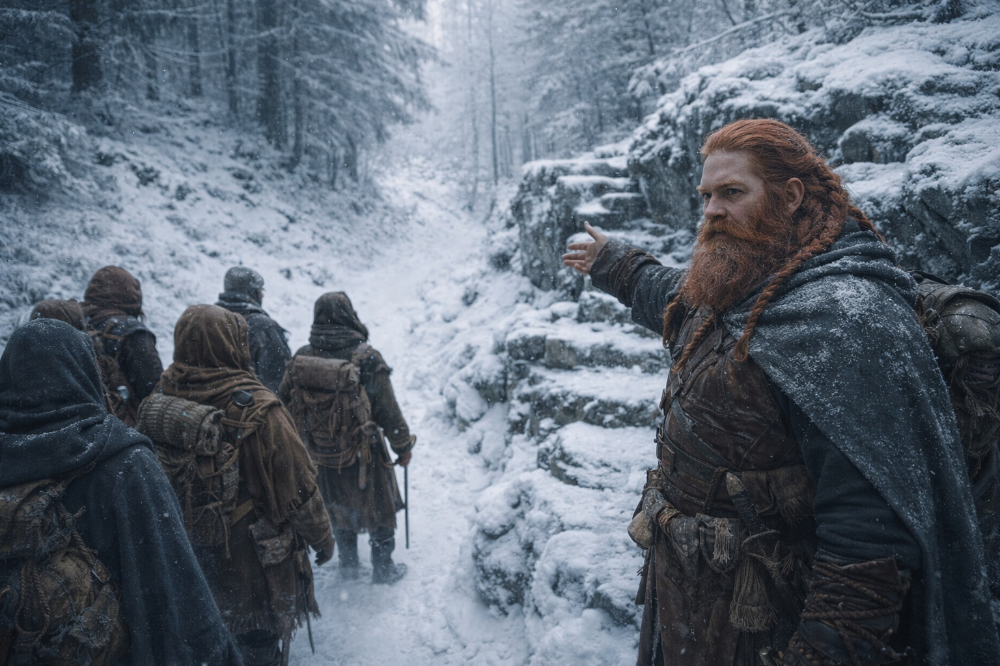
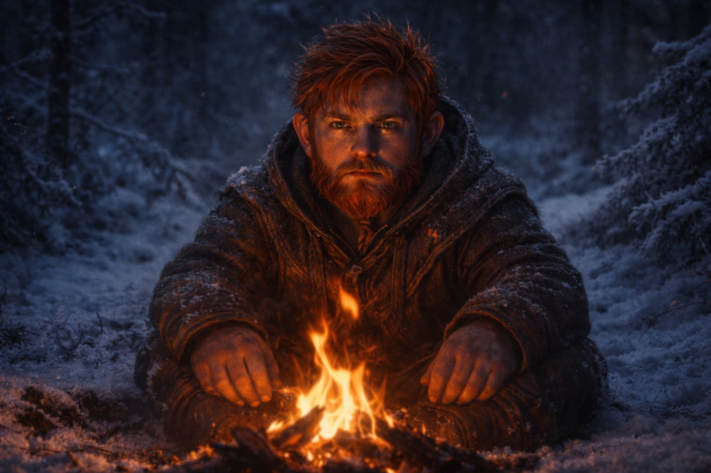
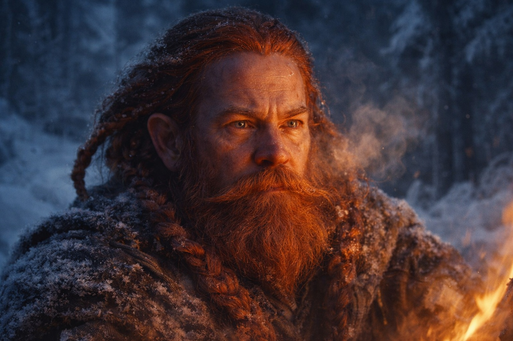
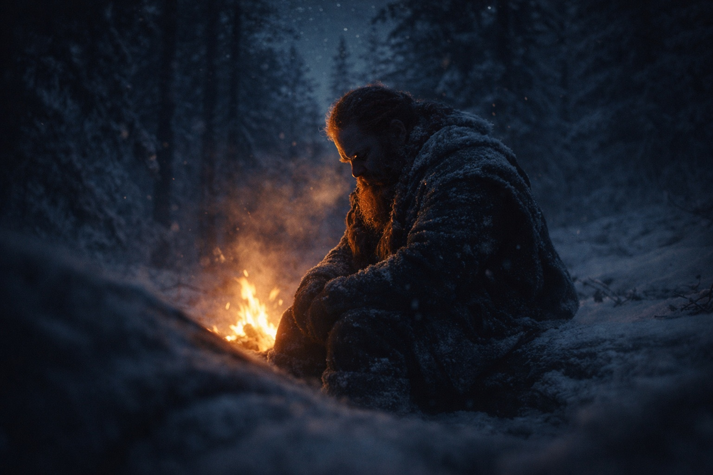

## Chapter 26 | Part 3 | The Watch

---

Balin started counting on the second day.

Not deliberately. The first few he noticed the way you notice a stone in your boot: irritation without understanding. A turn taken too wide. A rest called too early. A stream crossed at the shallow ford instead of the ice bridge fifty paces north, which was faster by half. Small things. The kind of decisions that could mean caution in unfamiliar terrain, or could mean nothing at all.

He watched his uncle's boots. They told him more than Dulint's face ever would.

The old dwarf's stride had a rhythm Balin had known since childhood, that rolling gait of a miner who'd spent forty years navigating tunnels where the ceiling was always lower than expected. Dulint walked the way rivers cut through limestone: patient, inevitable, carving his path with stubborn repetition. But now the rhythm kept breaking. A pause before a hill. A glance backward that lingered two breaths too long. The boots would stop, and Dulint's head would turn, and his lips would move without producing words.

Three.

That was three, by midmorning of the second day. Three unnecessary delays that cost them nothing individually but added up to a lost hour by the time Eldric called the noon halt.

"Your uncle's being careful," Eldric said, not looking at Balin. The soldier was crouched beside a fallen pine, running his eyes along the ridge to the north. Routine sightline check. Balin had learned to read those too. "Ground's gotten worse since the frost deepened."

"He's being something," Balin said.

Eldric's eyes moved from the ridge to Balin's face. Held there. The soldier was deciding whether to ask. He didn't.

Four happened after the noon halt. A trail forked and Dulint led them left, around a granite shelf that could have been climbed in minutes. The detour added another quarter-hour. Five was a water stop at a stream that ran too fast to have frozen, where Dulint spent ten minutes refilling skins that were already three-quarters full. Six was the decision to camp a full hour before dark, in a clearing that offered less shelter than the stand of hemlocks they'd passed half a league back.

Balin sat by the fire and said nothing. His uncle told a story about a cousin's goat that had learned to open gate latches, and the story went nowhere, circling back on itself, the punchline always one sentence further than the last attempt. Xandor listened politely, hands working a knot of bark loose from his staff. Maris lay wrapped in a blanket near the fire's edge, her breathing shallow and measured, her face the color of old candle wax. She hadn't spoken since morning.

Seven. Eight. Nine. Ten.

The third day brought them into denser forest where the pines grew so close their branches wove together overhead, cutting the light to a grey twilight even at midday. Good terrain for moving fast. Narrow trails, firm ground, no visibility for anything hunting from above. Eldric said as much. Dulint nodded. Then led them along the treeline's edge instead, where the snow was deeper and every step required twice the effort.

Eleven.

Twelve was choosing to cross a frozen creek on foot rather than using the downed oak that bridged it cleanly. Balin watched his uncle test the ice with his boot heel, declare it solid, and lead them across with water seeping through the frost at every step. Balin's left sock was soaked within seconds. So was Dulint's. The old dwarf didn't seem to notice.

"Uncle," Balin said that evening, when the others were occupied. Maris sleeping. Xandor communing with a birch tree in soft whispers. Eldric walking the perimeter, counting shadows.

Dulint looked up from the fire. His iron-ore eyes caught the light and threw it back, flat, guarded. "Mm?"

"The creek today. There was a log."

"Log was rotten."

It wasn't. Balin had pressed his palm to it when they passed. Solid heartwood. Pine beetle scarring on the bark but the core intact, dry, capable of holding ten dwarves. He said nothing about this. His uncle's eyes stayed on his face, waiting, and in the waiting Balin saw what he'd been afraid to name.

Dulint knew that Balin was watching.

The old dwarf's mouth worked behind his beard. The fire snapped. Somewhere north, a bird Balin couldn't identify screamed a three-note call that bounced off the frozen canopy.

"Best get sleep," Dulint said. "Long day tomorrow."

Every day was a long day. That was the point.

Thirteen. Fourteen. Fifteen on the fourth morning, when Dulint stopped the column to investigate a pile of scat that any forest dweller could have identified as elk from twenty paces. Sixteen when he doubled them back to recover a waterskin he claimed to have dropped, then produced it from his own pack with a confused frown that was the worst acting Balin had ever seen.

Seventeen was the hill.

The trail ran straight up a moderate slope, switchbacking twice through scrub pine. A fifteen-minute climb at an honest pace. Dulint studied it the way a mason studies a cracked foundation, rubbing his beard, shifting his weight from foot to foot. Then he turned north.

"Easier grade around the side," he said.

The grade around the side took forty-five minutes.

Balin walked behind his uncle and counted his breaths and understood. Not everything. Not the note, not the muttered conversation in the dark, not the specific shape of whatever had been shown to Dulint in the seer's tent. But the pattern was clear now, visible the way a constellation becomes visible once someone traces the lines between stars.

Seventeen times his uncle chose the slower path.

Every delay deliberate. Every rest unnecessary. Every fork taken in the direction that added distance rather than subtracted it. His uncle wasn't being cautious. His uncle was stalling. Buying time against a deadline that Balin couldn't see, stretching the journey like a man stretching the last hour before an execution.

The note in the boot. The muttering in the dark. And now this: a trail of small sabotages that pointed north and said *not yet, not yet, not yet*.

Balin lay in his bedroll that night and watched his uncle sit the first watch. Dulint's silhouette against the fire was the shape Balin had known his whole life, broad and immovable and safe. The shape of the person who'd fed him, trained him, dragged him back from every stupid risk his young body had flung itself toward.

The shape of a man building a cage out of minutes.

---

**End of Chapter 26.3 —> 26.4: [The Crack: The Almost](/the-crack-the-almost/)**