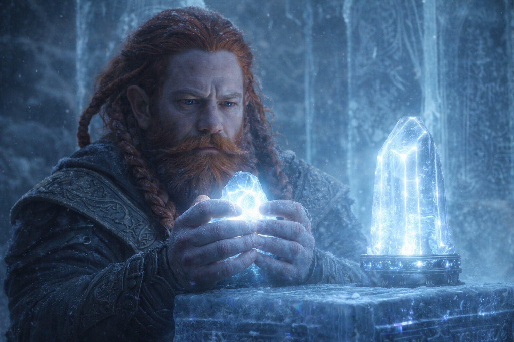
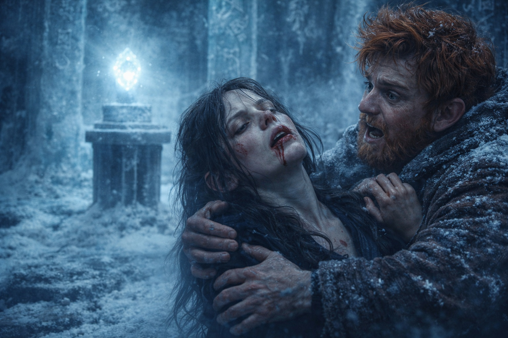
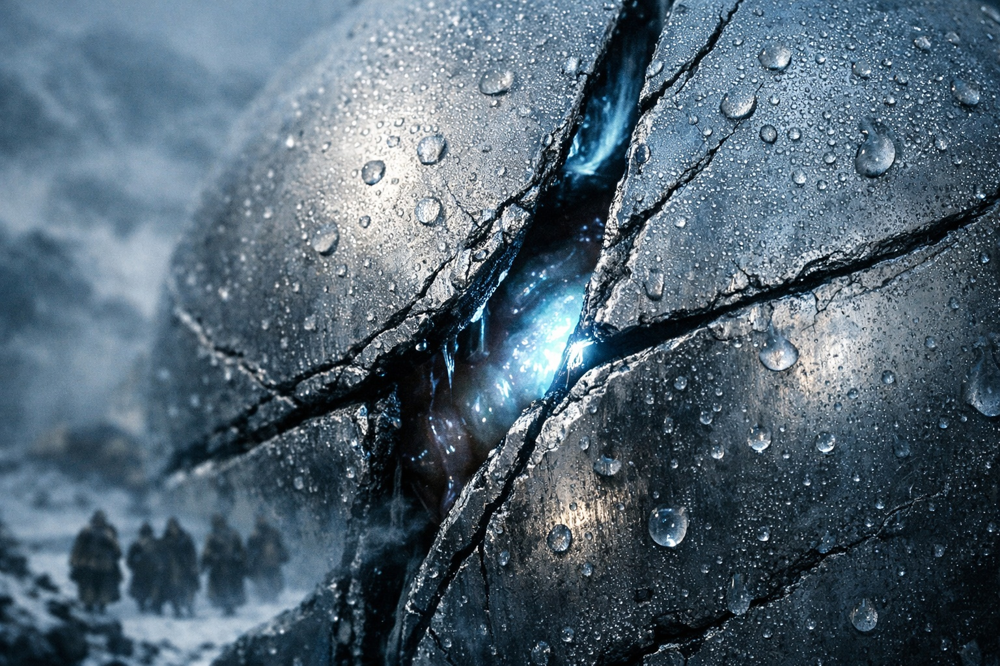
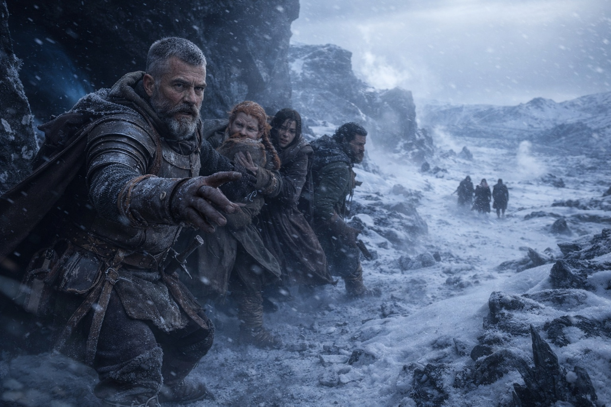

## Chapter 20 | Part 3

--- 

Sound returned before sight.

Maris lay on the ice chamber floor with blood in her mouth. Balin gripped her shoulders and shook her, calling her name. His voice sounded far away. The pain behind her eyes made it hard to concentrate.

"Maris. Maris, look at me. *Maris.*"

She blinked. The chamber resolved around her in pieces. Ice walls. Ancient markings. The pedestal. Balin's face, white with fear.

"I'm here," she managed. Her voice sounded wrong. Thick. "What happened?"

"You dropped." Balin's grip on her shoulders didn't loosen. "Straight down, like someone cut your strings. Your nose is bleeding."

She touched her upper lip. Her fingers came away red.

"How long?"

"A few seconds. Maybe ten." He looked over his shoulder. "Dulint touched the fragment."

Maris followed his gaze. Dulint stood at the pedestal with his hands wrapped around the fragment, knuckles white, face blank. Not blank like sleep. Blank like shock. The Beacon sat on the stone beside the fragment where he'd set it, and the two objects pulsed in perfect synchrony now. The same rhythm. The same light. As if they'd always been parts of the same thing.

But the Beacon had changed.

Its surface, which had always been smooth metal, had developed seams. Fine lines running across its casing like veins. As Maris watched, one of the seams widened slightly and something inside the Beacon shifted. Wet. Organic. The gap closed again before she could see clearly, but the movement had been unmistakable.

Alive.

The Beacon looked alive.

"Dulint." Eldric stood two paces back, sword still drawn, watching the old dwarf with the careful attention he gave to things he might need to fight. "Put it down."

Dulint didn't respond. His eyes were fixed on the fragment in his hands, and his lips moved without sound.

"*Dulint.*"

The dwarf blinked. His hands opened. The fragment rolled off his fingers and landed on the pedestal with a sound like a bell struck underwater.

"I heard it," Dulint whispered. "It was talking. Not words. More like... directions. A map drawn in sound."

Xandor approached the pedestal and knelt, studying the two objects without touching either. His expression was one Maris had never seen on him before. His face held awe cut with dread.

"They're merging," the druid said. "The fragment is integrating with the Beacon. Or the Beacon is absorbing the fragment. The distinction matters, but I can't tell which way it's flowing." He looked up at Dulint. "You said directions. Directions to what?"

"More pieces." Dulint's voice was steadier now but his hands still shook. "There are more fragments. Four, maybe five. Scattered. Hidden. I could feel them, like points of heat on a map I couldn't quite see."

"You could feel them because the Beacon is using you as a receiver." Xandor's voice carried no accusation, only the flat tone of someone stating an observation they wished they hadn't made. "It's broadcasting through you now. Not just from itself. Through you."

Dulint moved his hands away from the pedestal.

Maris pressed herself upright against the chamber wall, ignoring Balin's outstretched hand. Her head pounded with each heartbeat but the worst of the pressure was fading. The vision had been violent but brief, cut short by the shock of the fragment's connection.

She'd seen something in that white flash. Something new.

She wasn't ready to talk about it yet.

"We need to leave," Eldric said. "This place was broken into before we arrived. Whoever did it may still be close." He looked at Dulint. "Can you carry both?"

Dulint looked at the fragment. It was small, dark, etched with the same script that covered the chamber walls. His fingers shook as he picked it up and placed it beside the Beacon in his pack.

When the objects touched, the Beacon's hum deepened. Maris felt the vibration in her chest.

And something distant felt it too.

There was no vision this time. She felt the distant attention, but could not place it. Someone had noticed them.

"We need to leave *now*," she said.

Eldric looked at her. Whatever he saw in her face was enough.

"Move," he said.

They moved.

---

**End of Chapter 20.3 —> 20.4: [The First Fragment: The Vision](/the-first-fragment-the-vision/)**
