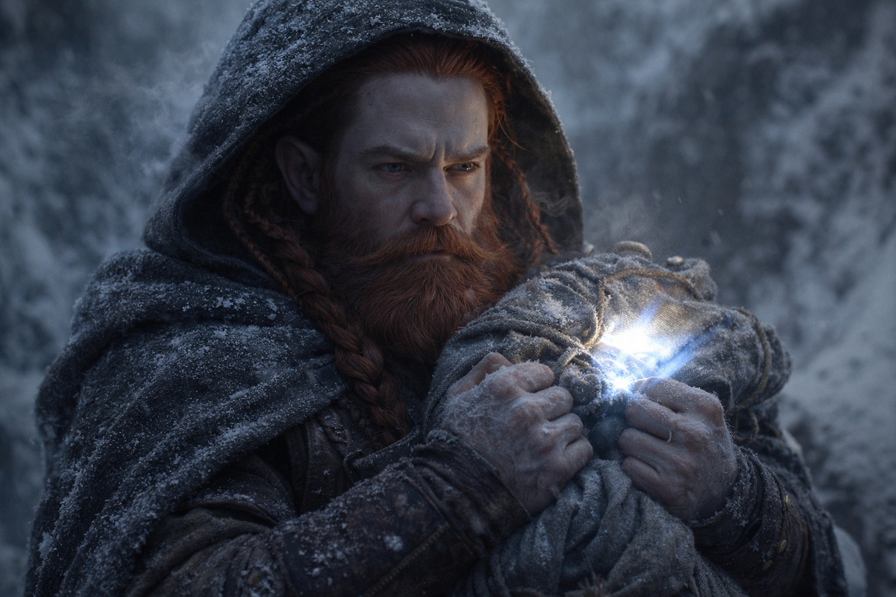

## Chapter 20 | Part 5

--- 

Eldric found the body at first light.

He'd gone to check the perimeter, a habit so ingrained he did it before eating, before speaking, before acknowledging that the sun had risen. Maris heard him leave and come back. The time between was too long.

"Nobody move," he said from the rim of the ravine. His sword was already drawn. "Dulint. Come up here. Just you."

The others waited. Maris counted heartbeats. Thirty-seven before Dulint's shadow returned to the rim, and even from below she could see how his posture had changed. Stiffer. Older.

"Balin, stay with Maris and Xandor." Dulint's voice carried the particular flatness he used when he needed everyone to obey without questions. "Don't come up."

They came up anyway.

The Frost Giant lay twenty paces from the ravine, face down in the frosted grass. Maris had felt someone tracking them for days. She had thought it might be one of the Grukmar following them after the ambush.

It would never strike at anything again.

The giant had been killed with precision that made the ambush look clumsy. No wasted cuts. No defensive wounds. Whatever had done this had struck once, from behind, severing the spine at the base of the skull. The giant hadn't even had time to turn around.

Dulint stared at its back.

A message had been cut through the leather and flesh. The strokes were deep and even; every letter was legible.

GIVE US THE BEACON.

Four words. Common trade script. No dialect, no flourish, nothing that identified the author. Just a demand, inscribed on a body left close enough to find.

"Not a giant," Eldric said. He was studying the ground around the body, reading tracks the way Maris read visions. "Look at the prints. Boots, not bare feet. Two sets, both the same size, both the same stride. Military training. Moving in formation even out here."

"Giants don't write in trade script," Xandor added. He hadn't looked at the body directly. He was watching the treeline. "And they don't send messages. They send war parties."

"So who?" Balin's voice was tight. He was looking at the carved letters with the expression of someone trying to understand a language he didn't speak.

"Someone who wants the Beacon," Maris said. "Someone who knows we have it."

"Someone who found us before we found the fragment." Eldric crouched by the nearest boot prints and measured them against his hand. "These tracks are old. Two days, maybe three. They've been watching us since before the cave."

Dulint was silent. He stood over the body with the pack pressed to his chest, the Beacon pulsing inside it, louder now, stronger, as if the fragment's integration had turned up the volume on a signal that was already too loud.

"The fragment changed the broadcast," Dulint said quietly. "Made it stronger. Wider. More... specific." He looked at Maris. "You felt it. In the cave. Something noticed."

"Something was already noticing," Maris said. "This just made it easier for them to find us."

Eldric stood. "We move. Different direction than the Beacon wants. We need distance, cover, and a place to think."

"The Beacon won't like that," Dulint said.

"The Beacon doesn't get a vote."

They covered their tracks as best they could and left the body where it lay. The two sets of boot prints led northwest. Eldric checked that direction before turning away.

They headed east into dense forest, where the branches forced them to slow down. Eldric kept them moving. Maris watched the ground, picking her way over roots while she tried to stop seeing the message on the giant's back.

At midday, they stopped long enough for water.

"These aren't bandits," Eldric said. He hadn't sat down. "Bandits are opportunistic. This is a retrieval team. They know what we're carrying, they know what it does, and they want it intact."

"How do you know they want it intact?" Balin asked.

"Because we're still alive." Eldric scanned the canopy above them. "A team this skilled could have taken us at any point. They killed the giant to show they could, and they left a note instead of an arrow. That's professional restraint. They're giving us a chance to hand it over."

"And if we don't?"

Eldric didn't answer that.

Dulint pulled the pack open and looked at the Beacon. The fragment sat beside it, both pulsing in unison, and the seams on the Beacon's surface had widened slightly since the cave. Through the largest gap, Maris caught a glimpse of something that didn't look like metal. Dark. Textured. Wet.

She looked away.

"We can't give it to them," Dulint said. "I don't know what it is. I don't know what it wants. But I know giving it to people who carve messages into bodies isn't the answer."

"Then we need to move faster than them and farther than they expect." Eldric tightened his pack straps. "East, not north. Get away from the Beacon's heading, find somewhere defensible, figure out our next step."

"The Beacon is pointing north," Xandor said. "Toward the next fragment. If we go east, we lose the trail."

"Better than losing our lives."

The druid looked at Dulint, who turned to Maris. She lowered her eyes. She could still taste blood.

"The person in my vision," she said. "The drow. He's connected to the Beacon. I don't know how. But every time the Beacon gets stronger, the vision gets clearer. If we stop pursuing the fragments, we might lose the connection."

"And if we keep pursuing them," Eldric said, "we might lose everything else."

Silence.

"Compromise," Dulint said finally. "We go east for now. Put distance between us and the hunters. But we don't abandon the heading entirely. We arc. East, then north, then west to reconnect." He looked at Eldric. "Slower, but alive."

Eldric considered it. Nodded once.

Eldric led them east through the forest. Balin stayed beside Maris.

Behind them, the message on the giant's back dried in the sun.

In Dulint's pack, the Beacon still pointed north.

---

**End of Chapter 20.5 —> 21.1: [The Black Garden: The Borderlands](/the-black-garden-the-borderlands/)**
