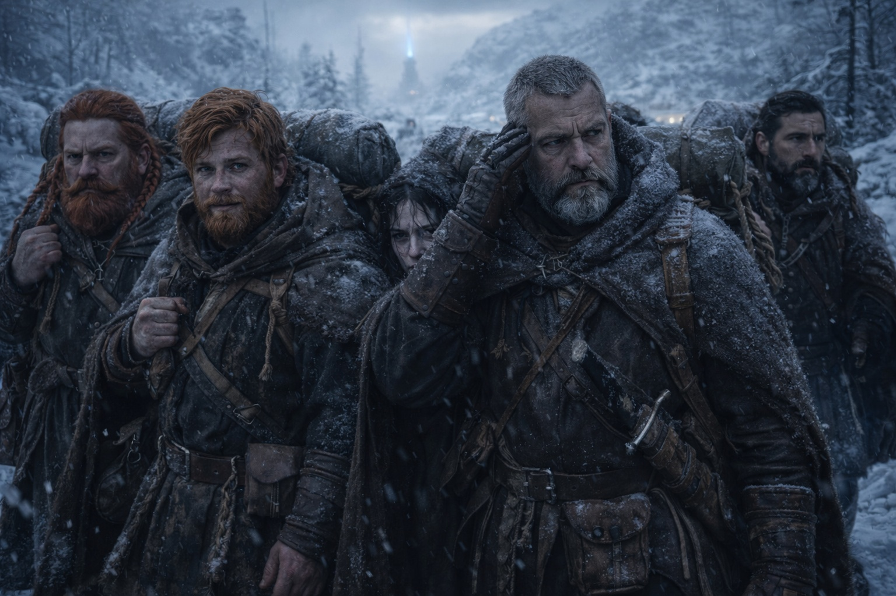
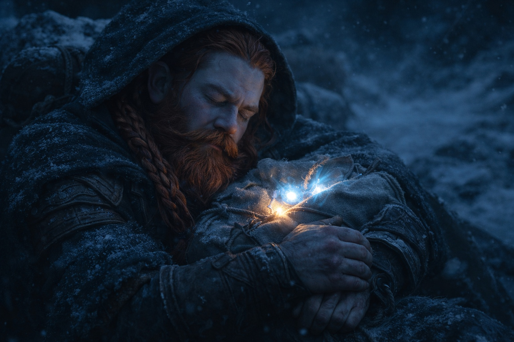
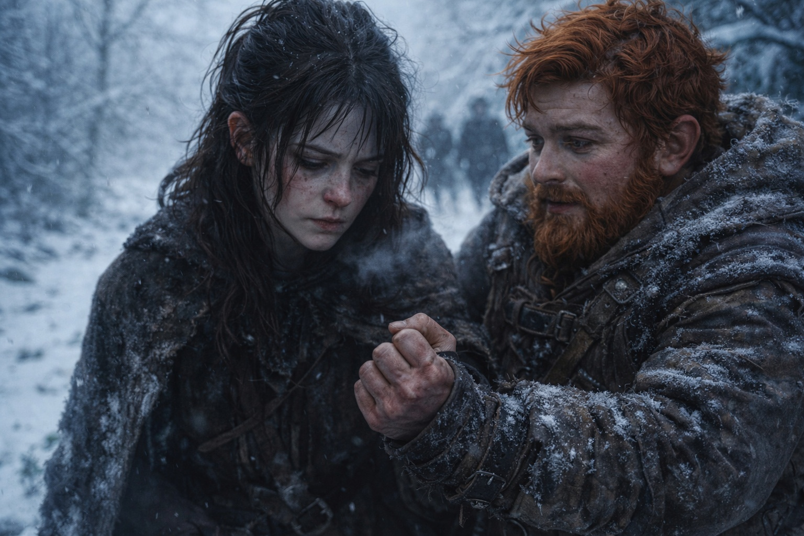
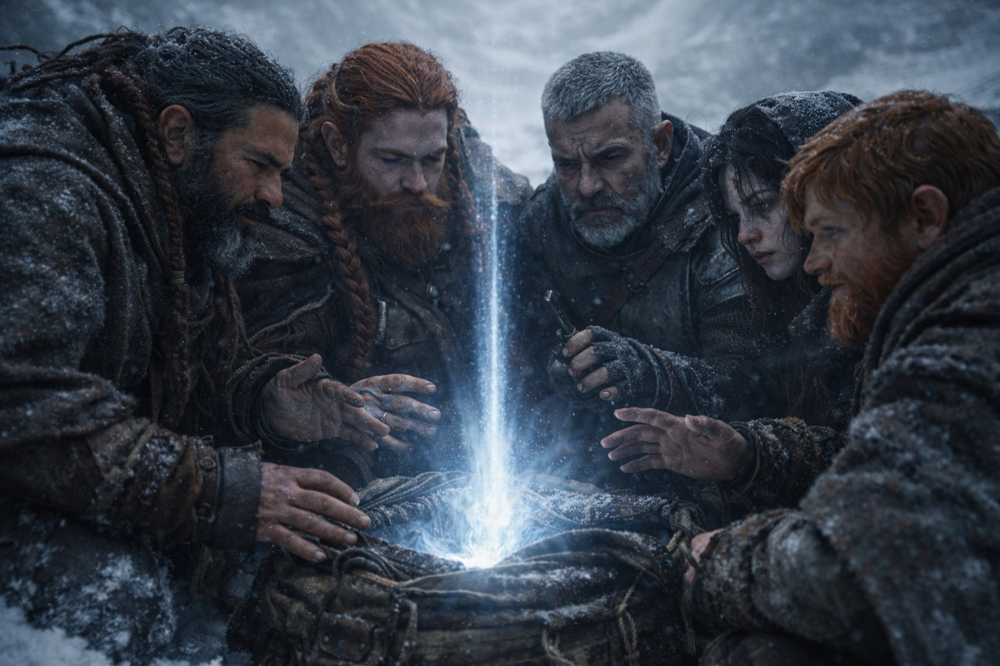
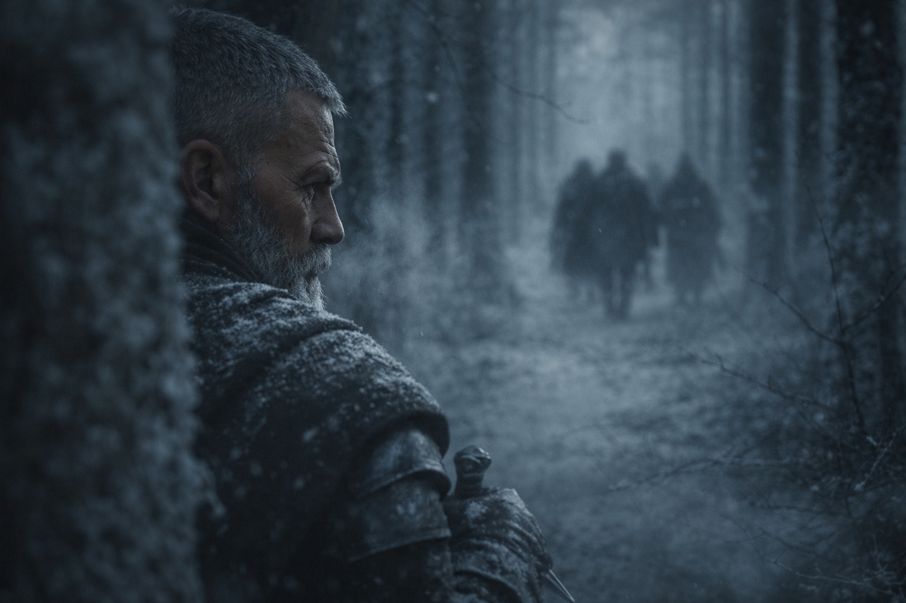

## Chapter 20 | Part 1

--- 

The Beacon had changed.

Maris noticed it first, three days after the ambush, while Dulint slept with the pack pressed against his chest. The artifact's steady pulse had broken into quick bursts followed by silence, then a low hum that made her teeth ache.

She said nothing about it. She'd learned, over the past weeks, that pointing out things only she could sense earned her worried looks and careful distances.

The terrain shifted around them as they pushed north. The gentle hills of central Astalor gave way to rockier ground, sparse trees bent by wind that came down from the Frostgard passes. The grass thinned. The soil turned grey. At night, the temperature dropped enough to see their breath.

"We're close to the border regions," Eldric said on the fourth morning, studying the horizon. "Another two days and we'll hit Frostgard territory proper. Ice and stone. No shelter worth the name."

"The artifact doesn't care about shelter." Dulint's voice carried the rough edge of someone who hadn't slept well in days. "It wants us to keep moving."

"The artifact doesn't want anything," Xandor corrected gently. "It responds to proximity. We're approaching something it recognizes."

Maris felt a pull toward the mountains ahead. She pressed her palm against her temple and breathed through the pressure behind her eyes.

The visions had been coming more frequently since the ambush. Fragments, mostly. A flash of dark water. Pale hands reaching through something thick and resistant. A face she couldn't quite resolve, features slipping away the moment she tried to focus. Each one left her with a nosebleed and a headache that lasted hours.

She hadn't told the others about the face.

"Maris." Balin had fallen into step beside her. He moved differently now, watchful in a way he hadn't been before the ambush. His hand rested near his sword hilt as a matter of habit rather than bravado. "You're doing the thing again."

"What thing?"

"The thing where you stare at nothing and your right hand shakes."

She looked down. Her hand was trembling against her thigh. She curled it into a fist.

"I'm fine."

"You don't have to be fine. You just have to tell us when you're not." He paused. "That's what Eldric told me, anyway. After."

The boy was trying so hard. She wanted to tell him that his concern was misplaced, that the visions weren't the danger. The danger was what happened when they stopped.

"The Beacon is pointing differently," she said instead. "More precisely. Like it's narrowing."

Balin frowned. "Narrowing how?"

"Before, it pointed generally northeast. Now it points to one spot in the mountains." She could feel the direction without touching the artifact.

Dulint, walking ahead with Xandor, stopped. He set the pack down and opened the flap, peering inside.

"She's right," he said. "The glow's changed. Brighter. Focused."

Xandor knelt beside the pack and held his weathered hands over the artifact without touching it.

His eyes closed. Maris counted twelve heartbeats before his fingers began to tremble and he drew his hands back.

"There's something ahead," the old druid said finally. "Something that matches the Beacon's frequency. A resonance. Like a tuning fork answering another."

"Another artifact?" Eldric's hand moved to his sword.

"A piece of one." Xandor opened his eyes. "The Beacon isn't whole. It never was. It's been searching for its missing parts since we left Stonehold. And now it's found one."

The wind picked up, carrying the smell of ice and old stone down from the passes. Maris pulled her cloak tighter and watched the mountains grow against the sky. Somewhere up there, buried in rock or ice or forgotten ruins, something was answering the Beacon's call.

The ache in her skull worsened with every step north.

"How far?" Dulint asked.

Xandor stood slowly, joints protesting. "A day. Perhaps less. It's close."

Dulint shouldered the pack again. The Beacon pulsed hard enough for Maris to see the light through the canvas. Short pulses followed as he walked.

They walked.

Behind them, something else was walking too.

Maris could sense a presence behind them. It kept its distance. She could not tell who was following.

She opened her mouth to say so. Closed it. Opened it again.

"We're not the only ones who noticed," she said quietly.

Eldric looked at her. "Noticed what?"

"Whatever's ahead. Whatever the Beacon found." She swallowed. "Something else is looking for it too."

The soldier studied her face for a long moment, then turned to scan the treeline behind them. Nothing moved. Nothing visible.

"How sure are you?"

"Sure enough to not want to sleep tonight."

Eldric nodded once. "Then we move faster."

---

**End of Chapter 20.1 —> 20.2: [The First Fragment: The Location](/the-first-fragment-the-location/)**
