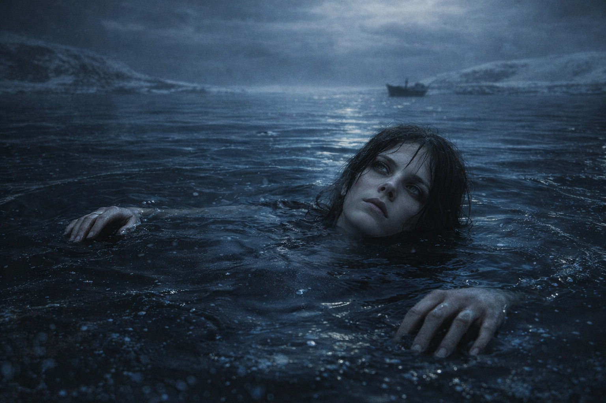
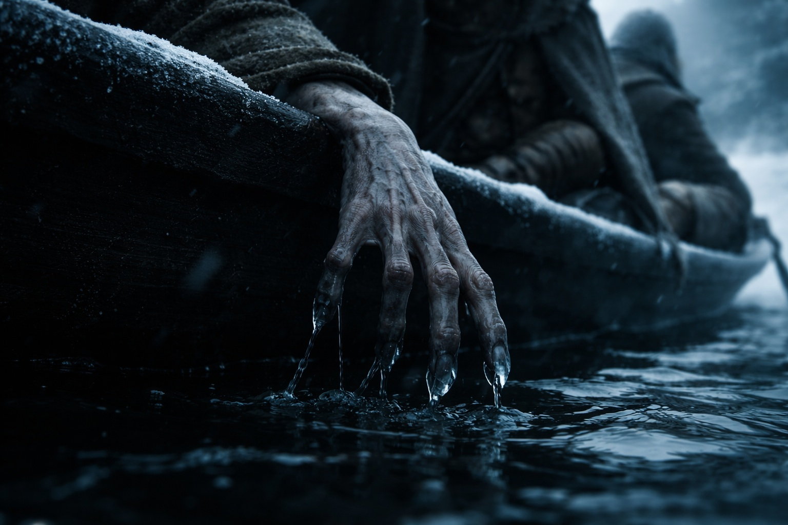

## Chapter 20 | Part 4

--- 

The vision came that night.

They'd put distance between themselves and the ice cave, moving fast through terrain that grew rockier with each hour. Eldric pushed them until Maris's legs gave out, then pushed them another league before conceding to rest in a shallow ravine where the wind couldn't reach.

Maris barely felt the ground when she sat. The Beacon's new signal had been pressing against the inside of her skull all day, louder now, insistent. She'd been counting the nosebleeds. Four since the cave. The blood came without warning, a warm trickle she'd wipe away before anyone noticed.

They always noticed.

"Eat something." Xandor crouched beside her, offering dried meat from their dwindling supplies. "Your body is burning through reserves faster than it should."

"I'm not hungry."

"That isn't what I asked."

She took the meat. Chewed mechanically. Swallowed.

The Beacon pulsed in Dulint's pack across the camp. Each pulse hurt behind Maris's eyes. Before the fragment, she could sometimes shut out the signal. Now it persisted even when she turned away.

She lay back against the ravine wall and closed her eyes.

The vision seized her.

No preamble. No warning flash. One moment she was in the ravine with cold rock against her back, and the next she was somewhere else entirely.

Water. Black water, thick as oil, stretching to a horizon that didn't exist. She floated in it without sinking, or perhaps she was the water, looking up through its surface at a sky made of stone.

The Stable Image came.

The image that had haunted her for weeks resolved with a clarity that stopped her breath. A small boat on black water. A hand reaching over the side, trailing fingers through the surface. She'd seen this a hundred times, always fragmentary, always dissolving before she could make sense of it.

This time the image held.

She could see the arm now, thin and long, with blue-ash skin. The hand trailed in the water, its long fingers ending in sharp nails.

The arm led to a shoulder. The shoulder led to a face.

His face had the same blue-ash skin. White hair lay tangled against his head, wet with water or sweat. In the poor light, she could just make out the yellow of his eyes.

The face was young. Not a child's but not a man's either. Something between. The features were too sharp for a human, cheekbones cut high, jaw narrow, ears that swept to points she could see even through the matted hair.

He was looking at her.

He met her eyes without surprise.

His mouth opened.

His voice broke on the first word.

*"Help me."*

She heard both words. Then the vision broke.

She came back screaming.

Balin was holding her down. Eldric had her legs pinned. Xandor was pressing cloth against her nose, which was pouring blood in a steady stream, soaking her shirt, pooling in the dirt beneath her.

"She's back," Balin said. "Maris, can you hear me? You're safe. You're in the ravine. You're safe."

She couldn't stop shaking. Her teeth chattered so hard she bit her tongue. The taste of blood mixed with the phantom taste of black water.

"How long?" she whispered.

Balin and Eldric exchanged a look.

"Two minutes," Eldric said. "Maybe three. You were convulsing. Foam at the corners of your mouth."

Three minutes. The longest vision she'd ever had. And the clearest.

Xandor helped her sit up slowly, supporting her head, wiping blood from her chin. His hands were steady but his eyes were not.

"What did you see?" he asked.

"A face." Her throat hurt. "I saw a face. Blue-grey skin, white hair, pointed ears. Yellow eyes. He was in water, black water, and he looked at me. He said..." She swallowed. "He said *help me.*"

Silence.

Dulint looked at Xandor. Something passed between them, a communication Maris was too wrecked to interpret.

"A drow," Xandor said softly. "You're describing a drow."

"A what?"

"Dark elves. From the underdark civilizations." The druid's voice was careful, measured. "They're not supposed to exist above ground. Not in this part of the world. Not for centuries."

Maris closed her eyes. She could still see him in the water, frightened, looking straight at her.

"He's real," she said. "Wherever he is, whatever he is, he's real. And he's running out of time."

---

**End of Chapter 20.4 —> 20.5: [The First Fragment: The Hunters](/the-first-fragment-the-hunters/)**
