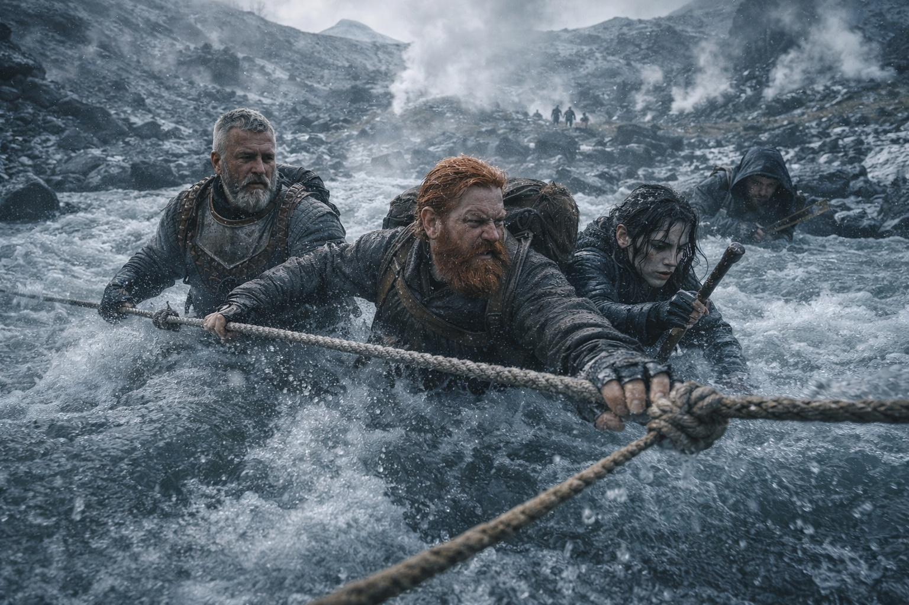
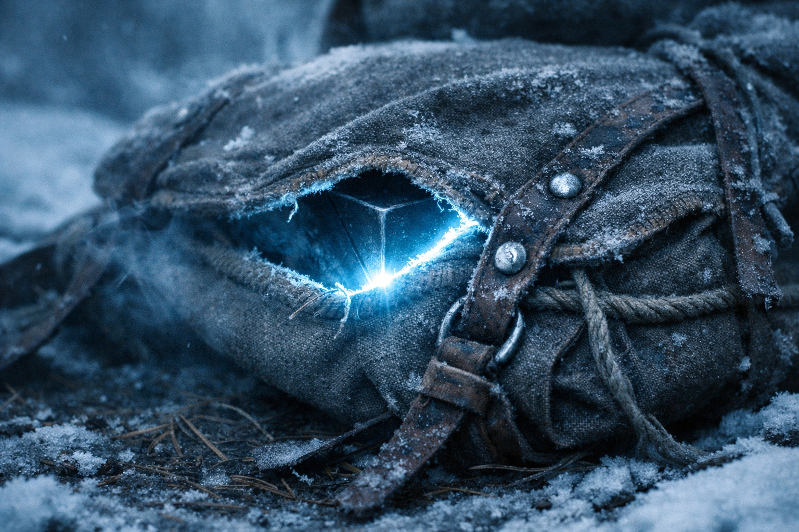
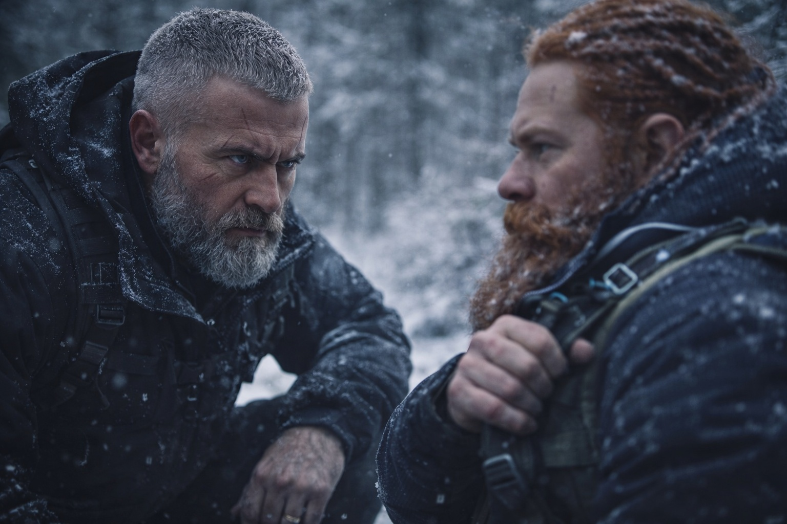
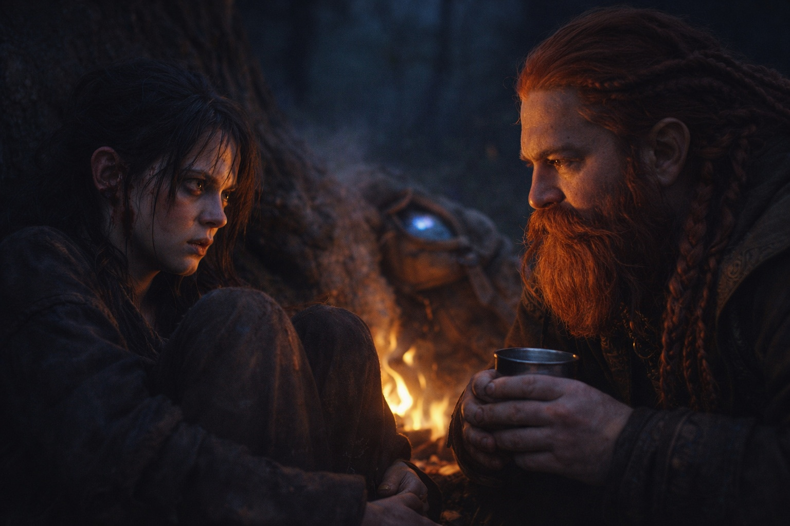
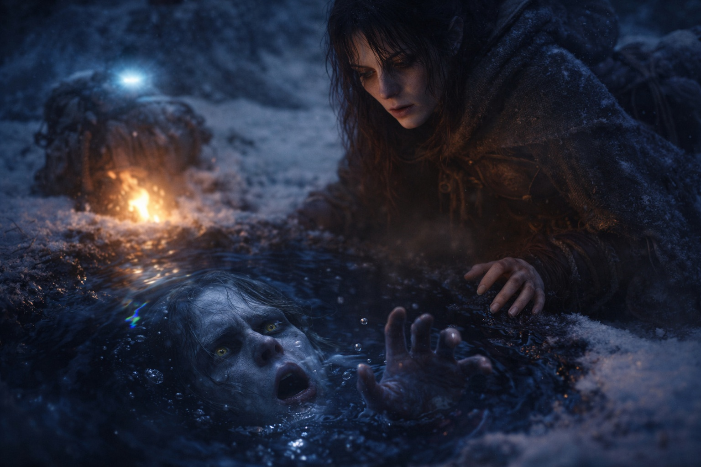

## Chapter 22 | Part 3

--- 

Maris started bleeding at midday.

Not a nosebleed this time. Blood from her ears, thin red trails that ran down her jaw and spotted the collar of her shirt before she noticed. Xandor saw it first and stopped the group with a raised hand.

"Sit down," the druid told her. "Now."

"I can walk."

"Your ears are bleeding."

Maris touched her jaw. Looked at her fingers. The expression that crossed her face wasn't surprise. It was resignation. The face of someone who'd been expecting exactly this and had run out of ways to pretend it wasn't happening.

She sat.

Dulint watched from three paces away. Each pulse from the Beacon made the corner of Maris's eye twitch. The signal had grown stronger since the cave.

"How long has this been happening?" Xandor asked, tilting her head to examine the bleeding.

"The ears started yesterday. Small. I thought it would stop." She paused. "The visions are stronger since the fragment. Clearer but heavier. Like something is pressing against the inside of my skull."

"The fragment amplified the Beacon's signal," Xandor said. "Before, the Beacon was a whisper. Now it's a shout. Your sensitivity hasn't changed, but the volume has."

"Can you block it?"

The druid was quiet for a moment. "No."

"Can you reduce it?"

"I can manage the symptoms. Not the cause. The cause is the Beacon, and the Beacon isn't going to get quieter." He looked at Dulint. The look held more than medical concern. It held a question that Dulint didn't want to answer.

Eldric crouched beside Maris, his earlier frustration replaced by the focused attention he gave to tactical problems. "Can you travel?"

"Yes."

"Can you travel at speed?"

Maris hesitated. That hesitation said more than any answer could.

"She needs rest," Dulint said. "We slow down. Give her body time to adjust."

Eldric looked from Maris to Dulint. For a moment, Dulint hoped the soldier would accept this explanation for the delays.

"You've been going slow for her," Eldric said. Not accusing. Realizing.

"She can't handle the pace."

"That's true. But it's not why you've been going slow." Eldric stood. "It's a convenient reason for something else."

Dulint said nothing.

They made camp early. Xandor prepared a tea from dried herbs he kept in a leather pouch, something for pain and swelling, and Maris drank it without complaint. The bleeding stopped within the hour, but she remained pale, hollow-eyed, curled against a tree root with her arms wrapped around her knees.

Dulint brought her water and sat nearby, not close enough to crowd, not far enough to seem like he was avoiding her.

"I can manage," she said before he could speak.

"I know."

"But you're using me as a reason to go slow." She looked at him with eyes that saw too much and couldn't stop seeing. "I'm your excuse. Eldric knows it. Balin suspects it. The only thing protecting you is that they feel guilty about pushing a sick woman."

Dulint had no answer to that.

"You need the slower pace," Dulint said.

"I do. But that's not why you're choosing it." She turned her head, pressing her temple against the bark. "What happened in Stonehold?"

"Nothing that concerns—"

"Everything concerns us. We're in this together. Your secret, whatever it is, is making decisions for all five of us." She closed her eyes. "I see things, Dulint. I see things I can't unsee and I carry them because there's no one to give them to. The face in the water. The yellow eyes. The voice asking for help. I carry all of it."

She opened her eyes.

"You can carry yours alone, if you want. But know that the weight is showing."

Dulint looked down at the pack between them. The Beacon's light showed through the canvas.

"The visions," he said, because talking about her pain was easier than talking about his. "The face you saw. You said drow."

"Xandor called them that. Dark elves. Underground civilization. Not supposed to be in this part of the world."

"But you saw one."

"I saw a young person drowning in dark water, asking for help." Her voice flattened. "The Beacon connects us somehow. Each time it gets stronger, I see him more clearly. And each time I see him, the cost gets higher."

"Then maybe we should stop chasing the fragments."

Maris looked at him, and pity crossed her face before she could hide it.

"We can't stop. That's what you don't understand. It's not about the fragments. The connection exists whether we chase them or not. The Beacon will broadcast whether we like it or not. We can follow it and find what's waiting at the other end, or we can sit here and let it come to us."

She leaned back and closed her eyes again. "I'd rather be searching than waiting."

Dulint sat with her until she slept, then sat with his own thoughts, which were worse company.

---

**End of Chapter 22.3 —> 22.4: [The Fracture: The Near-Confession](/the-fracture-the-near-confession/)**
