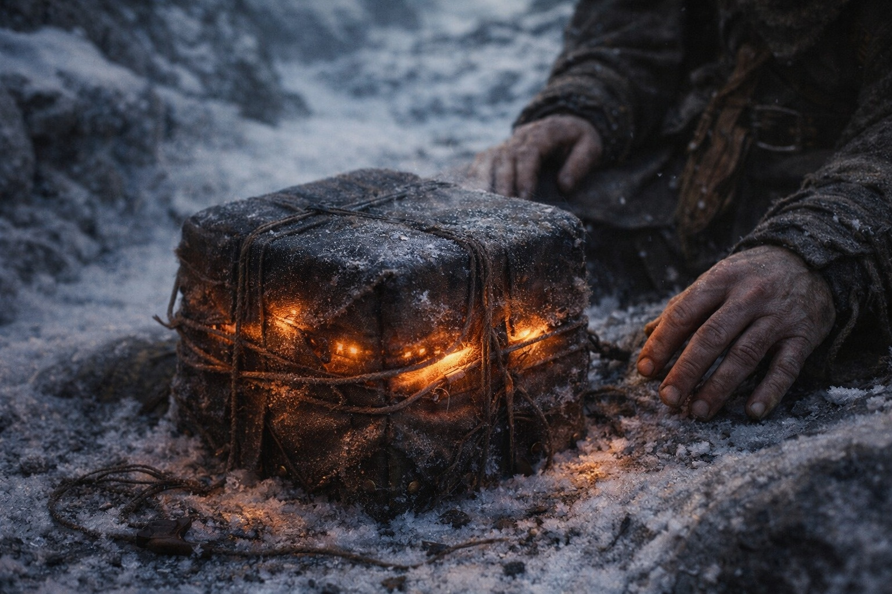

## Chapter 35 | Part 1 | The Alignment

---

Xandor spread the fragments across a flat stone and weighed the corners with river pebbles.

Aldric had chosen the hollow for its sightlines. Balin had agreed because it was the first level ground they'd found in six hours. Maris sat beside Xandor, trying to ignore the pull in her chest.

The fragments were everything they'd gathered since Zuraldi. Scraps of text Xandor had copied from three different temple libraries before the roads got bad. Maris's vision accounts, dictated to Balin in the mornings when the details were still sharp, written in his careful hand on paper they couldn't afford to waste. The Beacon's behavioral log, which was Dulint's memory, because nobody had thought to keep records until Aldric suggested it two weeks too late.

"Here." Xandor tapped a yellowed page. "The Shattered Covenant. Fragment nine. 'When the membrane thins, the system seeks a bearer. Not a hero. Not a chosen instrument. A frequency match. Dual affinity. Air and water, the binding elements.'" His staff leaned against the rock. Maris hadn't heard him speak to a plant in three days.

"You've read that to us before," Aldric said, drawing the stone along his blade.

"I have. But I didn't have this before." Xandor placed a second page beside the first. His handwriting, smaller than Balin's, cramped with the urgency of someone transcribing in poor light. "The Athenaeum fragment. Recovered from the Frostgard monastery, the one that burned. Partial translation: 'The mechanism requires interface. Living interface. The barrier cannot renew itself. It was not built to. It requires a body that carries both elemental affinities in sufficient concentration to serve as a conduit between the Nexus component and the barrier's core frequency.'"

Silence.

The wind moved through the depression. The Beacon hummed inside its wrapping on Dulint's pack, steady, directional, pointed northeast.

"A conduit," Dulint said. He looked toward his pack.

"A living conduit, if the translation holds. But this word could mean component or housing." Xandor pointed at the disputed line. "Dulint carries the chassis. The other bearer has Erase. This text doesn't tell us what else they need."

Maris's left nostril throbbed around the strip of cloth she'd packed into it that morning. The hum had grown louder as they walked. She couldn't tell how much of that came from their own approach and how much from his.

"Now put it together with what she's seen." Xandor's voice changed. Quieter. The tone he used when he was about to say something he'd been holding back. "Maris. The visions. The man you see."

"Dark elf. An artifact beneath his shirt. Crystals on his belt." Maris kept her eyes on the page. "He's moving through the dead forest. There's something else in him. She feels it, but she can't identify it."

"And the affinities? Air and water?" Xandor asked.

"She doesn't know his affinities."

"Then that part remains unconfirmed." Xandor held the page flat. "A bearer with an artifact, drawn toward the barrier. Enough to compare with the fragments. Not enough to be sure."

The Beacon's hum rose. Maris pressed a finger beneath her nose and found fresh blood.

"There's also the timing." Xandor checked a second fragment. "These records describe a renewal window that recurs after centuries. A period when contact becomes possible."

"But?" Aldric stopped sharpening.

"The changes we're recording are faster than the records suggest. Something could be forcing the window. From the other side."

"What kind of something?" Balin asked.

Xandor had no answer. Maris looked northeast, pressing her palm against the ache in her chest.

"If someone acts before the window opens, these fragments predict a breach." Xandor kept his hands on the page. "The changing signal may be our only warning."

Maris held the stained cloth under her nose. She had learned to notice changes in the hum through pain. She still couldn't read them.

She looked from one fragment to the next.

A breach. If Xandor was right, reaching the barrier could be worse than failing to reach it.

"How long?" Dulint asked.

Xandor searched the copies again. One ended halfway through a sentence.

"I don't know. Days. Weeks. The acceleration makes prediction unreliable." He paused. "But it's soon. The fragments describe what happens when the window opens at the wrong point in the cycle. 'Breach, not renewal. Opening, not sealing. Everything the barrier contains becomes briefly, catastrophically visible.'"

Briefly. Catastrophically.

Maris closed her eyes. She could find the bearer through the Beacon, at a cost. She hadn't found any way to make him hear her.

She opened her eyes. The northeast horizon was clear. The Beacon hummed.

"We need to move faster," she said.

Nobody disagreed.

---

**End of Chapter 35.1 —> 35.2: [The Map That Bleeds: The Names](/the-map-that-bleeds-the-names/)**
