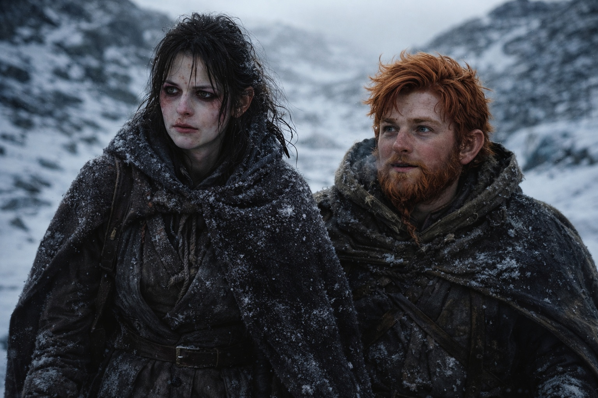
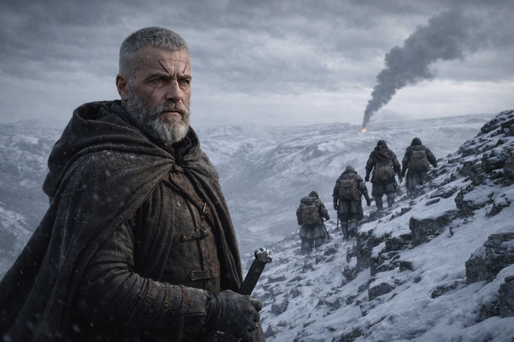
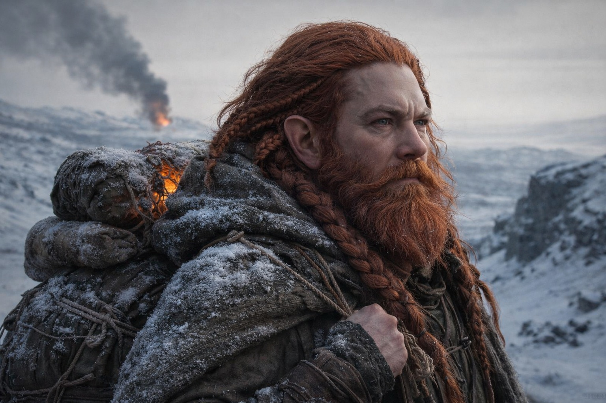

## Chapter 35 | Part 4 | The Fire

---

---

Three days after the vision, they saw the smoke.

Maris walked with Balin's arm near her elbow, not touching, not supporting, just present in the way a wall is present beside a staircase. She hadn't asked for it. He hadn't offered it. It had simply become the arrangement her body negotiated with the world after the seizure: she walked, and Balin walked within catching distance, and neither of them acknowledged the geometry.

Her body was a ledger of costs. The nosebleeds had stopped on the second day, crusted and dark inside both nostrils. The blood from her ears had dried to a brownish residue she could feel when she swallowed, a grit in the channels that muffled the world's sharper sounds. The blood from her eyes had been the worst, not because it hurt more but because Balin had seen it and his face had done something she didn't have the energy to address. She could see. The vision in her left eye was slightly blurred, the kind of blur that could be temporary or could be the first draft of permanent. She didn't mention it.

They'd pushed hard. Dulint set the pace and the pace was punishing, the kind of forced march that ate provisions and wore joints and converted the body's reserves into distance at an exchange rate nobody could sustain for long. Xandor kept up through stubbornness and his staff and an old man's refusal to be the reason others slowed. Balin's limp had returned, genuine now, the walking stick doing real work. Aldric walked flank with his hand on his sword and his eyes on the ridgeline where the grey cloaks had been visible at dawn, closer now, matching their speed, maintaining distance as if tethered.

The terrain had changed. The frozen grassland had given way to rocky hills that climbed northeast toward something, a rise in the landscape that Aldric called foothills and Xandor called the barrier's shadow, the place where the membrane between this side and the other began to affect the geography. The air tasted different here. Thinner. Sharper. The cold was a different cold, not the honest cold of winter but something metallic, the cold of proximity to a thing that shouldn't exist.

The Beacon had been steady since the vision. Not louder. Not screaming. Steady in the way a compass is steady when you're walking straight toward what it points at. Dulint carried it and said nothing about it and his face was stone.

The smoke appeared on the morning of the third day.

Aldric saw it first because Aldric saw everything first. He stopped on a ridge and stood and didn't move, and the stillness drew the rest of them to his position like a current draws debris.

Northeast. On the horizon. A column of smoke, pale against the grey sky, rising from a point beyond the hills. Not campfire smoke. Not the thin thread of a settlement cooking or a forest burning naturally. This was thick. Sustained. The smoke of something large burning in a concentrated area, something stone or metal that wouldn't have burned at all without extraordinary heat.

"That's where the Beacon points," Dulint said.

Nobody needed him to say it. They could all see the Beacon's direction, could feel it in the way Dulint's body angled toward the smoke as if the artifact in his pack had turned his spine into a needle. The smoke rose from the exact bearing the Beacon had been screaming toward for weeks.

Maris stared at the smoke and felt the afterimage behind her eyes, the tower burning, the stone cracking, the thing with wings.

"That's the tower," she said.

The words came out flat. Not distance language. Not clinical. Flat because there was nothing between her and the fact, no buffer of analysis or distance pronoun, just the naked recognition of seeing in the real world the thing she'd seen through the Beacon's frequency four nights ago.

"The tower from the vision." Xandor's voice was steady. His hands on his staff were not.

"The tower is gone. That's the aftermath. Whatever happened over there, that smoke is what's left." Maris looked at the column rising into the grey sky. It didn't bend in the wind. It rose straight, as if the heat at its source was too intense for the atmosphere to redirect. "She saw it burning. That's it burning."

Silence. Five people on a frozen ridge in the foothills of a barrier they couldn't cross, watching smoke rise from the place where everything they'd been tracking had just changed.

"How far?" Aldric asked.

"Two days at this pace," Dulint said. "Maybe less if the terrain opens up past these hills."

"Two days." Aldric looked at the smoke. "Whatever happened there is already over."

"The fire's still burning."

"Fires burn for days after the event. That doesn't mean we arrive in time to change anything."

Dulint turned. His face was the face of a man who had known this for leagues, who had known it since the vision, since the first time Maris had screamed on a frozen plateau and bled from her eyes and described a tower cracking and a figure with wings. He'd known they were too far. He'd marched them hard anyway. Because being too far was different from being as close as possible, and the second was all he had.

"We don't arrive in time," Dulint said. "We arrive."

Xandor sat on a rock. He was breathing hard. The march had cost him more than he'd shown, and sitting was the confession his body made when his pride stopped watching. He looked at the smoke with the expression of a man reading a text he'd hoped to never find outside a library.

"If the tower is gone," he said, "then the buffer is gone. The tower was the last fixed point between the barrier's interface and whatever lies beyond it. Without it, the bearer approaches the barrier with no intermediate structure. No calibration point. No safety margin."

"What does that mean?" Balin asked.

"It means the process accelerates. It means whoever is pushing the timing just removed the one obstacle that could have slowed it down." Xandor looked at his staff. He looked at his hands. He looked at the smoke. "It means we have less time than we thought, and we already thought we didn't have enough."

Maris sat on the frozen ground. Not because she chose to. Because her knees made the decision for her, the body's quiet veto of the mind's insistence on standing. The cold seeped through her trousers. The ridge wind cut across her face. The smoke rose on the horizon, straight and thick and patient, burning from a place where a tower had stood and a dark elf had walked through fire and something with wings had announced itself to a world that had forgotten it existed.

She could see him. She couldn't reach him. She knew what he was and not who. She knew the mechanism and not the outcome. She knew the fire and the wings and the armored woman who had already decided, and she knew that knowing these things changed nothing because knowledge from the wrong side of an uncrossable boundary was just a more detailed version of helplessness.

"That's where he is," she whispered.

"Was," Aldric corrected.

Nobody argued.

The smoke rose. The Beacon hummed. The grey cloaks watched from a ridge to the south. The foothills climbed northeast toward a barrier that existed in dimensions none of them could name, and beyond that barrier, impossibly far and impossibly close, a dark elf whose name they didn't know was walking toward a mechanism that would renew or destroy the only thing separating this world from what lived on the other side.

Dulint shouldered his pack.

"Two days," he said. "We walk until dark."

They walked. The smoke did not diminish. The Beacon did not quiet. The distance between what they knew and what they could do remained absolute, a gap measured not in leagues but in the fundamental architecture of the barrier that separated the world they stood on from the world that was burning.

Maris walked and bled and watched the smoke and counted the cost of clarity, which was the same cost it had always been: seeing everything, changing nothing, carrying the weight of knowledge that served no purpose except to make the helplessness precise.

She walked northeast. Toward the fire. Toward the barrier. Toward a man whose name she didn't know, whose face she could draw from memory, whose frequency the Beacon tracked with the devotion of a compass pointing at true north.

The smoke rose straight into the grey sky, and the sky received it without comment, the way the world receives all evidence of catastrophe: patiently, indifferently, as if burning towers and falling barriers were just another variety of weather.

---

**End of Chapter 35.4 —> 36.1: [The Scale of War: The Confrontation](/the-scale-of-war-the-confrontation/)**