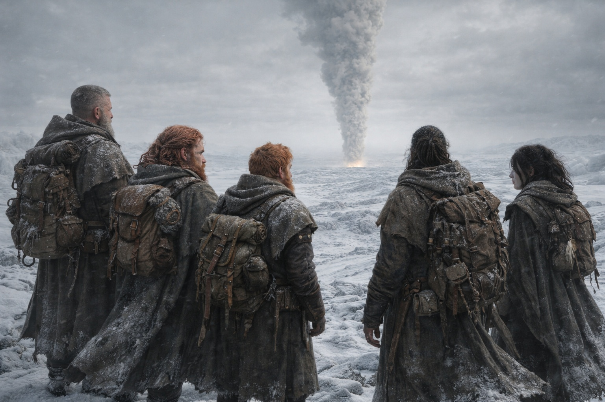
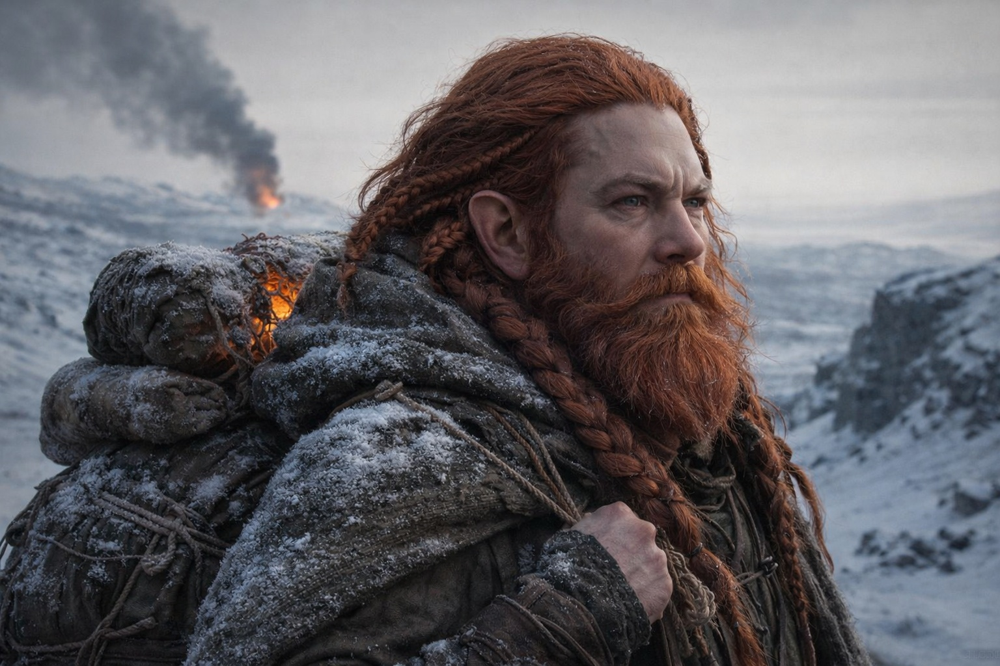

## Chapter 35 | Part 4 | The Fire

---

---

Three days after the vision, they saw the smoke.

Balin walked within reach of her elbow. She hadn't asked for help, but twice that morning he'd caught her when she stumbled.

The nosebleeds had stopped on the second day. Dried blood still clogged her ears, muffling voices. Her left eye remained blurred. She tested it whenever Balin looked away, closing the right eye to see if anything had improved.

Dulint kept a punishing pace. Xandor leaned hard on his staff, and Balin's limp had returned. Aldric watched the ridgeline where the grey cloaks had appeared at dawn. They were closer, matching the group's pace.

The frozen grassland had given way to rocky hills. Xandor called them the barrier's shadow. Maris only knew that breathing hurt more on the climbs and that she couldn't get her fingers warm.

The Beacon held a steady bearing. Dulint had stopped checking it at every ridge.

The smoke appeared on the morning of the third day.

Aldric stopped at the crest and raised a hand. The others climbed up beside him.

A thick column rose beyond the northeastern hills. It spread high above the horizon, too broad for a campfire. Maris could not see its source.

"That's where the Beacon points," Dulint said.

Maris followed the line of his outstretched hand. The smoke rose from the same bearing.

Maris stared at the smoke and felt the afterimage behind her eyes, the tower burning, the stone cracking, the thing with wings.

"That's the tower," she said.

Her voice sounded flat to her own ears. Three days since the vision, and she still saw the burning wall whenever she closed her eyes.

"The tower from the vision." Xandor's voice was steady. His hands on his staff were not.

"Same direction. Enough smoke." Maris watched the column rise. "She can't see the tower from here. But that's where she saw it burn."

They stood on the frozen ridge without speaking.

"How far?" Aldric asked.

"Two days at this pace," Dulint said. "Maybe less if the terrain opens up past these hills."

"Two days." Aldric looked at the smoke. "Whatever happened there is already over."

"The fire's still burning."

"Fires burn for days after the event. That doesn't mean we arrive in time to change anything."

Dulint looked back along the slope they'd just climbed. Xandor was still breathing hard. They couldn't have covered it much faster.

"We don't arrive in time," Dulint said. "We arrive."

Xandor sat on a rock with both hands braced on his staff. He waited until he could speak without gasping.

"If that was a calibration station, losing it could mean losing their measurements. We don't know what they kept there."

"What does that mean?" Balin asked.

"If they keep going, they may have to act without those checks." Xandor looked at the smoke. "That woman was pushing him forward. Nothing Maris saw suggests they stopped."

Maris's knees buckled. Balin caught her arm and helped her sit. Cold seeped through her trousers as she watched the smoke.

She could find him again. It might leave her unable to walk, and she still had no way to warn him. She kept her attention on Balin's hand until the urge to reach passed.

"That's where he is," she whispered.

"Was," Aldric corrected.

Nobody argued.

The grey cloaks had stopped on a ridge to the south. Aldric counted them while Dulint checked the route ahead.

Dulint shouldered his pack.

"Two days," he said. "We walk until dark."

Balin helped her stand. They followed Dulint down the ridge, with the smoke visible above the next hill.

She kept her good eye on the path. Reaching for another vision would slow them now.

At the bottom of the slope, she took her arm from Balin's and tried a few steps alone.

She made it to the next rise before she needed him again.

---

**End of Chapter 35.4 —> 36.1: [The Scale of War: The Confrontation](/the-scale-of-war-the-confrontation/)**
