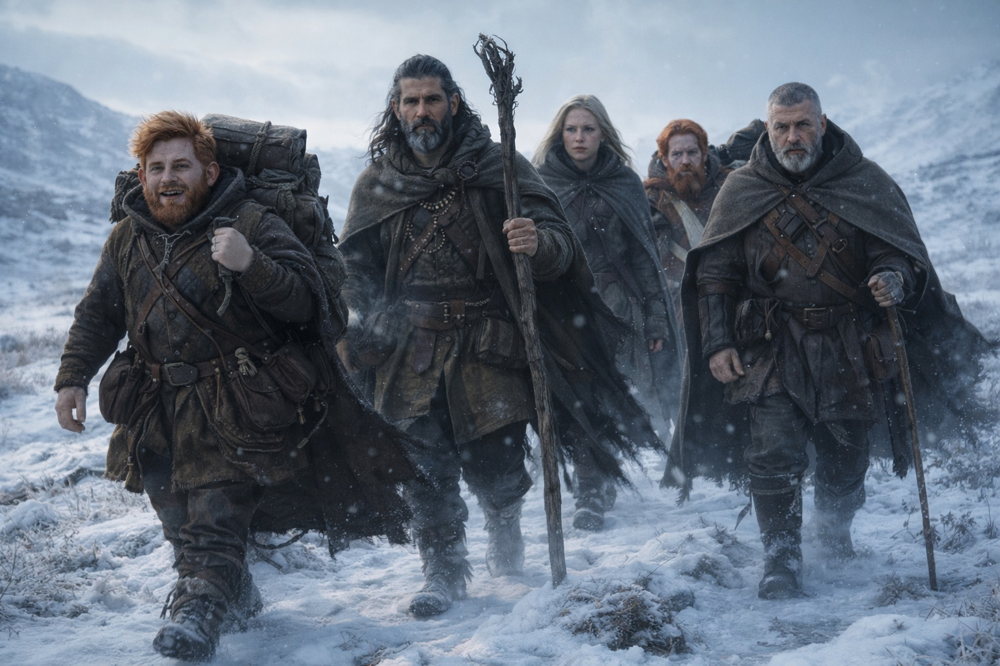
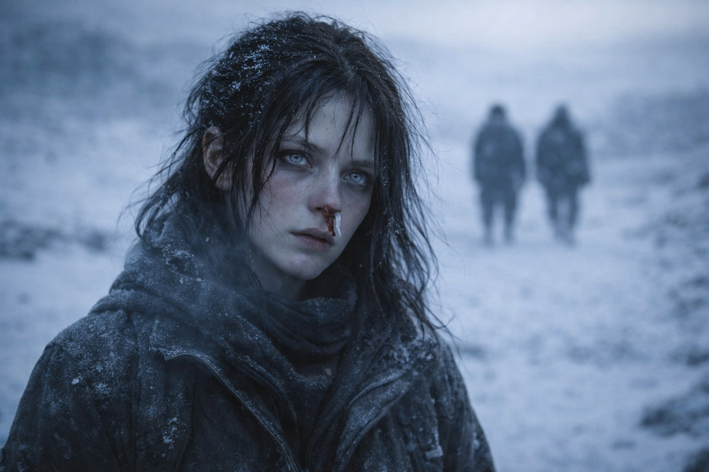
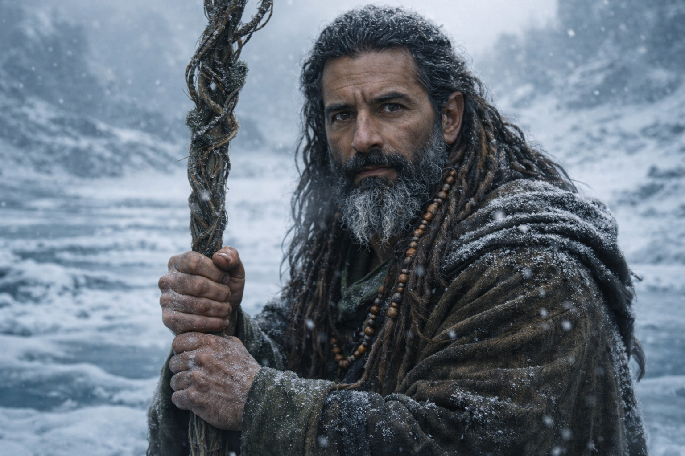
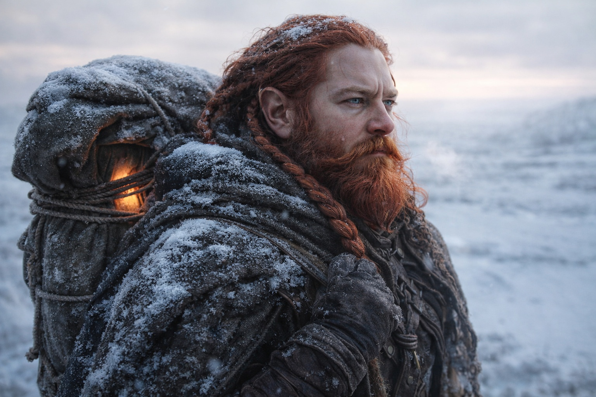
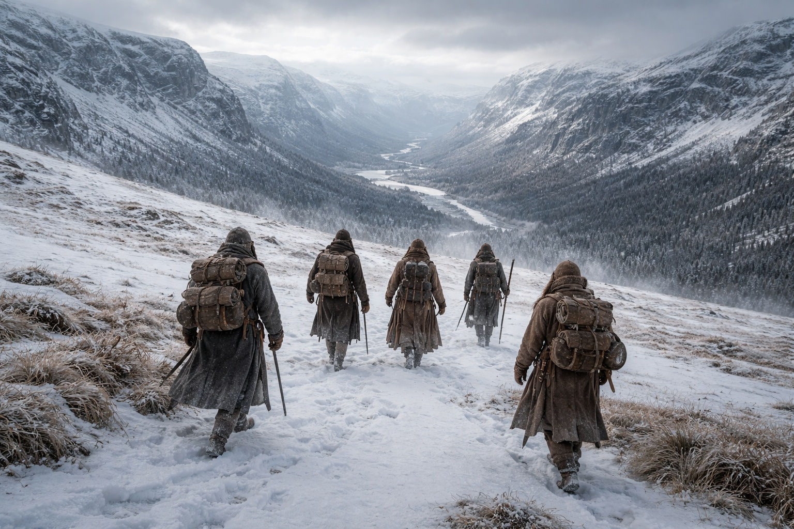

## Chapter 35 | Part 2 | The Names

---

They walked northeast through the second day with the knowledge sitting between them like cargo nobody wanted to carry.

Dulint led. He always led when the terrain was open and the direction was certain, because leading was the thing he did when thinking would have been worse. His pack hung heavy on his shoulders and the Beacon hummed inside it, steadier now, the way a compass needle steadies when you stop turning and walk the direction it points.

Maris walked behind Xandor and tried to assemble the face.

She'd seen it. Dozens of times. The dark elf with the artifact and the crystals at his belt and the presence inside him that the Beacon flinched from. She'd seen his face through the barrier's interference, through the frequency static, through the cost that came every time she reached. Dark skin. White hair. Young, but not the kind of young that meant inexperienced. The kind that meant the experience had started early and hadn't stopped.

She knew his affinities. His direction. His fear. The weight he carried that had nothing to do with the pack on his back. She knew the shape of the thing living behind his sternum, though knowing its shape was like knowing the shape of a fire by looking at the smoke. She knew he was walking east toward the barrier because someone had told him that was where his duty pointed, and she knew he believed them because believing was easier than the alternative.

She didn't know his name.

"The fragments don't name him," Xandor said. He was walking with his staff in both hands, using it as a balance aid rather than a walking stick, the way he did when his mind was somewhere his body wasn't. "The Shattered Covenant describes the function. Dual affinity. Nexus bearer. Barrier interface. It describes what the mechanism requires. It never describes who fills the requirement."

"No prophecy names the instrument," Aldric said. He was walking flank, ten paces out, his eyes on the ridgeline where the grey cloaks had been visible that morning. His left hand rested on the sword at his hip. The grip had improved, Maris noticed. The stiffness was nearly gone. "The prophecy describes the lock. Not the key."

"She sees his face," Maris said. The distance language again. The clinical remove. "Young. Dark elf. Not from any settlement she recognizes. He carries the artifact like he's been carrying it long enough that the weight is part of him. The crystals at his belt resonate with it. Four of them. Black. They hum at frequencies she can feel through the Beacon."

"Four black crystals," Xandor repeated. He stopped walking. His staff planted in the frozen ground. "You're certain?"

"She's certain."

"Adaptation crystals. The texts mention them. They form when prolonged exposure to a hostile magical environment forces the body to compensate. The crystals are the compensation made physical." He started walking again, faster. "Four means he's been in Wyrmreach long enough that the realm has changed him. Permanently."

Balin adjusted his walking stick. The limp was barely a limp now, more habit than necessity, but he kept the stick because it gave him something to do with his hands when conversations went places he didn't want to follow. "So we know what he is. Dual affinity. Bearing the artifact. Changed by Wyrmreach. Walking toward the barrier."

"We know what he is," Dulint confirmed. He didn't slow down. "We don't know who."

"Does it matter?" Balin asked.

The question hung in the air between them. Dulint's shoulders shifted under his pack. Xandor's staff struck the frozen ground in a rhythm that was almost but not quite steady.

"It matters," Maris said, "because the prophecy doesn't say he saves anything."

They all looked at her. She was walking with her hands in her pockets and her cloth-packed nostril crusted brown and her pale eyes fixed on a point in the northeast that none of them could see.

"The fragments describe arrival. Interface. The mechanism engaging. They describe the barrier responding to the conduit's frequency. They don't describe what happens after." She pulled her hands from her pockets. The left one was trembling. She put it back. "The fragments describe a process. Not an outcome. The process works whether the timing is right or wrong. Right timing: renewal. Wrong timing..."

"Breach," Xandor finished.

"The prophecy doesn't say he saves anything," Dulint said. He'd stopped walking. His voice was the particular quiet that Maris had learned to associate with the moments when Dulint's certainty and Dulint's fear occupied the same space. "It says he arrives. It says the barrier responds. It doesn't say the ending is good."

Silence. Five people standing in open terrain with the wind pulling at their clothes and the Beacon humming northeast and the knowledge that the person they were tracking was not a savior. He was a mechanism. A frequency match. A key that fit a lock that would turn the same direction regardless of whether the door should open.

"Then what do we do?" Balin asked.

Dulint looked northeast. His jaw was set. The pack with the Beacon sat against his spine, humming its single-note direction.

"We get there. Fast. We get to wherever the barrier is thinnest and we wait for the moment when the mechanism engages, and we do whatever we can do from this side." He started walking again. "Maybe that's nothing. Maybe we stand on the wrong side of a wall and listen to it break. But we're there. And if there's a moment when being on this side matters, we don't miss it because we were three days behind."

"We don't even know what being there means," Aldric said. Not arguing. Assessing. The operational voice of a man who needed to know the mission parameters even when the mission had no parameters.

"No," Dulint agreed. "We don't."

He kept walking. They followed. The terrain opened into a long slope that descended toward a river valley Maris couldn't see but could feel through the change in the air, the moisture, the way the wind carried something wetter than frost. The grey cloaks were behind them somewhere. The barrier was ahead of them somewhere. The dark elf whose name they didn't know was walking toward them from the other side of everything.

Maris felt the Beacon's pull and walked and didn't reach. Not yet. The cost was building in her skull like water behind a dam, and when she reached again, she wanted it to matter. She wanted to see more than a face without a name and a mechanism without an ending.

She walked northeast and saved her blood for when it counted.

---

**End of Chapter 35.2 —> 35.3: [The Map That Bleeds: The Vision](/the-map-that-bleeds-the-vision/)**