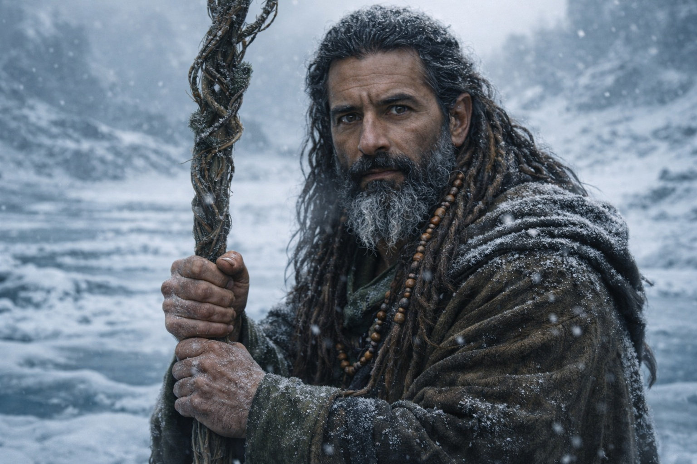
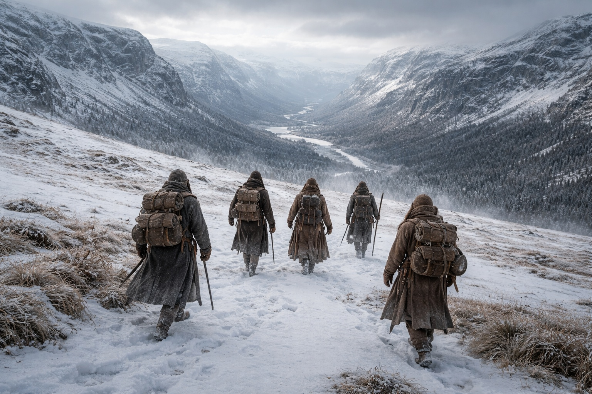

## Chapter 35 | Part 2 | The Names

---

On the second day, they kept walking northeast. Nobody asked Xandor to read the fragments again.

Dulint led across the open ground. He checked the Beacon's pull at every turn and set the pace without looking back.

Maris walked behind Xandor and tried to assemble the face.

She remembered white hair and bluish-ash skin. Yellow eyes, when the vision cleared enough to show them. The crystals at his belt were easier to make out than his face.

She had felt his fear and watched him move toward the barrier. She didn't know who had sent him, or whether he knew any more about the danger than they did.

She didn't know his name.

"These fragments don't name him," Xandor said. He held his staff across his body for balance. "They describe what a bearer needs. That isn't the same as describing the man."

"Then we'll have to ask him," Aldric said. He watched the ridge where the grey cloaks had appeared that morning, his left hand on his sword.

"She sees his face," Maris said. "She wouldn't recognize the settlement he came from. But the crystals are clear. Four at his belt. Black. She can feel them through the Beacon."

"Four black crystals," Xandor repeated. He stopped walking. His staff planted in the frozen ground. "You're certain?"

"She's certain."

"The texts associate those crystals with adaptation to Wyrmreach. Compatibility, not extra power." Xandor began walking again. "Four tells us what he carries. It doesn't tell us how long he's been there."

Balin adjusted his walking stick. "We know what he carries and where he's going. That's something."

"We know that much," Dulint said without slowing. "We still don't know who."

"Does it matter?" Balin asked.

Dulint shifted his pack. Xandor caught his staff on a frozen rut.

"It matters," Maris said, "because the prophecy doesn't say he saves anything."

They all looked at her. She was walking with her hands in her pockets and her cloth-packed nostril crusted brown and her pale eyes fixed on a point in the northeast that none of them could see.

"The fragments describe contact. They don't promise a repair." She pulled her left hand from her pocket, saw it shaking and put it back. "And if the timing is wrong..."

"Breach," Xandor finished.

"It says he arrives," Dulint said, stopping. "It says the barrier responds. It doesn't say we survive the response."

The wind tugged at Xandor's coat. He drew it closed and waited for Dulint to move.

"Then what do we do?" Balin asked.

Dulint looked northeast. His jaw was set. The pack with the Beacon sat against his spine, humming its single-note direction.

"We get there. Fast. We get to wherever the barrier is thinnest and we wait for the moment when the mechanism engages, and we do whatever we can do from this side." He started walking again. "Maybe that's nothing. Maybe we stand on the wrong side of a wall and listen to it break. But we're there. And if there's a moment when being on this side matters, we don't miss it because we were three days behind."

"We don't even know what we can do when we get there," Aldric said.

"No," Dulint agreed. "We don't."

He kept walking, and they followed down the long slope. The air grew damper as they descended. Aldric looked back for the grey cloaks.

Maris resisted the pull. Her head still hurt. The next time she reached, she wanted to learn more than how much blood it would cost.

She walked northeast and saved her blood for when it counted.

---

**End of Chapter 35.2 —> 35.3: [The Map That Bleeds: The Vision](/the-map-that-bleeds-the-vision/)**
