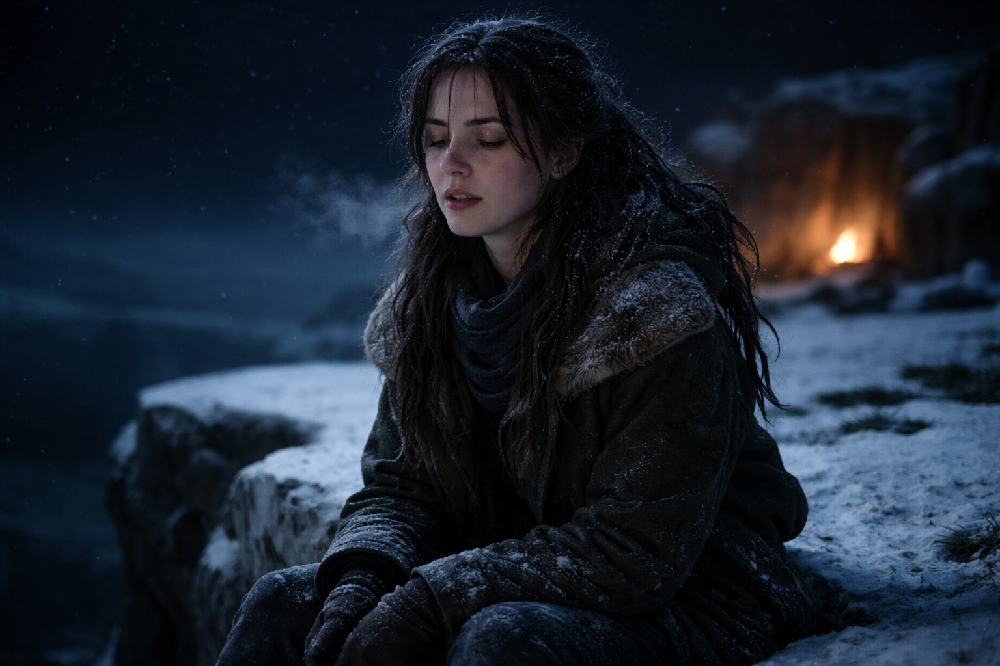
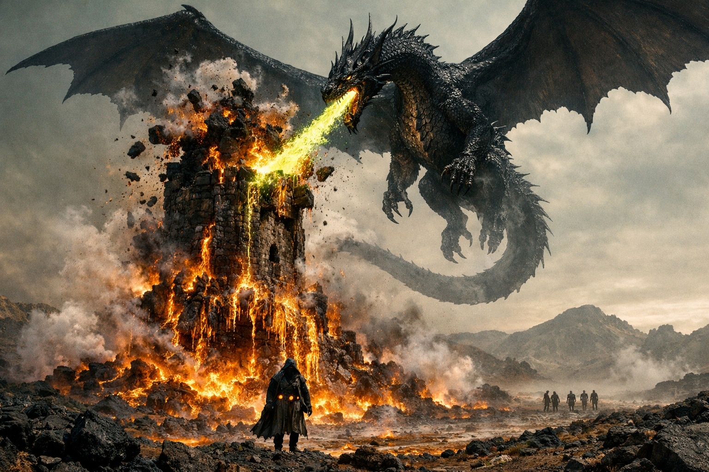

## Chapter 35 | Part 3 | The Vision

---

She reached on the fourth night because the Beacon wouldn't let her sleep.

The hum had shifted at dusk. By nightfall, the pain behind her left eye was keeping time with her heartbeat. She could feel it even when Dulint moved his pack away.

Aldric had chosen a stony plateau where he could watch the southern slope. Balin sheltered a small fire between rocks. Dulint sat against his pack, with the wrapped Beacon at his back. Xandor had fallen asleep with his staff across his knees.

Maris sat at the edge of the plateau and looked northeast and felt the frequency climb.

She didn't tell Balin what she was about to do. He was still washing blood from the cloth she'd used that morning.

She closed her eyes and reached.

There was less resistance this time. She pushed past it before the pain could make her stop.

A black stone tower rose above the dead forest. She had glimpsed parts of it before. Now she could see the broken ground around its base and a narrow approach between the ridges.

The dark elf was inside. Fear struck her as she found him. He was looking past her, toward something she couldn't yet see.

The goblin and the pale elf stood close to him. Farther away, a tall armored woman watched them. Maris could see her clearly but couldn't feel her through the Beacon.

Then the fire.

It fell from above. Wings crossed the sky, half hidden by smoke. The tower wall cracked under the heat.

The image shifted. The armored woman was driving the dark elf forward, away from the broken wall. Maris tried to see where they were going, but fire covered the path.

FIRE.

Heat struck her face. She tried to turn away and couldn't. His fear was still there, mixed with hers.

The winged shape banked above the tower. For a moment she saw scales through the smoke. Then it turned back toward the roof.

The dark elf stumbled through the flames with an arm across his face. His sleeve burned. He dropped low and kept moving, the four crystals still at his belt. Maris lost sight of him behind the falling stone. She couldn't see how he would get out.

Maris screamed.

Someone called her name from the plateau. She couldn't answer.

She was on the ground. Stone under her back. The sky above her was the real sky, stars, cold, correct. Her body convulsed. Her hands clawed at the rock. Blood from her nose, both nostrils, thick and fast. Blood from her left ear, warm, sliding down her neck. Blood from her right ear. And from somewhere she couldn't locate, a heat behind her eyes that resolved into wetness, red wetness, blood pooling in her lower lids and spilling down her temples.

Dulint knelt above her, reaching beneath her head before it struck the stone again.

"THE TOWER IS BURNING." She couldn't lower her voice. "HE'S IN THE FIRE. SOMETHING WITH WINGS. THE WOMAN'S PUSHING HIM FORWARD—"

Her back arched. Balin pushed loose stones away and folded a cloak beneath her head. His mouth moved, but she couldn't hear him over the hum.

Balin told her later that he'd counted eight seconds. She remembered none of them. Her tongue hurt where she'd bitten it.

When she could hold still again, she lay looking at the stars and tried to slow her breathing.

"Maris." Balin's voice. Close. Scared. His hands were still on her shoulders. "Maris, can you hear me?"

"I hear you."

"Don't move."

"I'm not moving." A pause. The blood was drying on her face. Cooling on her neck. Pooling in her ears, muffling the world. "I wasn't moving when it started either."

Aldric's face appeared above her. He'd crouched. His grey eyes moved across her face, reading the blood, calculating the cost. "How bad?"

"She can't tell yet." Maris swallowed. "Nose. Both ears. Eyes, she thinks. The seizure was new."

"Eyes," Aldric repeated. He looked at Balin.

"The tower was falling." Maris closed her eyes. "The woman kept pushing him forward. He went into the flames. She didn't hesitate."

"You think she expected the fire?" Xandor asked. He was still getting to his feet.

"She kept moving him toward the barrier. That's what she saw." Maris opened her eyes. Balin's face blurred above her. "She lost him in the smoke."

Wind swept across the plateau. Balin moved closer to block it.

"When?" Dulint asked.

Maris tried to shake her head and stopped at the pain. "She doesn't know. It could have happened. It could still be coming. The hum changed at dusk. That's all she can date."

Dulint stood. He looked northeast. The horizon was dark. Stars and nothing.

"Can you walk?" he asked.

"In the morning."

"Can you walk now?"

Maris touched the dried blood on her cheek. Every time she closed her eyes she saw his sleeve burning. She still hadn't seen him escape.

"Give me an hour," she said.

Balin settled beside her with the water. Dulint stayed on his feet, facing northeast.

She waited for the stars to stop blurring before she tried to sit up.

---

**End of Chapter 35.3 —> 35.4: [The Map That Bleeds: The Fire](/the-map-that-bleeds-the-fire/)**
