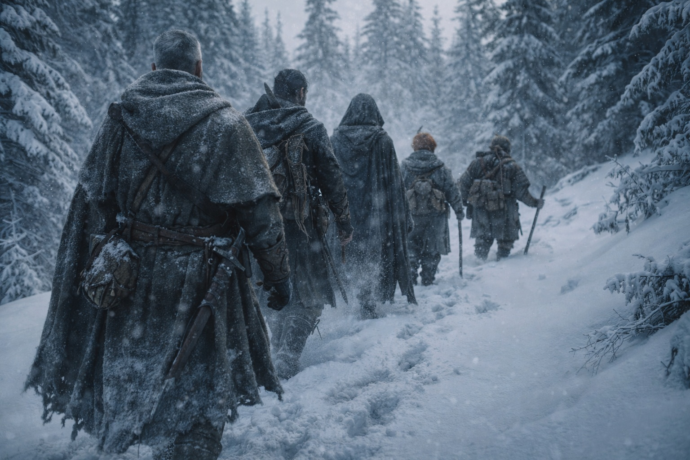
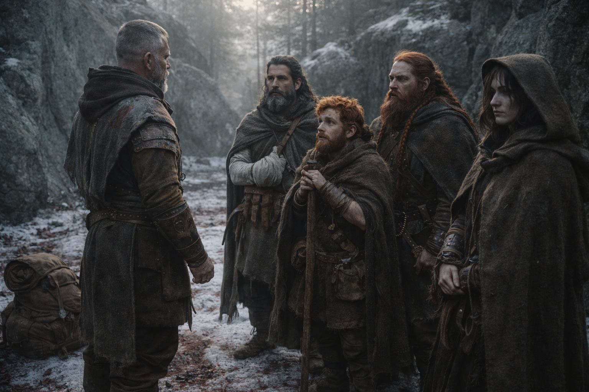

## Chapter 28 | Part 5 | The Choice

---

Nobody moved. Aldric shouldered his pack.

By first light, Aldric could see the blood on the snow and the torn cloth beside Xandor's bedroll.

He packed carefully, favoring his right arm. The bleeding had slowed, but his grip was still weak.

He would have to keep the next fight short.

Xandor sat with his left arm strapped to his chest. Maris had used her scarf for a sling. Aldric passed him water and waited while he drank with his good hand.

"Can you walk?" Aldric asked.

"I can walk."

"For how long?"

Xandor considered that with the seriousness it deserved. "Until I can't. I'll tell you before I fall."

Good enough. Aldric turned to Balin.

The dwarf was already standing, which was either stubbornness or defiance or both. He'd fashioned a walking stick from a pine branch during the night, stripped it with his belt knife while pretending to sleep, and now leaned on it with the careful balance of someone who'd calculated exactly how much weight his wounded calf could tolerate. The arrow wound was clean. Maris had packed it and wrapped it properly. He would walk. He would walk slowly.

"I'm not being carried," Balin said before Aldric could speak.

"I wasn't going to offer."

"You were thinking it."

"I was thinking you'd slow us down. There's a difference."

Balin's jaw tightened. Then, a fraction: something that wasn't quite a smile. "I'll keep pace."

"You'll keep close to pace. And you'll tell me if the bleeding starts again."

Dulint had packed before anyone else. Now he stood beside his bedroll with his axe secured, waiting for orders.

He'd said nothing since Balin spoke beside the rock. He checked the others' packs, tightened a loose strap and went back to his own.

Aldric let him be. There were conversations that needed to happen and conversations that needed time, and the difference between them was usually obvious. This one needed time.

Maris waited at the edge of the hollow, eating the last of her dried meat. Her pack was on and her hood up.

Five people. Three wounded. All standing. All packed. All looking at him.

Aldric set his pack down.

"They'll come again," he said. His voice carried across the hollow with the flat clarity of someone addressing a formation. Not loud. Not soft. The pitch of command that assumed attention without demanding it. "The horn last night was a recall. They're regrouping. Probably reinforcing. They know we're hurt, they know our pace will drop, and they know roughly where we're headed."

He looked at each of them. Xandor, grey-faced and upright. Balin, leaning on his stick with his chin raised. Dulint, still as the granite. Maris, watching from the edge.

"We go north. We move as fast as Balin's leg allows and we don't stop until we reach the Frostgard border crossing. That's four days at pace. Six or seven at ours. Every day between here and there is a day they can catch us, and when they catch us, we'll fight again, with fewer of us able to hold a sword."

Silence. Wind in the pines. A bird called once and fell quiet.

"Anyone want out, say it now." He held the silence for three heartbeats. "No judgment."

Nobody spoke. Nobody shifted. Xandor's breathing was shallow and steady. Balin's knuckles were white on his walking stick. Dulint's eyes were fixed on Aldric's face with an intensity that bordered on something Aldric didn't want to name.

"Good." Aldric picked up his pack. Settled it on his shoulders. Adjusted the straps with the precision of a man who'd done it ten thousand times and intended to do it ten thousand more. "Because I lied. I would have judged. Severely."

He started walking. North. Through the trees, along the ridge, following the route he'd planned in the dark hours while his company slept and the forest held its breath. Behind him, one by one, they followed. Xandor first, moving with careful steps that protected his shoulder. Then Maris, falling into the pace naturally. Then Balin, his stick finding purchase on the frozen ground, each step deliberate and paid for. Last, Dulint, who looked back once at the hollow where their blood had soaked into the snow, then turned and followed.

Snow began filling their footprints before the hollow was out of sight.

Aldric led. His sword hand ached. He'd studied the map, but the snow would hide trails and close passes it marked as open.

He walked. They walked.

 The forest swallowed them.

The pursuers would find their cold fire and the bloodied dressings. Aldric had buried the coals. There hadn't been time to hide everything.

Maris drew level with him after the first hour. She didn't speak. She walked beside him, matching his pace, and after a while she said, "She sees the path holding."

"The path or the people?"

"Both."

Aldric nodded. He looked back to check on Balin, who was keeping up.

The forest thinned as they climbed. The wind picked up. Somewhere behind them, patient and professional and certain, the grey cloaks followed.

Ahead of them, the border. Four days at pace. Six at theirs.

Behind them, faint through the trees, a horn answered once.

They did not look back.

---

**End of Chapter 28.5 —> 29.1: [The Drow in the Tower: The Lesson](/the-drow-in-the-tower-the-lesson/)**
