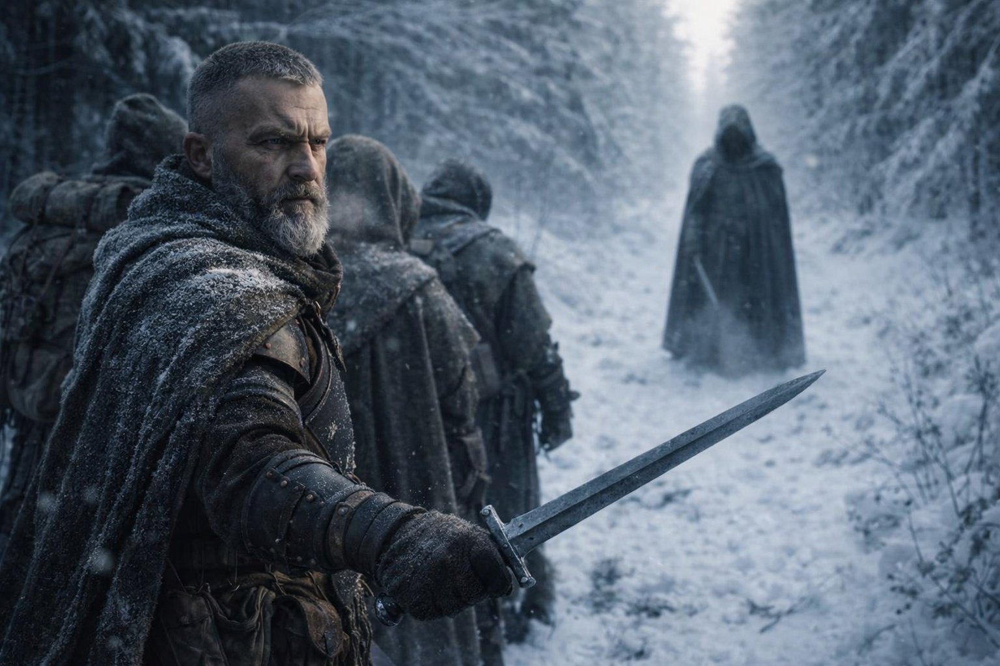

## Chapter 28 | Part 1 | The Cost

---

Aldric saw the trap three seconds before it closed.

First, jackdaws lifted from the pines ahead. Then he saw the snow. Someone had brushed out their tracks with a branch, leaving shallow grooves across the trail.

The third second was the horn.

One short blast, northeast. A signal horn, unlike the blaring brass the Grukmar used.

"Formation." The word left him before he'd finished turning. Muscle memory from twenty years of ambushes that hadn't arrived in time and the one that had. "Dulint, Balin, center. Xandor, left flank. Maris, back. Now."

They moved too late. Grey-cloaked figures stepped out from three sides, advancing in pairs.

Six of them. Two blocking the trail ahead. Two on the eastern ridge. Two more closing from the south, sealing the route they'd walked in on.

Professional. Coordinated. Patient enough to have set the trap and waited.

"They want what we're carrying," Aldric said. "Keep together."

Dulint gripped the pack holding the Cube and searched the tree line.

"How many more?" Balin asked. He'd already drawn his sword. The blade looked too large for him and he held it correctly anyway, the way someone holds a tool they've practiced with when nobody was watching.

"At least two we haven't seen. There's always a reserve. These are blockers. The kill team is somewhere else."

The lead figure on the trail ahead raised one hand, palm out. Not a surrender. A pause. He was tall, human, wearing the same grey cloak as the others, and when he spoke his voice carried the calm of someone conducting business.

"The device. Hand it over and walk away."

Aldric stepped between the speaker and Dulint, sword drawn.

"No."

The tall man's expression didn't change. "Captain." He said the rank like reading a manifest. "Discharged from the Ninth Frontier under disciplinary review. Current company: two dwarves, one druid, one seer. You're carrying something that belongs to people who will kill more than six to get it back. We are the polite option."

"You've done your research." Behind Aldric, Xandor planted his staff. Roots stirred beneath the snow; the druid's hand tightened, trembling on the wood. "Walk away. This is your polite option."

The tall man sighed the way a foreman sighs at a crew that refuses to evacuate.

Then every exit closed at once.

No one gave a signal. They didn't need one.

---

**End of Chapter 28.1 —> 28.2: [The Second Blood: The Line](/the-second-blood-the-line/)**
