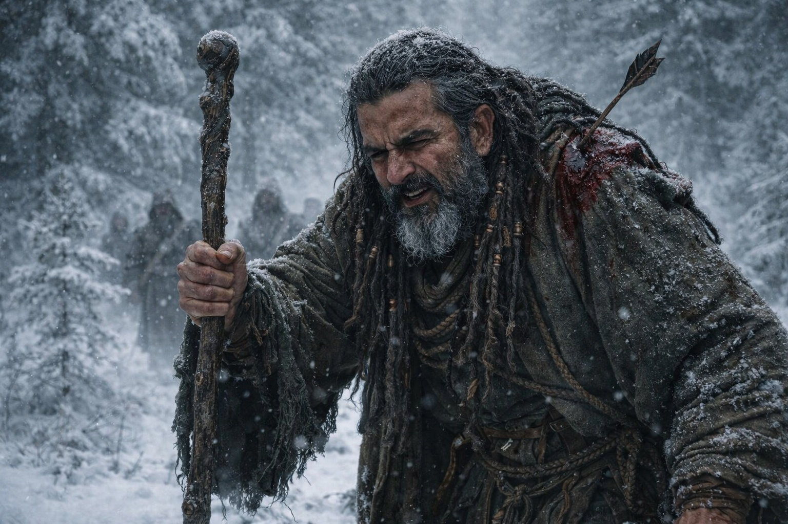
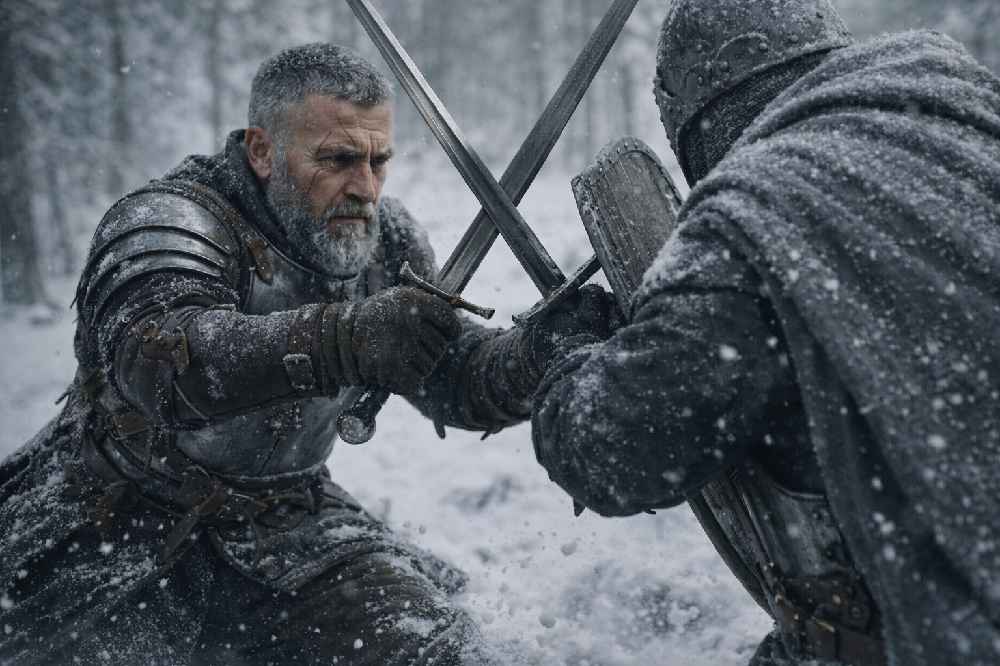
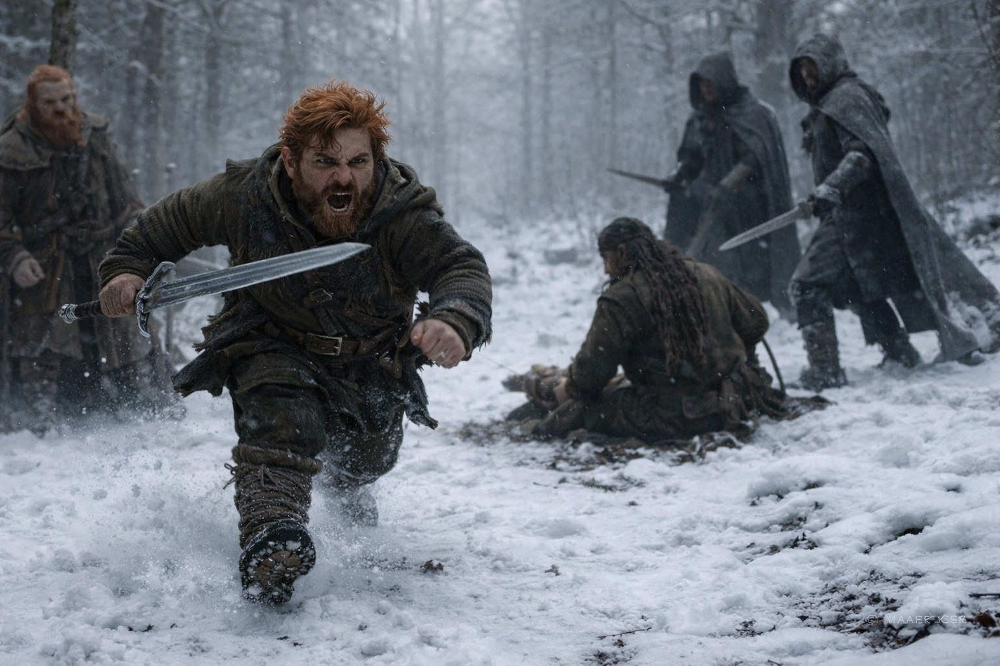
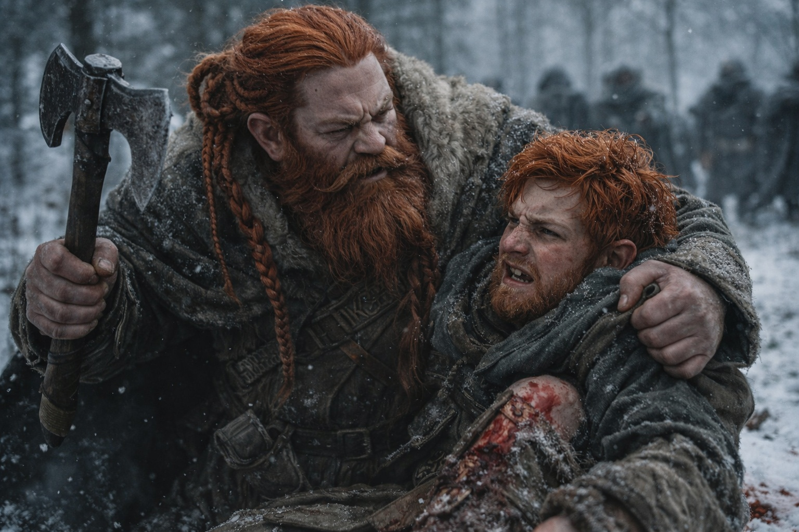

## Chapter 28 | Part 2 | The Line

---

The first arrow hit Xandor before the old druid finished raising his staff.

It punched through the outer layers of his robe and buried itself in his left shoulder, two inches above the collarbone, and the sound it made going in was a wet thud that Aldric had heard enough times to classify without thinking. Not bone. Muscle and tendon. Disabling, not killing. The archer who'd placed it understood the difference.

Xandor staggered but didn't fall. His staff struck the ground and something shifted beneath the snow, roots moving under frozen earth with a sound like distant cracking ice, and two of the grey-cloaked figures on the eastern ridge stumbled as the ground beneath their feet softened and gave.

Then the line collapsed.

Not theirs. The attackers'. They came in from three sides at once, disciplined pairs breaking into a coordinated rush, and Aldric stopped thinking and started counting. Distance. Angle. Speed. The tallest one first. Sword, right-handed, shield on the left, closing from the northeast with a stride that covered ground efficiently. Military training.

Probably frontier, judging by the economy of motion.

Aldric met him at seven paces from Dulint.

Steel rang on steel. The sound split the forest quiet into before and after. The tall man was good. Fast wrists, clean lines, a fighting style that had been drilled into him by someone who believed in fundamentals over flash. Aldric parried three strikes, gave ground on the fourth, and found the opening on the fifth, a half-step too wide on the attacker's left recovery that left his ribs exposed for the count of one heartbeat.

Aldric's blade caught the edge of the grey cloak and bit into the leather beneath. Not deep. The man jumped back, surprised, and Aldric used the gap to scan the field.

"Leave him!" Aldric shouted, because Balin was already moving.

The young dwarf was running toward Xandor, who was on one knee now, the arrow in his shoulder making his left arm useless, his right hand still gripping the staff as roots churned the ground around him. Two grey cloaks were closing on the druid, and Balin was sprinting directly toward them with the graceless determination of someone who had made a decision and burned every alternative behind it.

Dulint watched his nephew cross the gap between safety and the enemy line. His hand was on his axe. His legs weren't moving. The paralysis wasn't fear. It was the arithmetic of a man calculating two outcomes and finding both of them unacceptable.

Balin reached Xandor. His sword caught the first grey cloak's blade inches from the druid's neck, a block that shouldn't have worked at his height and didn't entirely, the impact jarring through his arms and driving him to one knee in the snow. But it was enough. The strike deflected wide. Xandor used the opening to drag himself backward, his staff scraping a line in the snow that the roots followed.

The second grey cloak swung low. Balin couldn't block it. He twisted, took the flat of the blade against his thigh instead of the edge across his calf, and the impact spun him sideways into Xandor.

Maris hadn't moved from her position at the rear. She stood with her back against a pine trunk, hands pressed against the bark, eyes wide but focused. Not looking at the fight. Looking through it, at the spaces between the combatants, at the geometry of the engagement.

"Two more coming from the south ridge," she said. Her voice was clinical, stripped of everything except the fact itself. "Thirty seconds."

Aldric killed the momentum of his current opponent with a shield bash he didn't have a shield for, driving the pommel of his sword into the man's wrist guard hard enough to loosen his grip, then shouldered past him toward the center of the fight.

The grey cloaks fought like soldiers. Not berserkers, not amateurs, not the Grukmar raiding parties that relied on numbers and fury. These were trained fighters who understood spacing and tempo and the mathematics of outnumbering someone. They rotated. When one engaged, the other circled. When one fell back, the replacement was already in position. It was efficient and impersonal and it was winning.

Aldric took a cut across his forearm. The blade sliced through his leather bracer and left a line of fire from elbow to wrist. He ignored it because ignoring it was the option that kept his sword moving, and his sword moving was the option that kept Dulint alive, and Dulint alive was the option that kept the Cube out of their hands.

Everything was arithmetic. Everything was always arithmetic.

Balin was bleeding. His left leg had a gash from the flat-blade impact that had opened the skin, not the muscle beneath, and he was fighting from one knee beside Xandor, defending the druid who was defending the ground that was defending them. The dwarf's sword was slowing. Each block came a fraction later than the last. Fatigue or blood loss or both.

"Back," Aldric commanded. "Everyone back. West. Through the trees. Now."

Dulint moved first. Axe in one hand, the other gripping Balin's collar, hauling his nephew upright with a strength that age should have taken from him but rage had returned.

Balin snarled at the contact but his legs took his weight and he stumbled west, bleeding into the snow.

Xandor's roots held the eastern flank for eight more seconds. Long enough for the group to reach the tree line. Long enough for Aldric to put himself between the grey cloaks and the retreat, his sword describing arcs that were less about striking and more about establishing a perimeter that cost too much to cross.

Then they were in the trees. Running. Not fast, because Xandor was bleeding and Balin was limping and Aldric's right arm was going numb below the cut, but moving, west, away from the trail and the trap and the people who wanted what they carried.

Behind them, the horn sounded again. Once. Patient.

No one answered it.

---

**End of Chapter 28.2 —> 28.3: [The Second Blood: The Weight](/the-second-blood-the-weight/)**