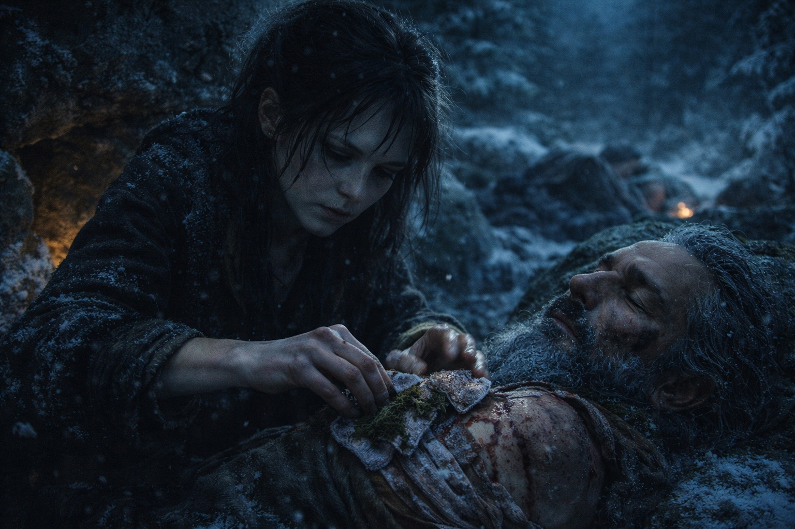
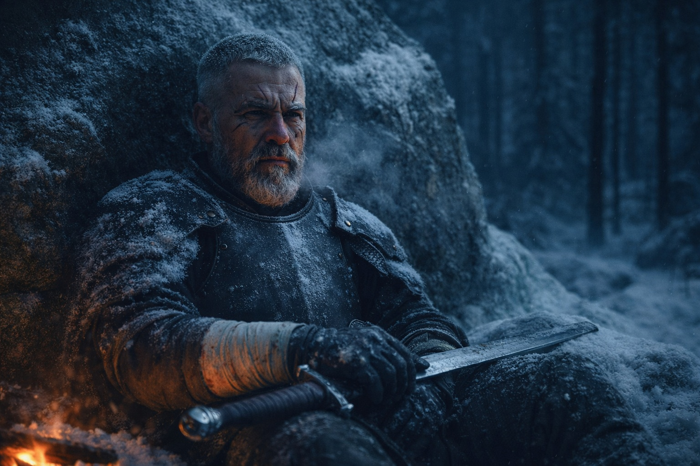
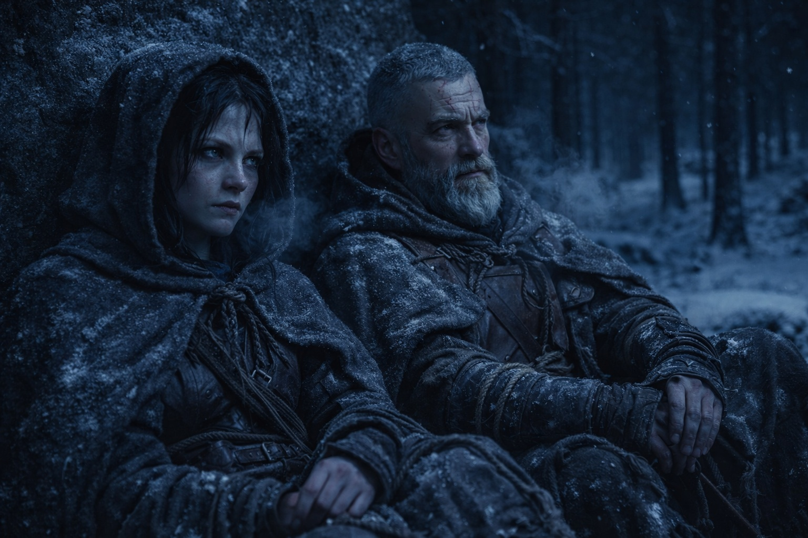
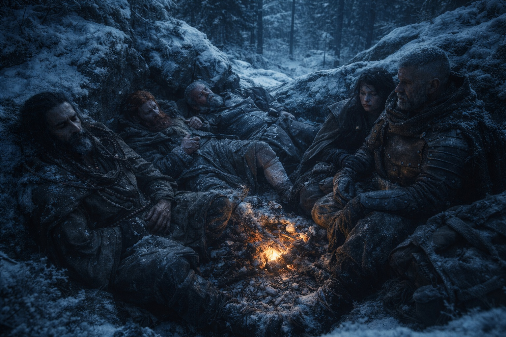
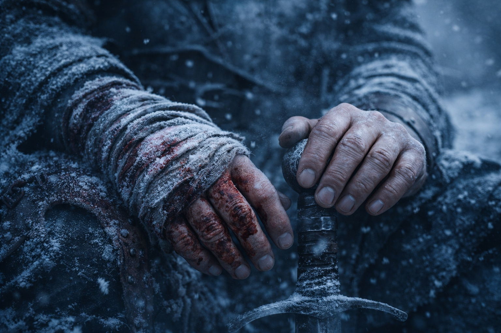

# Chapter 28.4 | The Second Blood: The Silence After

---

Maris changed Xandor's dressing at midnight and didn't wake anyone.

Aldric watched her from his position against the western granite wall, where he'd been sitting for the past four hours with his sword across his thighs, alternating between scanning the tree line and listening to the sounds his wounded company made in their sleep. Xandor's breathing was labored, a shallow rhythm that caught on every inhale as the damaged muscles around his shoulder protested the expansion. Balin slept with his hand on his sword hilt, a habit he'd developed in the last week that Aldric recognized from his own early service. Dulint didn't sleep. He lay with his eyes closed and his breathing too regular, performing rest the way someone performs calm when they're anything but.

Maris unwrapped the dressing, examined the wound by the minimal moonlight that filtered through the canopy, repacked it with the moss poultice Xandor had instructed her to prepare before consciousness left him, and rewrapped it with the clean strips she'd cut from her own spare shirt. Her hands were steady. Her face was not.

"You should sleep," Aldric said.

"So should you."

Fair point. He let it stand.

She settled against the granite beside him, close enough that he could see the dark circles under her eyes and the way her fingers kept pressing against her thighs as if checking that her hands were still attached. The distance language had crept back in.

 During the fight she'd been clinical, precise, "two more coming from the south ridge" delivered like a weather report. Now, in the silence after, the control was costing her.

"She saw it before it happened," Maris said. Third person. The distance. "Not the ambush. The outcome. Three wounded. Nobody dead. The horn sounding once."

Aldric processed that. "You saw the result and didn't warn us."

"She saw it during the fight. Not before. The visions don't come on schedule. They come when the Beacon reacts to threat." Her eyes were fixed on the tree line. "By the time she knew the outcome, the outcome was already happening."

"That's convenient."

"That's the cost." She looked at him. Her pale grey eyes were steady and exhausted and entirely without self-pity. "She sees the shape of things after they've started. Never before. If the visions came early enough to prevent anything, they wouldn't cost what they cost."

Aldric let that settle. It was the kind of truth that didn't improve with examination.

The forest was quiet in the way that northern forests are quiet in winter: not silent, but compressed, the sounds reduced to wind in canopy, the creak of frozen wood expanding, the distant investigation of an animal too far away to identify. No horns. No footsteps. No grey cloaks between the trees.

That worried him more than their presence would have.

"They're regrouping," he said. "Not retreating. The horn was a recall, not a withdrawal. They'll come again, better prepared, with more people or a better angle. We hurt one of theirs. They hurt three of ours. They're winning on arithmetic."

"Aldric."

"What."

"You're talking like a commander assessing casualties."

"I am a commander assessing casualties." He said it without inflection. The Ninth Frontier had taught him that emotions about command were a luxury purchased with other people's survival. "Xandor can't fight. His left arm is useless for weeks. Balin can walk but not run. My grip is compromised. You haven't collapsed yet, which means the next vision that hits will put you down for hours. And the Cube is still broadcasting our position to anyone listening."

Maris was quiet for a moment. "She saw something else. During the fight. When the Beacon reacted to the grey cloaks."

"What."

"They know what the Cube is. Not just that it's valuable. They know what it does. The way the leader spoke, 'the device,' the way he described it as belonging to someone. These aren't opportunists. They were sent."

Aldric had already reached that conclusion. Professional coordination, knowledge of his service record, familiarity with the artifact. Someone with resources and intelligence networks had dispatched a retrieval team. The Grukmar scouts had been dangerous because they were numerous and aggressive. These people were dangerous because they were competent.

"We need to move at first light," he said. "Xandor walks or gets carried. Balin walks or gets left behind, which isn't going to happen, so he walks.

 We go north. Fast as we can."

"Aldric."

"What."

"You haven't slept in thirty-six hours."

He looked at his hands. The right one was wrapped in cloth that had already soaked through with a thin seepage. The left one was steady. That was the one that mattered for holding a sword if it came to it, which it would.

"I'll sleep when they stop following us."

Maris pulled her cloak tighter. The cold was settling into the granite hollow, condensation forming on the rock walls. Somewhere above them, through the canopy, clouds moved across the moon and the light shifted.

"She sees us making it," Maris said quietly. "Not clearly. Not completely. But the shape of it. Five people walking north. All five."

"Vision or hope?"

She didn't answer that, which was itself an answer. Aldric accepted it. Hope was a tool. Like a sword or a compass or the willingness to push an arrow through a man's shoulder because pulling it out would kill him. You used it when it was the option available.

He scanned the tree line.

 No horn. No movement.

That was worse.

---

*Next: The Second Blood: The Choice*

**End of Chapter 28.4 — continues in Chapter 28.5: [The Second Blood: The Choice](/the-second-blood-the-choice/)**
