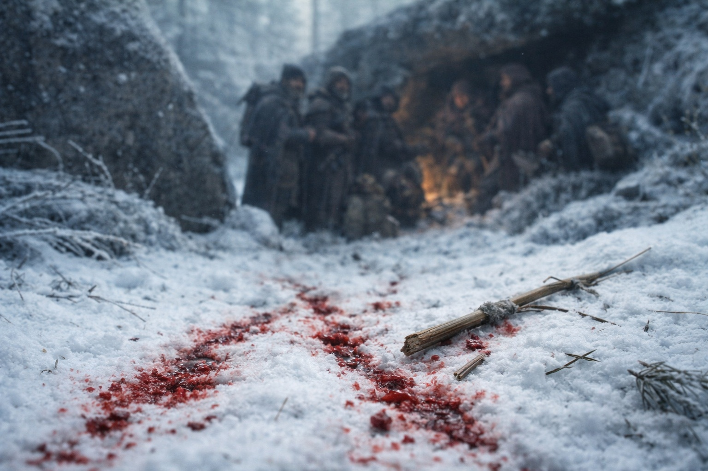

## Chapter 28 | Part 3 | The Weight

---

Balin came back carrying Xandor, an arrow in his own leg.

An arrow had caught Balin in the right calf during the retreat. He'd grunted, tightened his grip on Xandor and kept dragging the druid toward cover.

They'd put a ridge between themselves and the ambush site. Half a league of frozen hillside, the pines thickening as they climbed, old growth that hadn't been logged because nobody lived this far north to log it. Aldric found a depression between two granite outcroppings where the rock walls provided cover on three sides and the canopy above was dense enough to break their silhouette from the ridge.

He put Dulint on watch. The old dwarf went without speaking, his axe in his hand, his face the color of dirty snow.

Then Aldric knelt beside Xandor and went to work.

The arrow in the druid's shoulder had a broadhead tip, designed to lodge rather than pass through. Pulling it straight out would tear the muscle open. Aldric had seen this in the Ninth Frontier. He'd watched field surgeons handle it, and he'd watched men die because field surgeons weren't available.

"Maris. I need your hands."

Maris knelt beside him. Her fingers were cold but steady as she held the cloth clear of Xandor's wound.

"It needs to come forward, not back. Through and out." He found Xandor's eyes. The old druid was conscious, sweat beading on his olive skin despite the cold. "This is going to be brutal for about ten seconds."

"I've had worse." Xandor's voice was steady, which meant he was lying or he'd actually had worse, and Aldric respected both possibilities equally.

Xandor bit down on the strap Maris held between his teeth. Aldric worked until the arrowhead came free, then broke the shaft and removed what remained. The druid's cry was muffled by the leather.

Maris pressed a clean fold of cloth over the wound while Aldric reached for the bandages.

Balin sat against the granite wall and watched.

Balin's arrow had passed through his calf. Aldric removed the broken shaft and bound the wound with strips from his spare shirt. The young dwarf made no sound.

"I didn't die," Balin said to Dulint.

His uncle was twenty feet away, standing watch between two pines, his back to the camp. He stopped moving. Didn't turn.

"I was supposed to, wasn't I? Fast, you wrote. 'Balin dies fast.'" The young dwarf's voice was flat. Not triumphant. Not accusing. Just the voice of someone reciting facts that had lost their power to surprise but not their power to wound. "I ran toward the line. I fought. I bled. And I didn't die."

Dulint turned. His eyes were wet. He opened his mouth but couldn't answer.

"Not here," Aldric said. Quietly. To both of them. "That conversation happens when we're not bleeding and they're not behind us."

Balin held Aldric's gaze, then leaned his head against the granite and closed his eyes.

Aldric finished binding his forearm and tested his sword grip. He couldn't close his hand tightly. Against the men who'd ambushed them, that could be enough to get him killed.

He sat back on his heels and looked at what he had.

One druid with a shoulder wound that would take weeks to heal properly and was going to get days at most. One young dwarf with a leg wound that would slow the group's pace by at least a quarter. One old dwarf who was carrying a secret that had just been spoken out loud. One seer who hadn't collapsed yet, which meant the next collapse would be worse. And himself, sword arm compromised, responsible for all of them.

He'd lost men before. In the Ninth Frontier, when Varian and Elric were taken, he'd stood in the empty watchtower and counted the things he could have done differently. The list had twenty-three items. He'd memorized it. He carried it the way Dulint carried the note in his boot.

This wasn't the Ninth Frontier. These people weren't soldiers who'd accepted the contract. They were a druid, two dwarves, and a seer who'd been pulled into something none of them fully understood, and he was leading them because someone had to and the alternatives were worse.

The horn had sounded once, patient, after they'd fled. Patient meant organized pursuit. Patient meant they knew exactly where the group was going because the Cube in Dulint's pack was broadcasting its position to anyone with the means to listen.

He looked at the blood on the snow. Three wounded, and the pursuers could read their trail as easily as he could.

He waited for a second horn.

It didn't come.

---

**End of Chapter 28.3 —> 28.4: [The Second Blood: The Silence After](/the-second-blood-the-silence-after/)**
