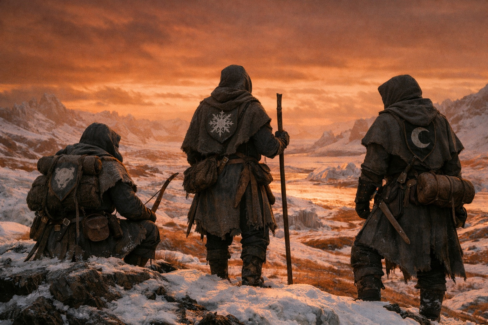
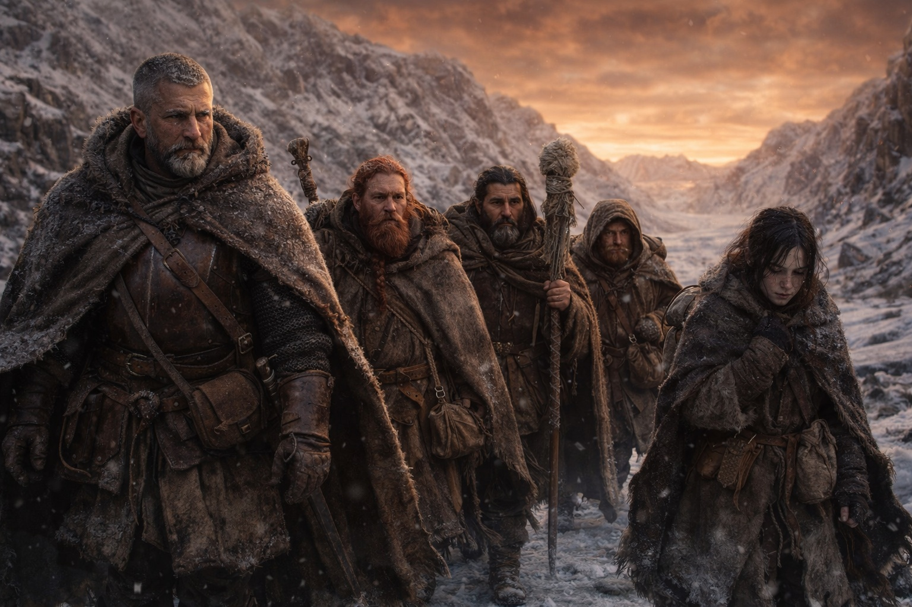
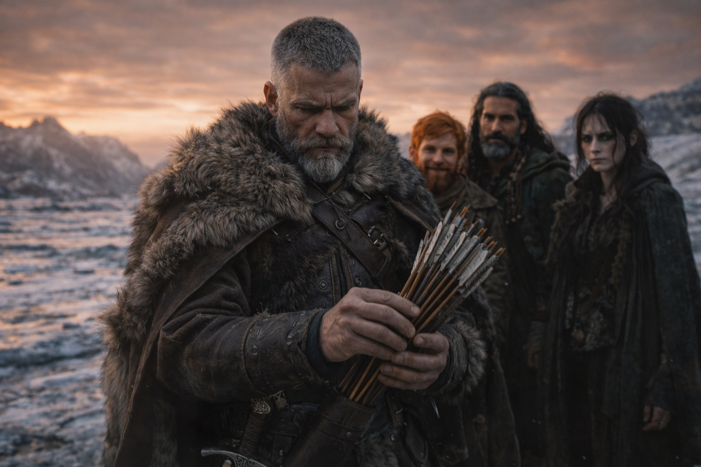
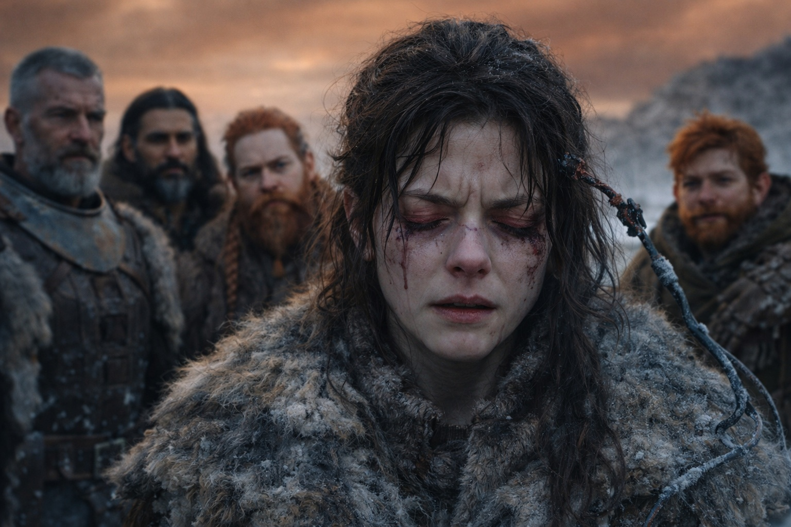
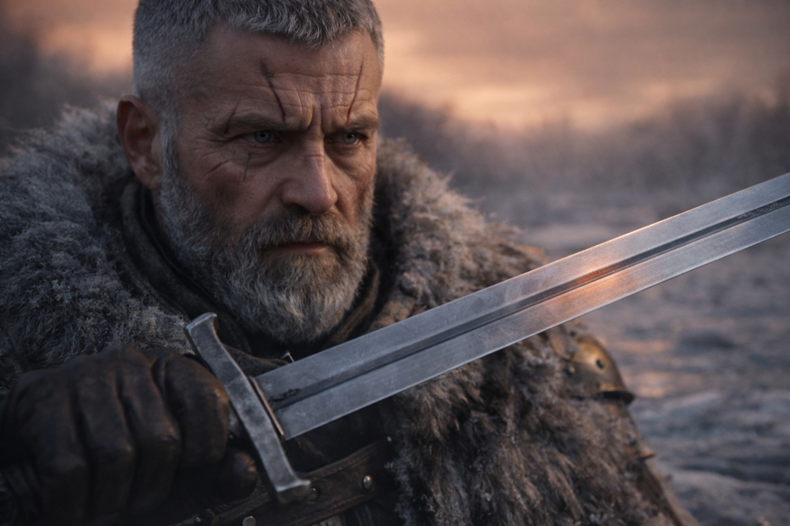

---
order: 332
title: "The Things That Follow: The Hunters Return"
description: "Same discipline. Different banners."
date: 2024-11-14
language: en
chapter: 45
subchapter: 1
storyline: west
canon_phase: main
canon_sequence: W-045-001
narrative_weight: high
category: Frostgard
author: Aldric
type: Main
tags: ['#the things that follow', '#aldric', '#frostgard']
thumbnail: image.jpg
featured: false
counterpart_path: site/content/posts/es/frostgard/lo-que-sigue-el-regreso-de-los-cazadores/index.mdx
counterpart_title: "Lo Que Sigue: El Regreso de los Cazadores"
---

# Chapter 45.1 | The Things That Follow: The Hunters Return

---

Aldric saw them on the third day south.

Three figures on the ridge to the east, silhouetted against the amber-rust sky, moving in a pattern he recognized because he had spent his career recognizing patterns of movement and because these particular patterns had tried to kill him twice before. Staggered spacing. No visible weapons, which meant concealed weapons. The lead figure moving at the pace that scouts move when they have already found what they are looking for and are now confirming the find for someone behind them.

He stopped walking. The others stopped behind him: Dulint first, then Xandor, then Balin, then Maris, who was moving under her own power now but with the careful deliberation of someone who did not trust her legs to do what legs were supposed to do without supervision.

"Hunters," Aldric said.

Dulint looked at the ridge. "The same ones?"

"Same discipline. Different banners." The figures on the ridge wore grey, not the brown and leather of the hunters who had pursued them in Part 3. Grey with a sigil that Aldric could not make out at this distance, which meant they were displaying it, which meant they wanted the sigil seen, which meant whoever sent them wanted credit for the pursuit. "They came from the south. Between us and the route home."

"How many?"

"Three visible. Which means at least eight." The ratio was professional standard. Three scouts for every five operatives meant an organized unit, funded, supplied, operating with intelligence about the target's position and heading. These were not opportunistic bandits who had stumbled across five travelers in the wasteland. These were people who had known where the group was and had positioned themselves along the return route.

"They can't want the Beacon," Dulint said. "It's dead."

"They don't know that." Aldric's hand went to his sword. The forge-resonance was gone, the blade cold steel without the augmentation that had made it something more, but cold steel still cut. "Or they don't care. The breach changed the landscape. Whatever the Nexus system was, whatever fragments and artifacts are still connected to it, they're more valuable now. Not less. The system broke. The pieces of a broken system are worth more to the people who want to understand it than the pieces of a working one."

Xandor looked up from his journal, which he had been writing in while walking, the scholar's ability to document and move simultaneously being one of the few skills that had not been degraded by the breach. "He's right. The Beacon may be dead as a tracking instrument, but it's still a Nexus component. Its crystal matrix, its interface architecture, the data encoded in its structure, all of it is now a primary source for anyone trying to understand what happened to the barrier. Governments. Factions. Private interests. Anyone with the resources to send hunters into Frostgard."

"Wonderful," Dulint said.

Aldric counted his arrows. Fourteen. He had started the journey with thirty. The mathematics of attrition were simple and the answer was the same answer it always was: not enough.

The cold sword at his hip, fourteen arrows, a party of five with one damaged seer and one priest with a broken staff and one scholar with no combat training and one dwarf who fought like a miner, which was to say effectively but without economy.

The figures on the ridge moved east. Not approaching. Scouting the position, confirming numbers, reporting back. Professional. Patient. The discipline of people who were paid to be disciplined and who had been trained to value information over action.

"They won't attack today," Aldric said. "They're confirming our heading and strength. The main group will be south, positioned along whatever route they've calculated we're most likely to take. They'll wait for us to walk into the position they've prepared."

"Then we don't walk into it."

"The terrain folds south and west. We've been walking the only viable corridor for three days. They know the corridor. They've had time to prepare it." He looked at the frozen landscape, the ice and rock and the amber-rust sky above, the wrong-colored light making the snow look like rust. "We could go east. Into Grukmar territory. Or north, back toward the barrier."

Neither option required discussion. North was the barrier, damaged and leaking contamination. East was Grukmar, where the clans would be responding to the breach with the same predatory instinct that Grukmar clans responded to every disruption.

"So we walk south through their position," Dulint said.

"Yes."

"With fourteen arrows and a cold sword and a broken staff and a dead stone."

"Yes."

Maris spoke. She had been quiet for most of the three days south, conserving energy, processing whatever the damaged connection was still feeding her. When she spoke, her voice had the quality of someone reporting from a distance, the same distance-language she used when the visions were present.

"There are more behind them. Not hunters. Soldiers. Frostgard soldiers, moving north in formation. And from the west, others. I can't see clearly, the connection is raw and I can't control what it shows me, but there are groups converging on this area.

Not because of us. Because of the barrier. The breach. The sky. Everyone who can move north is moving north."

Aldric looked at the ridge. The three scouts were gone. Moving back to report.

"How long before they come for us?"

Maris closed her eyes. The effort of using the damaged connection visible in the tension of her jaw, the way she held herself when pushing through something that hurt. "Tomorrow. The main group is half a day south. They'll come at dawn, from two directions. They want the Beacon. They want Xandor's records. They want me."

"You?"

"A seer who witnessed the breach. Who has a connection to the person who caused it. I'm evidence. I'm an instrument. I'm the most valuable thing in Frostgard right now, and I'd rather not find out what valuable means to the kind of people who send hunters to collect it."

Aldric looked at his companions. The dwarf with the dead Beacon. The scholar with the journal. The priest with the split staff. The seer with the bleached eyes.

"Then we move tonight," he said. "South, through their position, before they're ready. Fourteen arrows, a cold sword, and whatever we have. We move fast and we don't stop."

He drew the cold sword. The steel caught the amber-rust light and gave back nothing. No resonance. No warmth. Just metal.

It would have to be enough.

---

**End of Chapter 45.1 — continues in Chapter 45.2: [The Things That Follow: The Factions](/the-things-that-follow-the-factions/)**