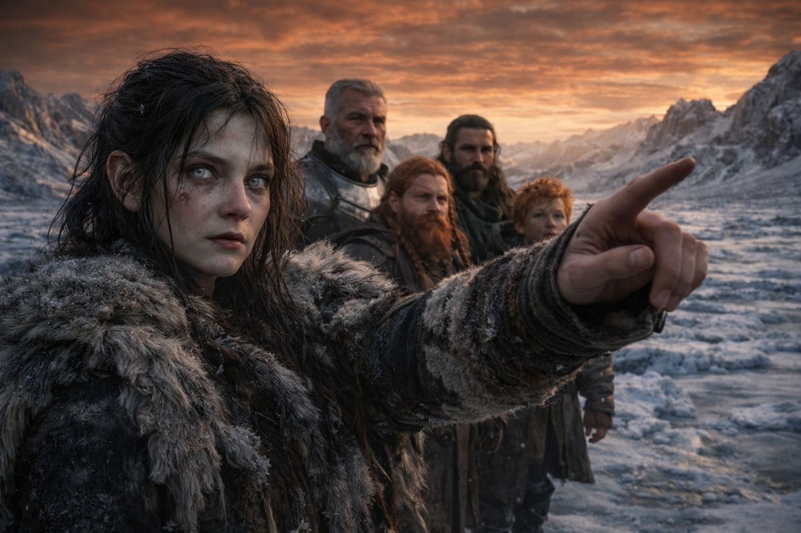
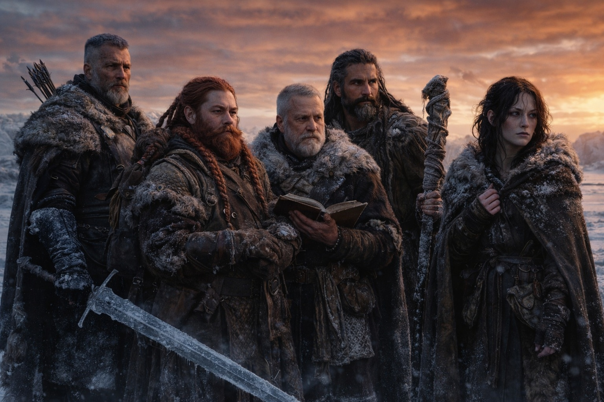
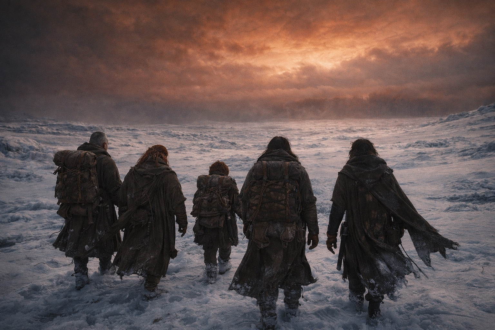

# Chapter 45.4 | The Things That Follow: The Road

---

They reached the settlement on the fourth day, as Balin had estimated, and the settlement was not what it had been.

Aldric saw it from the southern ridge: a Frostgard trading post, fifty buildings, a wooden palisade, smoke from chimneys. It should have been a way station, a place to resupply and report and send word south. Instead it was a staging ground. Soldiers in the streets. Wagons being loaded. Horses tethered in lines outside the walls. The banners of three Frostgard clans flying from the gatehouse, which meant a council of war had been called or was being called or had already concluded and the decision was march.

"We don't go in," Aldric said.

The others looked at him.

"Five travelers with a story about the barrier. Walking into a military staging ground. We'll be questioned. Detained. The Beacon will be confiscated. Xandor's journal will be taken as intelligence. Maris will be identified as a seer and held for examination. We walk in as witnesses and we come out as prisoners."

"Then what?" Dulint asked.

"We go around. Resupply from what we can find outside the walls. Keep moving south."

"Aldric." Dulint's voice carried the particular weight of a man who had been walking on frozen ground for too long and who needed to ask a question he already knew the answer to. "If we don't report to the settlement, and we don't deliver our testimony, and we don't put the account into official channels, what exactly are we doing?"

Aldric looked south. Past the settlement. Past the Frostgard territory. Past everything that was organized and official and documented. South, and then wherever the dark elf was.

"We're finding him."

The silence that followed was not disagreement. It was the group absorbing the shift, the pivot from one mission to another, the way a compass needle swings when the field changes. They had been heading south to report. Now they were heading toward a person. The destination had changed, but the motion was the same: forward, into whatever came next.

Xandor spoke first. "The testimony matters. The account matters. But Aldric is right that delivering it to a military staging ground risks losing control of it. And the account without the person who caused the breach is incomplete. The testimony of five witnesses is hearsay. The testimony of the person who touched the barrier is evidence."

Balin looked at the settlement. The smoke, the banners, the organized violence preparing to deploy. "We'll need supplies."

"I know."

"And Maris needs rest. Real rest. In a bed. With food that isn't trail rations."

Maris answered before Aldric could. "I'll rest when we find him. Until then I'll walk." Her voice was not strong, but it was certain, the kind of certainty that comes from the body's refusal to accept its own limitations as permanent. "I can feel him. Stronger today than yesterday. The connection is raw but it's there and it's pulling northeast and I can follow it the way you follow a sound in fog. Not clearly. But enough."

Aldric looked at her. The bleached eyes that had seen things no one should see. The bruises fading beneath them, the body healing around the damage the way a tree grows around a wound. She was not the Maris who had left the coast. That Maris had been a seer with a calibrated instrument and a clear mission and the confidence of someone whose gifts fit the situation. This Maris was something else. The gifts had changed. The situation had changed. What remained was a person who could feel a thread in a broken world and was willing to follow it.

"Northeast," she said. She pointed.

Into Frostgard. Into the territory between the settlement and the barrier. Into the space where three armies were converging and hunters were reorganizing and the Grukmar were marching and the sky was amber-rust and the magic was wrong and everything was different.

Into the wrongness.

Aldric counted his arrows. Eleven now, after the passage through the hunter position. The cold sword at his hip. Five people with insufficient resources and incomplete information and a seer pointing into the most dangerous territory in Astalor.

He looked at each of them. Dulint, who had carried the Beacon and the mission and the responsibility and who was still carrying them even though the Beacon was dead and the mission had changed. Xandor, who had documented every mile and every anomaly and every impossible thing and who would continue documenting because understanding was the only weapon a scholar carried. Balin, who had prayed through a cracked staff and walked through a broken world and whose faith was not in the instrument but in the thing the instrument pointed toward. Maris, whose eyes had been changed by what she had seen and whose hand was steady as it pointed northeast toward a person she had never met and a connection she could not fully control.

His sword was cold. His arrows were few. His companions were damaged. The world was mobilizing for a war that had no clear sides and no clear objectives and no clear end.

They walked.

The sky was wrong. The Beacon was dead. The world was mobilizing for a war that had not been declared yet. Somewhere, on the other side of everything, a dark elf with white hair was still alive. Maris could feel him. Barely. Like a candle on the other side of a storm.

"That way," she said. She pointed into the wrongness.

They walked.

---

**End of Chapter 45 — continues in Chapter 46.1: [What Cannot Be Taken Back](/what-cannot-be-taken-back-the-walk-back/)**