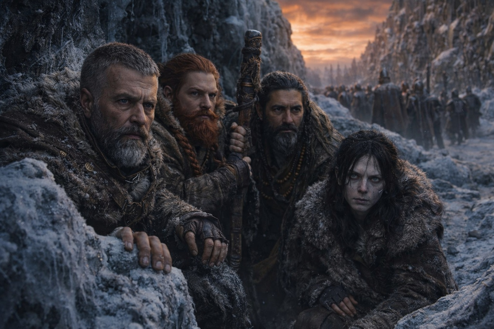
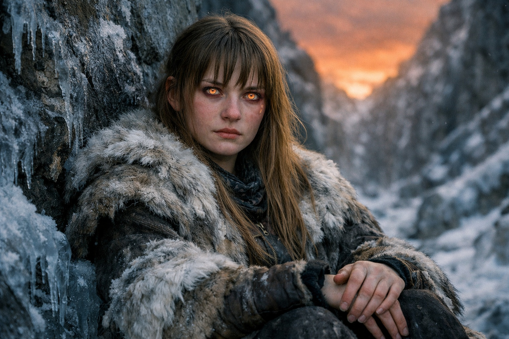

---
order: 334
title: "The Things That Follow: The War"
description: "The sky proves something happened. Not who did it."
date: 2024-11-16
language: en
chapter: 45
subchapter: 3
storyline: west
canon_phase: main
canon_sequence: W-045-003
narrative_weight: high
category: Frostgard
author: Aldric
type: Main
tags: ['#the things that follow', '#aldric', '#frostgard']
thumbnail: image.jpg
featured: false
counterpart_path: site/content/posts/es/frostgard/lo-que-sigue-la-guerra/index.mdx
counterpart_title: "Lo Que Sigue: La Guerra"
---

## Chapter 45 | Part 3 | The War

---

On the second day south they saw the first column close enough to read the banners.

Frostgard. A full war-band, two hundred soldiers at least, marching in formation along the eastern ridge with supply wagons and siege equipment that had no business being this far north in winter. The kind of deployment that took weeks to organize and days to execute, which meant the decision to march had been made within hours of the sky changing, which meant whoever commanded this force had been prepared for the possibility that the sky would change, which meant someone had known, or suspected, or feared.

Aldric watched them from concealment in a frozen ravine. The others crouched behind him, breathing shallow, waiting.

"They're not looking for us," he said. "They're heading northeast. Toward the barrier."

"Everyone is heading toward the barrier," Xandor said. "The breach is the event. Every faction that can project force is projecting it toward the source. They want to see. They want to understand. They want to control."

"Control what?"

Xandor looked at Aldric with the expression of a man who has thought further ahead than he wanted to. "The Nexus system. The barrier is damaged, not destroyed. The system that maintained it is disrupted, not erased. The fragments that connected to it, the components, the artifacts, the interface points, all of them still exist. They're inert now, or degraded, but they're still components of a continental-scale system. And the knowledge of how that system worked, the understanding of what the Drow built and maintained for a thousand years, that knowledge is now the most valuable thing in Astalor."

"Why?"

"Because whoever understands the system can repair it. Or weaponize it. Or both." Xandor's voice was flat, the tone of a scholar stating facts he wished were not facts. "The barrier fragments are not just dead stones. They're components of a mechanism that interfaced with something beyond our understanding. The energy structures, the containment protocols, the way the barrier connected to whatever the entity is. All of that is encoded in the fragments. Including the Beacon."

Dulint's hand went to his pack. The inner pocket. The dead stone.

"The Beacon is a dead stone," Dulint said.

"The Beacon is a dead component of a system that held back something that should not exist in this world. The crystal matrix, the interface architecture, the calibration data. Dead, yes. But readable. Analyzable. Reverse-engineerable by anyone with the skill and the resources and the desperation." Xandor paused. "And there will be desperation. The barrier is compromised. The contamination is spreading. The magical field is destabilized. Every government, every faction, every power structure that depended on stability is now facing instability, and they will do what governments always do when faced with instability: they will look for weapons."

The Frostgard column passed. Two hundred soldiers marching toward the barrier in the amber-rust light, their boots crunching on frozen ground in a rhythm that Aldric's body recognized because his body had marched in rhythms like that and because the rhythm of organized violence is the same in every army.

"Nobody will believe us," Xandor said.

Aldric looked at the scholar.

"We have a dead stone, a bleeding seer, and a story about a dark elf who broke the barrier. That is what we carry. That is our testimony. And when we deliver it, the people we deliver it to will hear: five exhausted travelers with an implausible story and no proof beyond a dead crystal and a damaged woman and the sky."

"The sky is proof enough."

"The sky proves something happened. Not who did it. Not why. Not how. The sky is evidence of an event. We are claiming to be eyewitnesses. Eyewitness testimony from five unknowns with no institutional backing, no military authority, no political connection. We will be heard politely and ignored efficiently."

The silence after that had the quality of a truth that no one wanted to accept because accepting it meant the suffering had a structure and the structure did not include resolution.

"Then we don't just testify," Aldric said. "We find him."

"Who?"

"The person the Beacon was tracking. The dark elf. The one who stood at the barrier and did this." He looked at the sky, the amber-rust that covered everything. "He's alive. Maris said so. He's on the other side of the barrier, or near it, or somewhere in the territory between the barrier and wherever the breach touched. We find him. We bring him back. We let him explain."

"The Beacon is dead," Dulint said. "We can't track him."

"Maris can feel him."

Everyone looked at Maris. She was sitting in the ravine, her back against frozen rock, her bleached eyes watching the conversation with the particular attention of someone who knows she is being discussed and is deciding how to respond.

"Barely," she said. "The connection is raw. Unfiltered. I can feel that he exists and that he's alive and that he's north of us. Beyond that, the resolution is gone. It's not like the Beacon. The Beacon was precise. This is like hearing a sound in a storm and trying to walk toward it."

"Can you do it?"

"I can try. The connection might strengthen as I heal, or it might degrade as the contamination spreads. I don't know. The system it was built on doesn't exist in the way it was designed to exist. Everything is working wrong. Including me."

"And if he's dead?" Xandor asked.

Aldric looked at the scholar. The question was fair. Aldric answered it with the same fairness.

"Then we find out who moved his hands. The dark elf didn't break the barrier alone. He was carrying an artifact. He was connected to systems. He was part of something larger. If he's dead, the trail doesn't end with him. It leads back to whoever sent him, whoever gave him the artifact, whoever designed the sequence that ended with the barrier opening."

"That's a war," Dulint said quietly.

Aldric nodded. "Yes."

The word sat between them in the frozen ravine while the Frostgard column's footsteps faded to the northeast and the amber-rust sky held its permanent position above.

"It's already a war," Aldric said. "Three armies marching. Factions mobilizing. Hunters reorganizing. The Nexus fragments becoming weapons. The Grukmar moving as a unified force for the first time in living memory. The dragons doing whatever the dragons are doing at a scale we can't see. The war started when the barrier cracked. The only question is whether we fight it from inside with knowledge or from outside with ignorance."

He checked his twelve arrows. The cold sword at his hip. The five of them in a frozen ravine with the world restructuring itself around them.

"Nobody will believe us. Fine. Then we bring them proof they can't ignore."

---

**End of Chapter 45.3 —> 45.4: [The Things That Follow: The Road](/the-things-that-follow-the-road/)**

