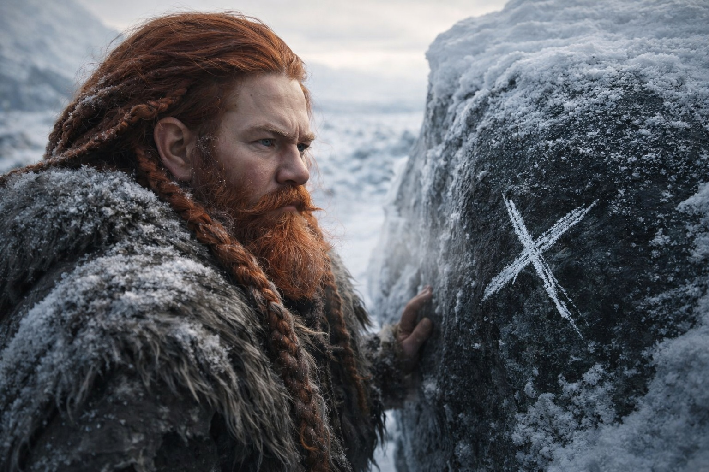
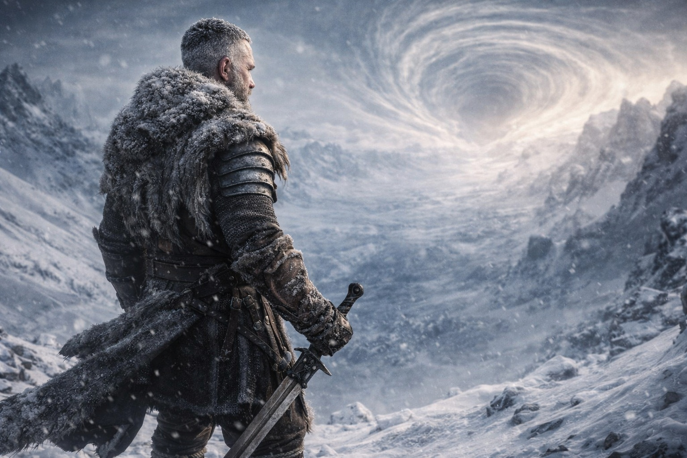

## Chapter 38 | Part 2 | The Attempt

---

---

They walked for six hours and covered no ground.

Dulint knew it before anyone said it. The ridge they'd camped beneath was still visible behind them, unchanged, the same distance it had been at midmorning. The snow underfoot was the same snow. The ice formations to the west were the same ice formations. He'd been counting his steps the way he'd counted inventory for forty years, and the count said they had walked four thousand paces northeast, and his eyes said they were standing where they'd started.

"Stop," he said.

The group stopped. Aldric's hand went to his sword, the reflex of a man whose body had learned to draw before his mind had learned to think, and Dulint didn't blame him. There was nothing to fight. That was the problem.

"Mark this stone." Dulint pointed at a boulder with a crack running through its face like a river delta. "Xandor, use the chalk."

Xandor marked it. A white X on dark stone. They walked northeast for another hour, the frozen ground crunching under their boots, the wind cutting through their furs, the Beacon humming against Dulint's spine with the devotion of a signal that had not questioned its direction once in three months.

They found the stone. The white X. Undisturbed. They had walked in a straight line for an hour and arrived where they'd begun.
"The terrain is looping," Xandor said. His voice had the controlled flatness of a scholar recording a phenomenon he couldn't explain. "Not circling. Looping. The geography itself is folded."

"Can we go around?" Balin asked.

"Around what? The fold is the terrain. There's no around." Xandor pulled out the Athenaeum fragment and held it beside the Beacon's glow. The artifact pointed northeast. One league. The Beacon had said one league since yesterday. It would say one league tomorrow. The distance was not a lie. The distance was simply not navigable by feet that existed on this side of the barrier's influence.

"The Beacon says one league," Maris said. She was walking without looking at the ground, her pale grey eyes fixed on the northeast distortion the way a person watches a wound they can't reach. "My feet say we haven't moved."

Balin's staff cracked against the frozen stone. The sound rang flat, absorbed by something in the air that ate resonance. "Why can we see it but not reach it?"

Nobody answered. Because the answer was the mechanism Xandor had described: the barrier's influence pushed back against approach from this side. Not a wall. Nothing so honest as a wall. A distortion. The landscape folding on itself, the leagues bending, the straight line curving back to its origin. The barrier didn't need to fight them. It simply made the ground they walked on insufficient for the distance they needed to cross.

Dulint tried south. Then west. Then northeast at a different angle. Each time the chalk mark waited for them. Each time the Beacon hummed its patient one league, the way a compass would point north even if the traveler was walking in circles, because the compass was not responsible for the traveler's legs.

By midafternoon the cold had deepened. The frost on their cloaks had stopped melting from body heat, which meant their body heat was losing the war against the temperature, which meant they needed shelter. The impossible ridge offered what the flat terrain did not: a windbreak, an overhang, a place where the frozen ground could be cleared enough to build a fire.

They returned to the ridge. The chalk X watched them arrive.

"It's not letting us close," Aldric said. He stood at the ridge's edge, staring northeast, his good hand clenching and unclenching on his sword grip. "The whole landscape is a gate and it's closed."

"Not closed," Xandor said. He was sitting on the frozen ground, the fragments spread before him again, working the problem the way he worked every problem: by refusing to let frustration replace analysis. "The gate opens. For the bearer. With the artifact. At the mechanism's invitation. We are not the bearer. We do not have the artifact. The mechanism has not invited us."

"Then we're standing at a door we can't open."

"We're standing at a door that doesn't know we exist."

The fire caught. Thin flames fighting the wind. Balin fed it with the methodical patience of a man whose limp had returned genuine and who understood that warmth was not comfort but survival. The cold here was different from the cold they'd marched through for weeks. It had a deliberate quality, as if the temperature itself was part of the barrier's influence, pushing them away not through walls but through the accumulation of small impossibilities: distance that wouldn't close, terrain that looped, cold that deepened faster than fire could fight.

Maris had not spoken since the chalk test. She sat against the frozen ridge, wrapped in furs that looked too thin, her eyes closed, her breathing shallow. The dried blood was gone from her face. The hollowness was not.

"Maris." Dulint sat beside her. Not close enough to intrude. Close enough to be heard over the wind. "Don't reach."

"She's not reaching." The distance language. Third person. The shield she raised when the connection was too close and the cost of closeness was measured in blood and function. "She's listening. The Beacon carries residual signal. She can hear the resonance without pushing through."

"What does it say?"

Maris opened her eyes. The left one was slightly clouded, the vision damage from her last attempt not fully healed, a cost she had paid and not recovered and might never recover. "He's still walking. Northeast. Toward the barrier. The thing inside him is counting." She paused. "One league on the Beacon. One league that won't end."

Dulint looked at the chalk X on the boulder. One league. Four thousand paces that led back to the same stone. A distance that existed and could not be crossed, a truth that could be known and not acted on, a gap between understanding and ability that was measured not in leagues but in the kind of distance that separated one side of a broken system from the other.

Lock 1. Knowledge creates suffering, not solutions.

"We try again tomorrow," Dulint said. "Different approach. We spread out. Test the fold's boundaries. If the loop has edges, we find them."

"And if it doesn't have edges?"

"Then we know that too."

The fire cracked against the cold. The Beacon hummed. One league. The distortion on the northeast horizon pulsed once, colors folding in on themselves, the sky doing something that human eyes could register but human language couldn't describe.

They had one league and no ground.

---

**End of Chapter 38.2 —> 38.3: [We Were Right: The Helplessness](/we-were-right-the-helplessness/)**