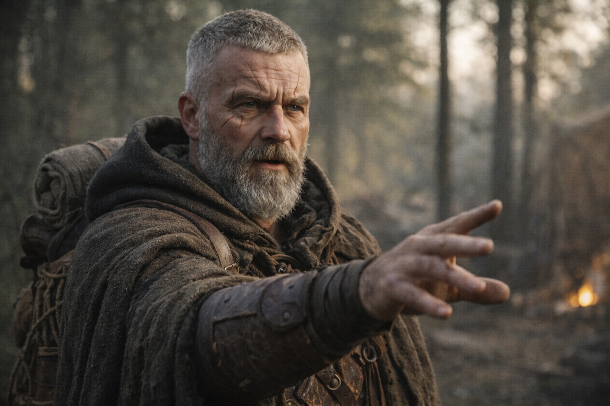
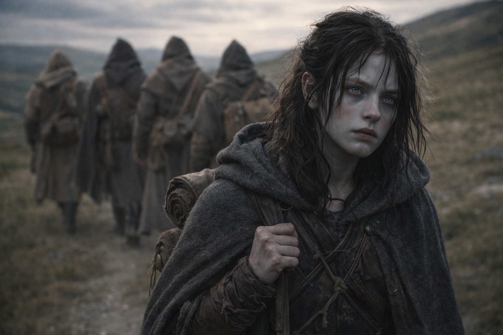
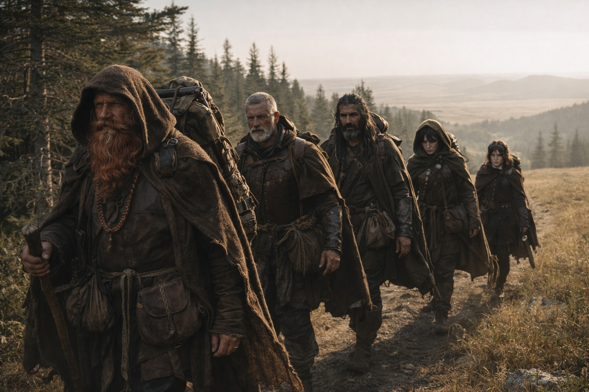

## Chapter 33 | Part 3 | The Course Change

---

The argument lasted an hour and settled nothing except the direction.

Dulint wanted to keep following the original bearing. It had led them this far from Zuraldi. He wasn't ready to change course for a man they'd only seen in visions.

"We don't know him," Dulint said. "The Beacon was leading us somewhere before it started following him. That place still exists."

"We felt several signals," Maris said. "This one is moving. We can't keep following the old bearing and expect to find him."

"You don't know that."

"She knows what she saw. He turned, and the pull changed with him."

"He carries a component we need," Aldric said. "Reach him and we may get answers. Keep walking toward an old mark and we may find nothing."

"We have a man we don't know," Dulint said, "carrying something we don't understand, on the other side of a barrier we can't cross."

"Can we cross it?" Balin asked.

Xandor sat against a tree, flexing his injured hand. He stopped when Balin looked at him.

"The barrier is not a wall," Xandor said. "It's a membrane. Things pass through it. People have passed through it, historically. But the crossing requires compatibility or circumstance, and we have neither." He paused. His good hand touched the tree beside him. Listened. "However. The Beacon is a component of the system that generates the barrier. It may have properties at the barrier's edge that we haven't observed yet. Proximity may reveal function."

"May," Aldric said.

"May," Xandor confirmed. "I am not in the habit of guaranteeing things I haven't tested."

"So we follow the bearing and hope the Beacon lets us cross when we get there." Aldric looked at Maris. "That's the plan?"

"Follow the bearing and look for a crossing," Maris said. "She can keep checking where he is. She can't promise what happens at the barrier."

Dulint stared at the fire pit, working the pack strap between his fingers.

"If we follow his bearing," Dulint said slowly, "we're no longer walking toward the convergence. We're walking toward a person."

"Yes."

"And if that person walks away from the convergence?"

"Then we decide whether to keep following him."

Dulint looked toward Balin. Maris remembered the note and waited for the objection. It didn't come.

Dulint took a breath, shouldered his pack and stood.

"Northeast still works," he said. "For now."

It wasn't agreement. It was the absence of a better objection. It would do.

Aldric had them ready in seven minutes. Balin tested his leg before setting off. Xandor needed help tightening the strap over his injured shoulder.

They walked northeast. The same direction as before, for now. The Beacon's bearing and the original course overlapped enough to make the change invisible to anyone who wasn't feeling it from the inside.

The pull changed while she walked. She adjusted her course a little east, and Dulint followed her signal.

She would have to keep doing that. There was no fixed destination she could hand Aldric and leave him to find.

Aldric fell into step beside her as the forest thinned into open ground.

"He carries a component we need," Aldric said. "We should reach him before he reaches the barrier. The signal's already hurting you here."

He glanced at the cloth in her hand. She folded the bloodstained side inward.

"She's trying," Maris said.

"Try faster."

Aldric moved ahead. Maris followed four paces behind Dulint, keeping the pull in reach.

She tried again. Pain spread from her left eye to her jaw.

---

**End of Chapter 33.3 —> 33.4: [What the Beacon Lost: The Distance](/what-the-beacon-lost-the-distance/)**
