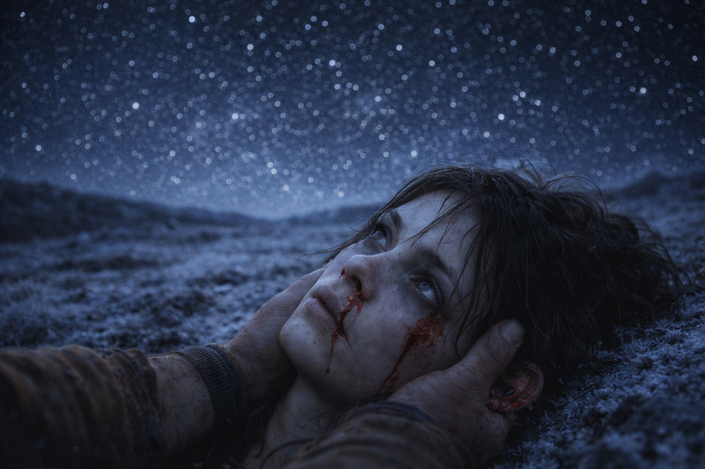
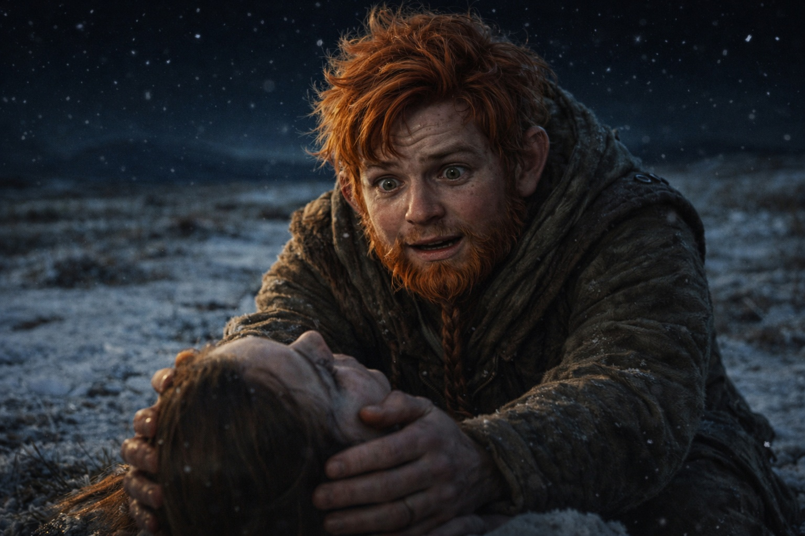
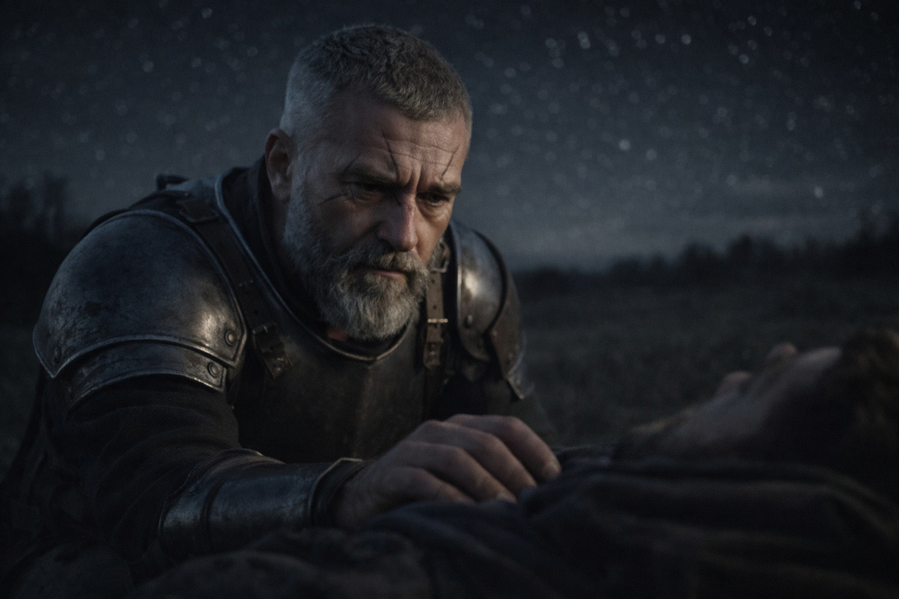
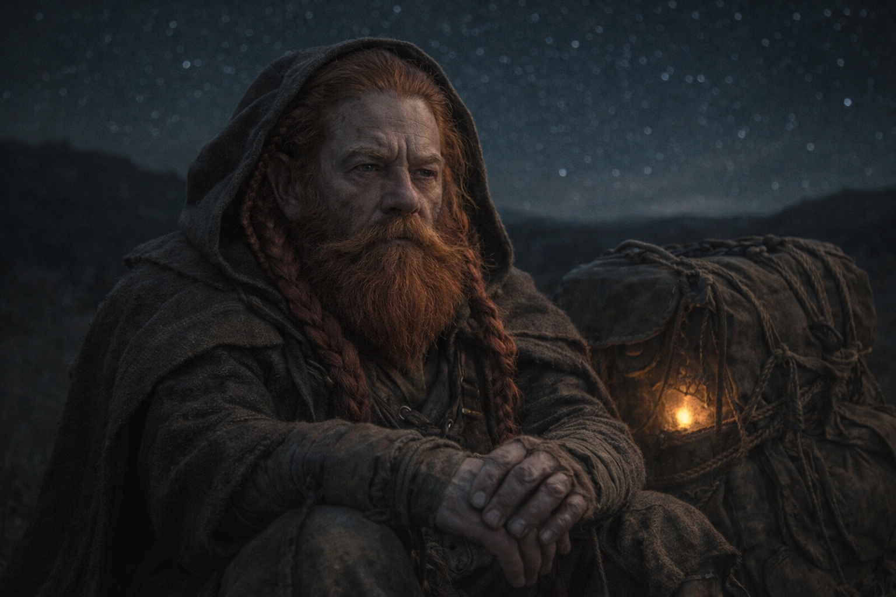

## Chapter 33 | Part 4 | The Distance

---

Maris reached for him on the third night and found the distance.

Not leagues. She'd felt leagues before. Leagues had weight and texture, the way a rope feels different at ten feet and a hundred. This was different. This was a gap that didn't measure itself in any unit she understood, a separation that existed in the space between what was possible on this side of the barrier and what was possible on the other.

She was sitting at the edge of their camp in open terrain, beyond the last of the spruce forest, in a landscape of low hills and frost-hardened grass that Aldric had chosen for its sightlines. The grey cloaks were three hills south, visible at dusk as faint movement along the ridgeline. Still following. Still patient. Still someone else's problem.

She closed her eyes. Reached. The Beacon responded.

The vision came hard and fast, the way the worst ones did, the ones that cost more than she planned to spend. Fire. Black stone. Mountains that piled against a sky the wrong color, a sky that looked like it had been painted by someone who'd had the concept of sky explained to them but had never seen one. The air tasted of metal and old heat and something organic and wrong, the breath of a landscape that was alive in ways landscapes should not be.

He was there. Walking. The dark elf with the artifact in his pack, moving through that wrong landscape with the ease of someone whose body had stopped fighting the place that should have killed it. Three figures with him, the pair she'd seen before, small and grey, and the new one, the tall woman in dark armor who the Beacon's frequency slid off of like light off a mirror.

He was far. Not far the way the Frostgard border was far, measurable in days and provision counts. Far the way the bottom of the ocean was far from the surface. The barrier sat between them, invisible and absolute, and he was on the other side of it, deep inside a realm that shouldn't exist, walking toward the very thing the barrier was supposed to contain.

The vision deepened. She felt his mind. Not his thoughts. His state. Tired. Wary. Carrying knowledge that weighed more than the artifact in his pack. He was afraid of what lay ahead and committed to reaching it anyway. The fear and the commitment coexisted in him the way two instruments play different melodies that somehow form a single piece. He didn't understand what the Beacon was, or what it tracked, or that five people on the other side of the world were following his signal. He understood duty. He understood cost. He understood that turning around was not one of his options.

Something else. Something behind the fear and the duty, buried deeper, stirring. A presence inside him that the Beacon's frequency recognized and recoiled from. Not the artifact. Something else. Something that lived in the space behind his sternum where decisions formed, something patient and vast and using him as an address rather than a destination.

The Beacon screamed.

Not sound. Frequency. A spike of resonance so sharp that Maris's vision went white and her body jerked and the back of her skull hit the frozen ground. She was staring at the sky. The real sky. Stars. Her sky, not his.

Blood from her nose. Both nostrils. Her left ear, warm and wet. The headache was no longer a headache. It was a structure, an architecture of pain with load-bearing walls and foundations and a roof that pressed against the inside of her skull.

Balin was beside her. His hands were under her head, lifting it from the ground. His hazel eyes were the color of panic pretending to be competence.

"I'm here," she said. The words came out slurred. "I'm back."

"How far?" Aldric's voice. From somewhere to her left. She couldn't turn her head.

"Far."

"How far, Maris?"

She closed her eyes. Not to reach. To remember what she'd seen. The landscape. The barrier. The distance that didn't measure in leagues. The dark elf walking east in a realm no one on this side of the barrier could enter, carrying a piece of the system that wanted to be whole, escorted by someone the system couldn't see, haunted by something the system feared.

"He's in Wyrmreach," she said. "Across the barrier. Deep inside. She can see him but she can't reach him. No one can reach him from this side." She opened her eyes. Balin's face was above her, young and scared. "He's impossibly far. And he's getting farther every day. He's walking east. Toward the barrier. Toward us. But from the inside."

"If he's walking toward the barrier," Xandor said, "then the distance closes."

"Not fast enough. Not nearly fast enough. The barrier is... she can feel it. It's between us. Not just distance. A boundary. The Beacon can sense him through it but we can't cross it. We're on the wrong side."

Aldric's face appeared above her. He'd crouched. His grey eyes were steady with the forced calm of someone who processed bad news by converting it to operational data.

"Can you tell him we're here?"

"No."

"Can you signal him? Through the Beacon?"

"The Beacon signals him already. He doesn't know what the signal is. There's something..." She struggled for the words. The architecture of pain shifted in her skull, settling into its new foundations. "There's something inside him. Something the Beacon recognizes. Something that's not him. The Beacon saw it and panicked."

"Panicked how?"

"The frequency spiked. That's why I'm on the ground."

Silence. The wind moved across the open terrain. The grey cloaks were invisible now, swallowed by the night three hills south.

Dulint sat beside his pack. His hands were still. His face was stone. The Beacon hummed inside the leather and cloth wrapping, steady and directional, pointed at a man none of them had met, across a boundary none of them could cross, walking deeper into a danger none of them could mitigate.

"We keep walking northeast," Dulint said. His voice was the voice of a man who had nothing left to offer except motion. "If he's walking toward the barrier from the inside, and we're walking toward it from the outside, then the Beacon is right about the direction even if it's wrong about the distance. We walk. We get as close as the barrier allows. And when something changes, we're there."

"Something will change?" Balin asked.

Nobody answered.

Maris lay on the frozen ground and stared at the stars and felt the pull in her chest, steady, personal, directed at a dark elf who walked through fire and wrong air on the other side of everything, getting farther every day, getting closer every day, the two measurements contradicting each other because the geography between them was a barrier that existed in dimensions she couldn't name.

She could see him. She couldn't reach him.

The Beacon hummed.

The stars were cold and correct and impossibly far above her, the way he was impossibly far ahead of her, the way everything worth reaching was impossibly far from everyone trying to reach it.

She closed her eyes and let the blood dry on her face and waited for the pain to settle into a shape she could carry in the morning.

---

**End of Chapter 33.4 —> 34.1: [The Price of Answers: The Outpost](/the-price-of-answers-the-outpost/)**