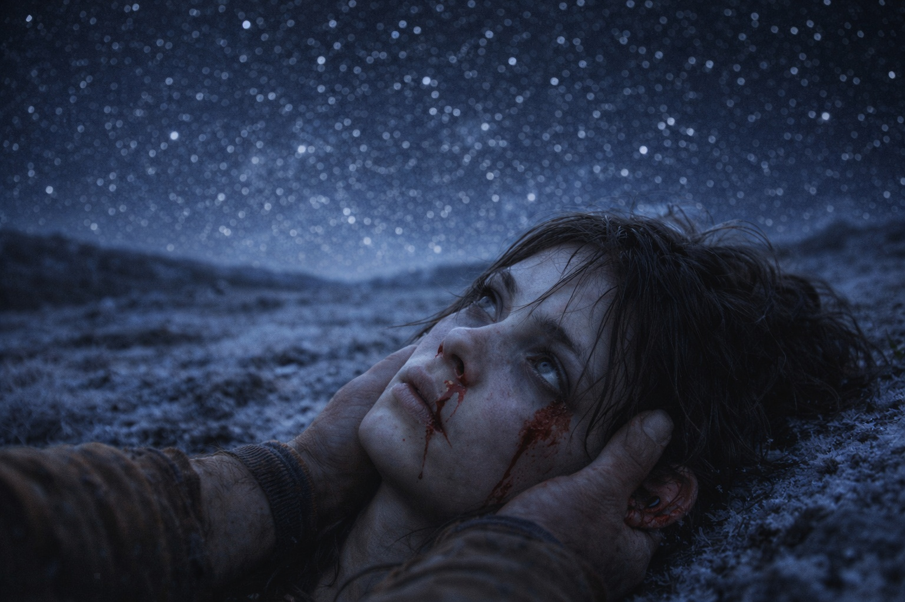
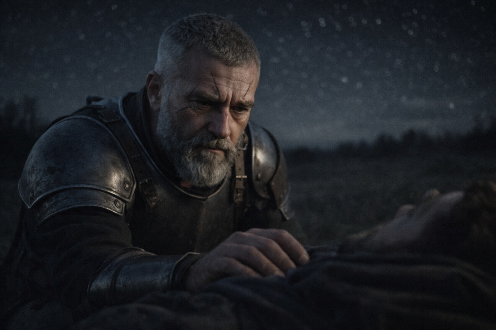

## Chapter 33 | Part 4 | The Distance

---

Maris reached for him on the third night and found the distance.

The image sharpened, but she couldn't reach past it. Each attempt met the same resistance.

She sat at the edge of camp in the low hills beyond the spruce forest. At dusk, Aldric had spotted the grey cloaks three hills south. He was watching that direction now.

She closed her eyes. Reached. The Beacon responded.

Heat struck first. Then she saw the black ridges beneath a purple sky and tasted metal. She pressed her hands harder against the frozen ground.

He walked with the goblin and the pale elf. The armored woman was ahead. Maris could see all four, but still felt nothing from the woman.

She could see the path at his feet more clearly than the frozen grass beneath her own hands. When she tried to reach him, the barrier stopped her.

He was tired and afraid. When the woman stopped, he stopped; when she moved, he followed. Maris tried to catch a thought clear enough to understand and lost it.

Then she felt another presence through him. The Beacon's hum rose as she tried to separate it from his thoughts.

The Beacon screamed.

The pulse struck before she could withdraw. Her vision went white and her head hit the ground. When she could see again, she was looking at the stars above their camp.

Blood ran from her nose and left ear. Pain spread across her skull until she couldn't lift her head.

Balin knelt beside her and supported her head. His hands shook.

"I'm here," she said. The words came out slurred. "I'm back."

"How far?" Aldric's voice. From somewhere to her left. She couldn't turn her head.

"Far."

"How far, Maris?"

She closed her eyes to remember. Black ridges, the three companions, and the resistance that had stopped her reaching any farther.

"Wyrmreach. Across the barrier." Balin's face blurred above her. "She can see him. She hasn't found a way to reach him. He's walking east, toward the barrier from inside."

"If he's walking toward the barrier," Xandor said, "then the distance closes."

"Not fast enough. Not nearly fast enough. The barrier is... she can feel it. It's between us. Not just distance. A boundary. The Beacon can sense him through it but we can't cross it. We're on the wrong side."

Aldric crouched beside Balin, close enough that she could see him without turning.

"Can you tell him we're here?"

"No."

"Can you signal him? Through the Beacon?"

"He feels a signal. She doesn't know whether he could understand a message." She swallowed. "There was another presence. When she tried to see it, the pulse struck her."

"Struck you how?"

"The frequency spiked. That's why I'm on the ground."

Silence. The wind moved across the open terrain. The grey cloaks were invisible now, swallowed by the night three hills south.

Dulint sat beside the pack with both hands on it. The Beacon kept humming while he waited for her to catch her breath.

"We keep going," Dulint said. "We get as close as the barrier allows. If something changes, I want us there to see it."

"Something will change?" Balin asked.

Nobody answered.

Maris lay still while the others argued over the route. The pull remained. It told her where to look, not how to get there.

She could see him. She couldn't reach him.

The Beacon hummed.

Balin kept his hand beneath her head until she could sit.

She waited for the pain to ease before trying to stand.

---

**End of Chapter 33.4 —> 34.1: [The Price of Answers: The Outpost](/the-price-of-answers-the-outpost/)**
